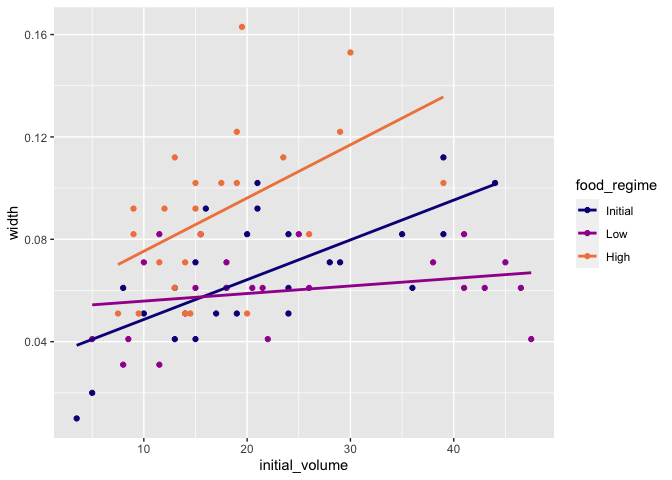
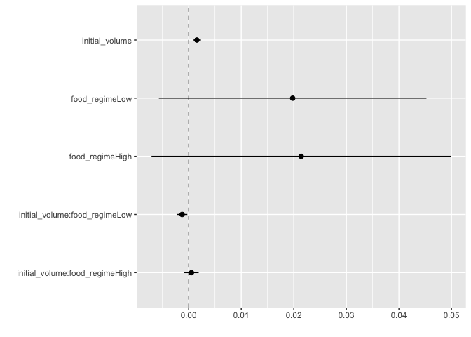
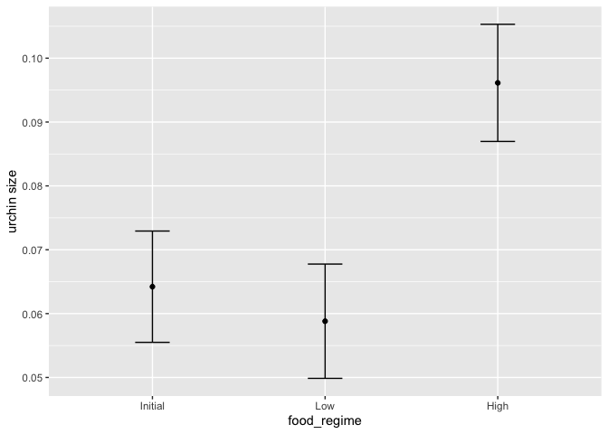
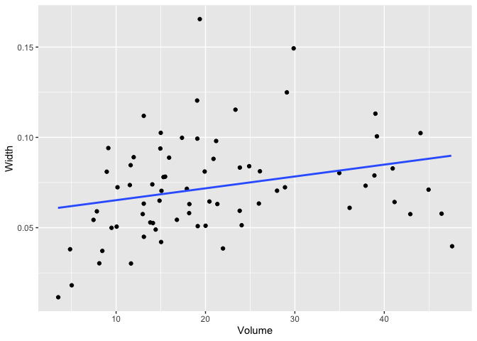
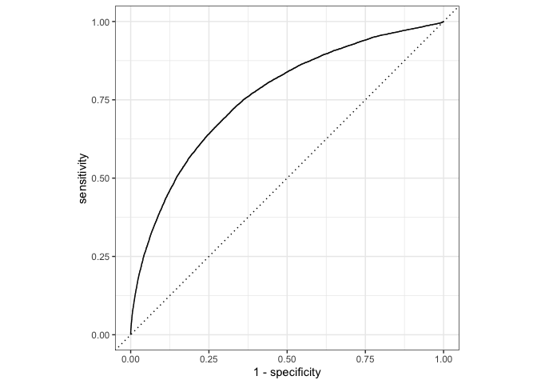

Tidymodels
================
Emma Grossman
6/2/2021

``` r
library(tidymodels)  # for the parsnip package, along with the rest of tidymodels
```

    ## Registered S3 method overwritten by 'tune':
    ##   method                   from   
    ##   required_pkgs.model_spec parsnip

    ## ── Attaching packages ────────────────────────────────────── tidymodels 0.1.3 ──

    ## ✓ broom        0.7.6      ✓ recipes      0.1.16
    ## ✓ dials        0.0.9      ✓ rsample      0.1.0 
    ## ✓ dplyr        1.0.5      ✓ tibble       3.1.0 
    ## ✓ ggplot2      3.3.3      ✓ tidyr        1.1.3 
    ## ✓ infer        0.5.4      ✓ tune         0.1.5 
    ## ✓ modeldata    0.1.0      ✓ workflows    0.2.2 
    ## ✓ parsnip      0.1.6      ✓ workflowsets 0.0.2 
    ## ✓ purrr        0.3.4      ✓ yardstick    0.0.8

    ## ── Conflicts ───────────────────────────────────────── tidymodels_conflicts() ──
    ## x purrr::discard() masks scales::discard()
    ## x dplyr::filter()  masks stats::filter()
    ## x dplyr::lag()     masks stats::lag()
    ## x recipes::step()  masks stats::step()
    ## • Use tidymodels_prefer() to resolve common conflicts.

``` r
# Helper packages
library(readr)       # for importing data
```

    ## 
    ## Attaching package: 'readr'

    ## The following object is masked from 'package:yardstick':
    ## 
    ##     spec

    ## The following object is masked from 'package:scales':
    ## 
    ##     col_factor

``` r
library(broom.mixed) # for converting bayesian models to tidy tibbles
library(dotwhisker)  # for visualizing regression results
```

# 1\. Build a Model

``` r
urchins <-
  # Data were assembled for a tutorial 
  # at https://www.flutterbys.com.au/stats/tut/tut7.5a.html
  read_csv("https://tidymodels.org/start/models/urchins.csv") %>% 
  # Change the names to be a little more verbose
  setNames(c("food_regime", "initial_volume", "width")) %>% 
  # Factors are very helpful for modeling, so we convert one column
  mutate(food_regime = factor(food_regime, levels = c("Initial", "Low", "High")))
```

    ## 
    ## ── Column specification ────────────────────────────────────────────────────────
    ## cols(
    ##   TREAT = col_character(),
    ##   IV = col_double(),
    ##   SUTW = col_double()
    ## )

``` r
urchins
```

    ## # A tibble: 72 x 3
    ##    food_regime initial_volume width
    ##    <fct>                <dbl> <dbl>
    ##  1 Initial                3.5 0.01 
    ##  2 Initial                5   0.02 
    ##  3 Initial                8   0.061
    ##  4 Initial               10   0.051
    ##  5 Initial               13   0.041
    ##  6 Initial               13   0.061
    ##  7 Initial               15   0.041
    ##  8 Initial               15   0.071
    ##  9 Initial               16   0.092
    ## 10 Initial               17   0.051
    ## # … with 62 more rows

``` r
ggplot(urchins,
       aes(x = initial_volume, 
           y = width, 
           group = food_regime, 
           col = food_regime)) + 
  geom_point() + 
  geom_smooth(method = lm, se = FALSE) +
  scale_color_viridis_d(option = "plasma", end = .7)
```

    ## `geom_smooth()` using formula 'y ~ x'

<!-- -->

``` r
lm_mod <- 
  linear_reg() %>% 
  set_engine("lm")
```

``` r
lm_fit <- 
  lm_mod %>% 
  fit(width ~ initial_volume * food_regime, data = urchins)
lm_fit
```

    ## parsnip model object
    ## 
    ## Fit time:  4ms 
    ## 
    ## Call:
    ## stats::lm(formula = width ~ initial_volume * food_regime, data = data)
    ## 
    ## Coefficients:
    ##                    (Intercept)                  initial_volume  
    ##                      0.0331216                       0.0015546  
    ##                 food_regimeLow                 food_regimeHigh  
    ##                      0.0197824                       0.0214111  
    ##  initial_volume:food_regimeLow  initial_volume:food_regimeHigh  
    ##                     -0.0012594                       0.0005254

``` r
tidy(lm_fit) %>% 
  dwplot(dot_args = list(size = 2, color = "black"),
         whisker_args = list(color = "black"),
         vline = geom_vline(xintercept = 0, colour = "grey50", linetype = 2))
```

<!-- -->

``` r
new_points <- expand.grid(initial_volume = 20, 
                          food_regime = c("Initial", "Low", "High"))
new_points
```

    ##   initial_volume food_regime
    ## 1             20     Initial
    ## 2             20         Low
    ## 3             20        High

``` r
mean_pred <- predict(lm_fit, new_data = new_points)
mean_pred
```

    ## # A tibble: 3 x 1
    ##    .pred
    ##    <dbl>
    ## 1 0.0642
    ## 2 0.0588
    ## 3 0.0961

``` r
conf_int_pred <- predict(lm_fit, 
                         new_data = new_points, 
                         type = "conf_int")
conf_int_pred
```

    ## # A tibble: 3 x 2
    ##   .pred_lower .pred_upper
    ##         <dbl>       <dbl>
    ## 1      0.0555      0.0729
    ## 2      0.0499      0.0678
    ## 3      0.0870      0.105

``` r
# Now combine: 
plot_data <- 
  new_points %>% 
  bind_cols(mean_pred) %>% 
  bind_cols(conf_int_pred)

# and plot:
ggplot(plot_data, aes(x = food_regime)) + 
  geom_point(aes(y = .pred)) + 
  geom_errorbar(aes(ymin = .pred_lower, 
                    ymax = .pred_upper),
                width = .2) + 
  labs(y = "urchin size")
```

<!-- -->

``` r
urchins %>% 
  group_by(food_regime) %>% 
  summarize(med_vol = median(initial_volume))
```

    ## # A tibble: 3 x 2
    ##   food_regime med_vol
    ##   <fct>         <dbl>
    ## 1 Initial        20.5
    ## 2 Low            19.2
    ## 3 High           15

``` r
ggplot(urchins,
       aes(initial_volume, width)) +      # returns a ggplot object 
  geom_jitter() +                         # same
  geom_smooth(method = lm, se = FALSE) +  # same                    
  labs(x = "Volume", y = "Width")         # etc
```

    ## `geom_smooth()` using formula 'y ~ x'

<!-- -->

# 2\. Preprocess your data with recipes

``` r
library(tidymodels)      # for the recipes package, along with the rest of tidymodels

# Helper packages
library(nycflights13)    # for flight data
# install.packages("skimr")
library(skimr)           # for variable summaries
```

``` r
set.seed(123)

flight_data <- 
  flights %>% 
  mutate(
    # Convert the arrival delay to a factor
    arr_delay = ifelse(arr_delay >= 30, "late", "on_time"),
    arr_delay = factor(arr_delay),
    # We will use the date (not date-time) in the recipe below
    date = as.Date(time_hour)
  ) %>% 
  # Include the weather data
  inner_join(weather, by = c("origin", "time_hour")) %>% 
  # Only retain the specific columns we will use
  select(dep_time, flight, origin, dest, air_time, distance, 
         carrier, date, arr_delay, time_hour) %>% 
  # Exclude missing data
  na.omit() %>% 
  # For creating models, it is better to have qualitative columns
  # encoded as factors (instead of character strings)
  mutate_if(is.character, as.factor)
```

``` r
flight_data %>% 
  count(arr_delay) %>% 
  mutate(prop = n/sum(n))
```

    ## # A tibble: 2 x 3
    ##   arr_delay      n  prop
    ##   <fct>      <int> <dbl>
    ## 1 late       52540 0.161
    ## 2 on_time   273279 0.839

``` r
glimpse(flight_data)
```

    ## Rows: 325,819
    ## Columns: 10
    ## $ dep_time  <int> 517, 533, 542, 544, 554, 554, 555, 557, 557, 558, 558, 558, …
    ## $ flight    <int> 1545, 1714, 1141, 725, 461, 1696, 507, 5708, 79, 301, 49, 71…
    ## $ origin    <fct> EWR, LGA, JFK, JFK, LGA, EWR, EWR, LGA, JFK, LGA, JFK, JFK, …
    ## $ dest      <fct> IAH, IAH, MIA, BQN, ATL, ORD, FLL, IAD, MCO, ORD, PBI, TPA, …
    ## $ air_time  <dbl> 227, 227, 160, 183, 116, 150, 158, 53, 140, 138, 149, 158, 3…
    ## $ distance  <dbl> 1400, 1416, 1089, 1576, 762, 719, 1065, 229, 944, 733, 1028,…
    ## $ carrier   <fct> UA, UA, AA, B6, DL, UA, B6, EV, B6, AA, B6, B6, UA, UA, AA, …
    ## $ date      <date> 2013-01-01, 2013-01-01, 2013-01-01, 2013-01-01, 2013-01-01,…
    ## $ arr_delay <fct> on_time, on_time, late, on_time, on_time, on_time, on_time, …
    ## $ time_hour <dttm> 2013-01-01 05:00:00, 2013-01-01 05:00:00, 2013-01-01 05:00:…

``` r
flight_data %>% 
  skimr::skim(dest, carrier) 
```

|                                                  |            |
| :----------------------------------------------- | :--------- |
| Name                                             | Piped data |
| Number of rows                                   | 325819     |
| Number of columns                                | 10         |
| \_\_\_\_\_\_\_\_\_\_\_\_\_\_\_\_\_\_\_\_\_\_\_   |            |
| Column type frequency:                           |            |
| factor                                           | 2          |
| \_\_\_\_\_\_\_\_\_\_\_\_\_\_\_\_\_\_\_\_\_\_\_\_ |            |
| Group variables                                  | None       |

Data summary

**Variable type: factor**

| skim\_variable | n\_missing | complete\_rate | ordered | n\_unique | top\_counts                                    |
| :------------- | ---------: | -------------: | :------ | --------: | :--------------------------------------------- |
| dest           |          0 |              1 | FALSE   |       104 | ATL: 16771, ORD: 16507, LAX: 15942, BOS: 14948 |
| carrier        |          0 |              1 | FALSE   |        16 | UA: 57489, B6: 53715, EV: 50868, DL: 47465     |

``` r
# Fix the random numbers by setting the seed 
# This enables the analysis to be reproducible when random numbers are used 
set.seed(555)
# Put 3/4 of the data into the training set 
data_split <- initial_split(flight_data, prop = 3/4)

# Create data frames for the two sets:
train_data <- training(data_split)
test_data  <- testing(data_split)
```

``` r
flights_rec <- 
  recipe(arr_delay ~ ., data = train_data) %>% 
  update_role(flight, time_hour, new_role = "ID") 
```

``` r
summary(flights_rec)
```

    ## # A tibble: 10 x 4
    ##    variable  type    role      source  
    ##    <chr>     <chr>   <chr>     <chr>   
    ##  1 dep_time  numeric predictor original
    ##  2 flight    numeric ID        original
    ##  3 origin    nominal predictor original
    ##  4 dest      nominal predictor original
    ##  5 air_time  numeric predictor original
    ##  6 distance  numeric predictor original
    ##  7 carrier   nominal predictor original
    ##  8 date      date    predictor original
    ##  9 time_hour date    ID        original
    ## 10 arr_delay nominal outcome   original

``` r
flight_data %>% 
  distinct(date) %>% 
  mutate(numeric_date = as.numeric(date)) 
```

    ## # A tibble: 364 x 2
    ##    date       numeric_date
    ##    <date>            <dbl>
    ##  1 2013-01-01        15706
    ##  2 2013-01-02        15707
    ##  3 2013-01-03        15708
    ##  4 2013-01-04        15709
    ##  5 2013-01-05        15710
    ##  6 2013-01-06        15711
    ##  7 2013-01-07        15712
    ##  8 2013-01-08        15713
    ##  9 2013-01-09        15714
    ## 10 2013-01-10        15715
    ## # … with 354 more rows

``` r
flights_rec <- 
  recipe(arr_delay ~ ., data = train_data) %>% 
  update_role(flight, time_hour, new_role = "ID") %>% 
  step_date(date, features = c("dow", "month")) %>%               
  step_holiday(date, holidays = timeDate::listHolidays("US")) %>% 
  step_rm(date)
```

> Create dummy variables for all of the factor or character columns
> unless they are outcomes:

``` r
flights_rec <- 
  recipe(arr_delay ~ ., data = train_data) %>% 
  update_role(flight, time_hour, new_role = "ID") %>% 
  step_date(date, features = c("dow", "month")) %>% 
  step_holiday(date, holidays = timeDate::listHolidays("US")) %>% 
  step_rm(date) %>% 
  step_dummy(all_nominal(), -all_outcomes())
```

``` r
test_data %>% 
  distinct(dest) %>% 
  anti_join(train_data)
```

    ## Joining, by = "dest"

    ## # A tibble: 0 x 1
    ## # … with 1 variable: dest <fct>

``` r
flights_rec <- 
  recipe(arr_delay ~ ., data = train_data) %>% 
  update_role(flight, time_hour, new_role = "ID") %>% 
  step_date(date, features = c("dow", "month")) %>% 
  step_holiday(date, holidays = timeDate::listHolidays("US")) %>% 
  step_rm(date) %>% 
  step_dummy(all_nominal(), -all_outcomes()) %>% 
  step_zv(all_predictors())
```

``` r
lr_mod <- 
  logistic_reg() %>% 
  set_engine("glm")
```

``` r
flights_wflow <- 
  workflow() %>% 
  add_model(lr_mod) %>% 
  add_recipe(flights_rec)
flights_wflow
```

    ## ══ Workflow ════════════════════════════════════════════════════════════════════
    ## Preprocessor: Recipe
    ## Model: logistic_reg()
    ## 
    ## ── Preprocessor ────────────────────────────────────────────────────────────────
    ## 5 Recipe Steps
    ## 
    ## • step_date()
    ## • step_holiday()
    ## • step_rm()
    ## • step_dummy()
    ## • step_zv()
    ## 
    ## ── Model ───────────────────────────────────────────────────────────────────────
    ## Logistic Regression Model Specification (classification)
    ## 
    ## Computational engine: glm

``` r
flights_fit <- 
  flights_wflow %>% 
  fit(data = train_data)
```

``` r
flights_fit %>% 
  pull_workflow_fit() %>% 
  tidy()
```

    ## # A tibble: 158 x 5
    ##    term                         estimate std.error statistic  p.value
    ##    <chr>                           <dbl>     <dbl>     <dbl>    <dbl>
    ##  1 (Intercept)                   5.25    2.72           1.93 5.40e- 2
    ##  2 dep_time                     -0.00167 0.0000141   -118.   0.      
    ##  3 air_time                     -0.0438  0.000561     -78.0  0.      
    ##  4 distance                      0.00615 0.00150        4.10 4.09e- 5
    ##  5 date_USChristmasDay           1.14    0.171          6.65 2.86e-11
    ##  6 date_USColumbusDay            0.627   0.169          3.72 2.03e- 4
    ##  7 date_USCPulaskisBirthday      0.702   0.133          5.29 1.25e- 7
    ##  8 date_USDecorationMemorialDay  0.363   0.117          3.11 1.86e- 3
    ##  9 date_USElectionDay            0.695   0.177          3.92 8.87e- 5
    ## 10 date_USGoodFriday             1.15    0.156          7.39 1.45e-13
    ## # … with 148 more rows

``` r
predict(flights_fit, test_data)
```

    ## # A tibble: 81,455 x 1
    ##    .pred_class
    ##    <fct>      
    ##  1 on_time    
    ##  2 on_time    
    ##  3 on_time    
    ##  4 on_time    
    ##  5 on_time    
    ##  6 on_time    
    ##  7 on_time    
    ##  8 on_time    
    ##  9 on_time    
    ## 10 on_time    
    ## # … with 81,445 more rows

``` r
flights_pred <- 
  predict(flights_fit, test_data, type = "prob") %>% 
  bind_cols(test_data %>% select(arr_delay, time_hour, flight)) 

# The data look like: 
flights_pred
```

    ## # A tibble: 81,455 x 5
    ##    .pred_late .pred_on_time arr_delay time_hour           flight
    ##         <dbl>         <dbl> <fct>     <dttm>               <int>
    ##  1     0.0183         0.982 on_time   2013-01-01 06:00:00    461
    ##  2     0.0426         0.957 on_time   2013-01-01 06:00:00   5708
    ##  3     0.0413         0.959 on_time   2013-01-01 06:00:00     71
    ##  4     0.0253         0.975 on_time   2013-01-01 06:00:00    194
    ##  5     0.0306         0.969 on_time   2013-01-01 06:00:00   1743
    ##  6     0.0236         0.976 on_time   2013-01-01 06:00:00   1077
    ##  7     0.0119         0.988 on_time   2013-01-01 06:00:00    709
    ##  8     0.137          0.863 on_time   2013-01-01 06:00:00    245
    ##  9     0.0526         0.947 on_time   2013-01-01 06:00:00   4599
    ## 10     0.0246         0.975 on_time   2013-01-01 06:00:00   1019
    ## # … with 81,445 more rows

``` r
flights_pred %>% 
  roc_curve(truth = arr_delay, .pred_late) %>% 
  autoplot()
```

<!-- -->

``` r
flights_pred %>% 
  roc_auc(truth = arr_delay, .pred_late)
```

    ## # A tibble: 1 x 3
    ##   .metric .estimator .estimate
    ##   <chr>   <chr>          <dbl>
    ## 1 roc_auc binary         0.761
