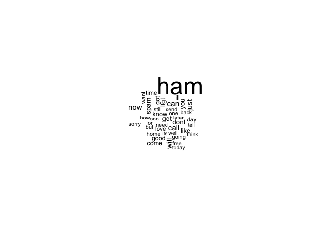

Probabilistic Learning - Classification Using Naive Bayes
================
Emma Grossman
4/14/2021

# Understanding Naive Bayes

Bayesian classifiers use training data to obtain probability of each
outcome based on evidence provided by feature values. It uses these
probabilities to classify unlabeled data later on. Bayesian classifiers
work particularly well when there are variables with weak effects;
combining all variables with weak effects could have a large impact on
the model.

… Lots of information about probabilities…

## The Naive Bayes algorithm

Naive Bayes isn’t the only Bayesian algorithm but it is the most popular
because of its early success in text classification.

Strengths: - simple, fast and effective - does well with noisy and
missing data - few examples required but also excels with large number
of examples - easy to obtain estimated probability for prediction

Weaknesses: - relies on often-faulty assumption of equally important and
independent features - not ideal for datasets with may numeric features
- estimated probabilities are less reliable than the predicted classes

It is called “naive” because it makes some “naive” assumptions about the
data, like that all features are equally important and independent,
which is rarely the case. The algorithm still performs fairly well,
however when these assumptions are violated.

It assumes **class-conditional independence** which means that events
are independent so long as they are conditioned on the same class value.

## The Laplace estimator

If one of the variables we are considering has a zero, this makes our
outcome probabilities 0 and 1 (assuming two outcomes), which is
unlikely. To counter this, we use the **Laplace estimator**, which adds
a small number to each count to ensure each feature has a non-zero
probability of occurring with each class. The number added to each count
is almost always 1.

The Laplace estimator was not added to our prior probabilities, though
it was added to the numerator and denominator of the likelihoods.

## Using numeric features with Naive Bayes

Naive Bayes works with categorical data, so to include numeric features,
we must **discretize** them by placing them into **bins**, called
**binning**. This method works well with a large training data set.

The first method for putting continuous data into discrete bins is to
find natural categories, or **cut points**. With no obvious cut points,
we can bin the data using quantiles. We need to keep in mind that we are
reducing our information by discretizing our continuous variables, so it
is important to strike a balance between too many bins (less information
loss) and too few bins (more information loss).

# Example - Filtering mobile phone spam with the Naive Bayes algorithm

## Step 1 - collecting data

## Step 2 - exploring and preparing the data

``` r
SMSSpamCollection <- read.delim("~/Documents/School/OSU/6. Spring 2021/R&C/explore-ML-and-DS-techniques/MLwR/smsspamcollection/SMSSpamCollection", 
                                header=FALSE, stringsAsFactors = FALSE)
```

    ## Warning in scan(file = file, what = what, sep = sep, quote = quote, dec = dec, :
    ## EOF within quoted string

``` r
str(SMSSpamCollection)
```

    ## 'data.frame':    3184 obs. of  2 variables:
    ##  $ V1: chr  "ham" "ham" "spam" "ham" ...
    ##  $ V2: chr  "Go until jurong point, crazy.. Available only in bugis n great world la e buffet... Cine there got amore wat..." "Ok lar... Joking wif u oni..." "Free entry in 2 a wkly comp to win FA Cup final tkts 21st May 2005. Text FA to 87121 to receive entry question("| __truncated__ "U dun say so early hor... U c already then say..." ...

``` r
SMS_raw <- SMSSpamCollection %>%
  mutate(
    type = as.factor(V1),
    text = V2
  )%>%
  select(c(type, text))
```

``` r
table(SMS_raw$type)
```

    ## 
    ##  ham spam 
    ## 2746  438

### Data preparation - cleaning and standardizing text data

`tm` is a text mining package in R that allows us to work easily with
data.

``` r
# install.packages("tm")
library(tm)
```

    ## Loading required package: NLP

    ## 
    ## Attaching package: 'NLP'

    ## The following object is masked from 'package:ggplot2':
    ## 
    ##     annotate

We need to create a **corpora** for our data.

``` r
sms_corpus <- VCorpus(VectorSource(SMS_raw$text))
print(sms_corpus)
```

    ## <<VCorpus>>
    ## Metadata:  corpus specific: 0, document level (indexed): 0
    ## Content:  documents: 3184

``` r
inspect(sms_corpus[1:2])
```

    ## <<VCorpus>>
    ## Metadata:  corpus specific: 0, document level (indexed): 0
    ## Content:  documents: 2
    ## 
    ## [[1]]
    ## <<PlainTextDocument>>
    ## Metadata:  7
    ## Content:  chars: 111
    ## 
    ## [[2]]
    ## <<PlainTextDocument>>
    ## Metadata:  7
    ## Content:  chars: 29

To view the content of a text message, we must use `as.character()`

``` r
as.character(sms_corpus[[1]])
```

    ## [1] "Go until jurong point, crazy.. Available only in bugis n great world la e buffet... Cine there got amore wat..."

``` r
lapply(sms_corpus[1:2], as.character)
```

    ## $`1`
    ## [1] "Go until jurong point, crazy.. Available only in bugis n great world la e buffet... Cine there got amore wat..."
    ## 
    ## $`2`
    ## [1] "Ok lar... Joking wif u oni..."

We want to now standardize our corpus so that punctuation and
capitalization isn’t getting in the way of our analysis.

``` r
sms_corpus_clean <- tm_map(sms_corpus,
                           content_transformer(tolower))
```

Let’s check if this worked as expected:

``` r
as.character(sms_corpus[[1]])
```

    ## [1] "Go until jurong point, crazy.. Available only in bugis n great world la e buffet... Cine there got amore wat..."

``` r
as.character(sms_corpus_clean[[1]])
```

    ## [1] "go until jurong point, crazy.. available only in bugis n great world la e buffet... cine there got amore wat..."

We can continue cleaning up by removing any numbers found in the texts.

``` r
sms_corpus_clean <- tm_map(sms_corpus_clean, removeNumbers)
```

We’ll use the `stopwords()` function to remove **stop words** like *to,
and, but,* and *or* which help English make sense but don’t provide any
useful information.

``` r
sms_corpus_clean <- tm_map(sms_corpus_clean, removeWords, stopwords())
```

We can also remove punctuation.

``` r
sms_corpus_clean <- tm_map(sms_corpus_clean, removePunctuation)
```

We can also use **stemming** which is a process that reduces words to
their root form. *learned, learning,* and *learns* would be stripped of
their suffixes so that the machine learning algorithm won’t treat
different forms of a word as different words.

The `tm` package uses the `SnowballC` package to stem words, but it is
not automatically installed by default.

``` r
# install.packages("SnowballC")
library(SnowballC)
wordStem(c("learn", "learned", "learning", "learns"))
```

    ## [1] "learn" "learn" "learn" "learn"

``` r
sms_corpus_clean <- tm_map(sms_corpus_clean, stemDocument)
```

After all of these modifications, our text variable is left with blank
spaces that once separated the removed pieces. Let’s also remove these.

``` r
sms_corpus_clean <-  tm_map(sms_corpus_clean, stripWhitespace)
```

Let’s look at a comparison of before and after the modifications.

``` r
lapply(sms_corpus[1:3], as.character)
```

    ## $`1`
    ## [1] "Go until jurong point, crazy.. Available only in bugis n great world la e buffet... Cine there got amore wat..."
    ## 
    ## $`2`
    ## [1] "Ok lar... Joking wif u oni..."
    ## 
    ## $`3`
    ## [1] "Free entry in 2 a wkly comp to win FA Cup final tkts 21st May 2005. Text FA to 87121 to receive entry question(std txt rate)T&C's apply 08452810075over18's"

``` r
lapply(sms_corpus_clean[1:3], as.character)
```

    ## $`1`
    ## [1] "go jurong point crazi avail bugi n great world la e buffet cine got amor wat"
    ## 
    ## $`2`
    ## [1] "ok lar joke wif u oni"
    ## 
    ## $`3`
    ## [1] "free entri wkli comp win fa cup final tkts st may text fa receiv entri questionstd txt ratetc appli s"

### Data preparation - splitting text documents into words

We now want to split the messages into individual terms with
**tokenization**. We can do this with `DocumentTermMatrix()`, which
creates a data structure called a **document-term matrix (DTM)**: rows
are documents and columns are terms. These are called **sparse matrix**
because there are many zeros in each row.

``` r
sms_dtm <- DocumentTermMatrix(sms_corpus_clean)
```

We can set arguments of `DocumentTermMatrix()` to do the preprocessing
that we performed manually, but there is a slight difference.

``` r
sms_dtm2 <- DocumentTermMatrix(sms_corpus, control = list(
  tolower = TRUE,
  removeNumbers = TRUE,
  stopwords = TRUE,
  removePunctuation = TRUE,
  stemming = TRUE
))
```

``` r
sms_dtm
```

    ## <<DocumentTermMatrix (documents: 3184, terms: 6605)>>
    ## Non-/sparse entries: 33316/20997004
    ## Sparsity           : 100%
    ## Maximal term length: 40
    ## Weighting          : term frequency (tf)

``` r
sms_dtm2
```

    ## <<DocumentTermMatrix (documents: 3184, terms: 7012)>>
    ## Non-/sparse entries: 34286/22291922
    ## Sparsity           : 100%
    ## Maximal term length: 40
    ## Weighting          : term frequency (tf)

The reasons these are different is because of how we ordered the
preprocessing steps. `DocumentTermMatrix()` applies its cleanup
functions to the text after the have been split into words so some words
are split differently. Order of operations matter.

### Data preparation - creating training and test datasets

``` r
set.seed(822)
smp_size <- floor(0.75 * nrow(sms_dtm))
train_id <- sample(1:nrow(sms_dtm), smp_size)
sms_dtm_train <- sms_dtm[train_id,]
sms_dtm_test  <- sms_dtm[-train_id,]
```

It will be convenient later on to have the labels corresponding the the
testing and training data set, so let’s go ahead and create them now.

``` r
sms_train_labels <- SMS_raw[train_id,]$type
sms_test_labels  <- SMS_raw[-train_id,]$type
```

And let’s now confirm that the proportions of our training/testing data
are about equal.

``` r
prop.table(table(sms_train_labels))
```

    ## sms_train_labels
    ##       ham      spam 
    ## 0.8643216 0.1356784

``` r
prop.table(table(sms_test_labels))
```

    ## sms_test_labels
    ##       ham      spam 
    ## 0.8567839 0.1432161

Since both data sets contain about 13% spam data, it seems the spam
messages were divided evenly between the data sets.

### Visualizing text data - word clouds

``` r
# install.packages("wordcloud")
library(wordcloud)
```

    ## Loading required package: RColorBrewer

Let’s put this in action.

``` r
wordcloud(sms_corpus_clean, min.freq = 50, random.order = FALSE)
```

<!-- -->

``` r
# default min.freq is 3
# bc FALSE, words are plotting in decrease frequency
```

Let’s see what the wordcloud looks like split but spam and not spam.

``` r
spam <- SMS_raw %>%
  filter(type == "spam")
ham <- SMS_raw %>%
  filter(type == "ham")

wordcloud(spam$text, max.words = 40, scale = c(3, 0.5))
```

    ## Warning in tm_map.SimpleCorpus(corpus, tm::removePunctuation): transformation
    ## drops documents

    ## Warning in tm_map.SimpleCorpus(corpus, function(x) tm::removeWords(x,
    ## tm::stopwords())): transformation drops documents

<!-- -->

``` r
wordcloud(ham$text, max.words = 40, scale = c(3, 0.5))
```

    ## Warning in tm_map.SimpleCorpus(corpus, tm::removePunctuation): transformation
    ## drops documents
    
    ## Warning in tm_map.SimpleCorpus(corpus, tm::removePunctuation): transformation
    ## drops documents

<!-- -->

``` r
# max.words looks at the 40 most common words
# scale adjusts the max and min font size
```

If there is not a lot of overlap in the common words of our word cloud,
Naive Bayes will likely be very successful.

### Data preparation - creating indicator features for frequent words

Since there are so many unique words in all of the texts, we can reduce
the number of features by eliminating words that appear in less than 5
messages.

We can use the `findFreqTerms()` function which takes a DTM and returns
a character vector containing the words that appear a specified number
of times.

``` r
sms_freq_words <- findFreqTerms(sms_dtm_train, 5)
str(sms_freq_words)
```

    ##  chr [1:1144] "abiola" "abl" "abt" "accept" "access" "account" "across" ...

So, there are 1144 words appearing in at least 5 different text
messages.

Now we want to subset and only include these 1144 words.

``` r
sms_dtm_freq_train <- sms_dtm_train[, sms_freq_words]
sms_dtm_freq_test  <- sms_dtm_test[, sms_freq_words]
```

Since Naive Bayes is expecting categorical data, we need to convert all
of our features to categorical data.

``` r
convert_counts <- function(x){
  x <- ifelse(x > 0, "Yes", "No")
}
```

We can apply this function to all of the features in our data with
`apply()`.

``` r
# MARGIN = 2 tells apply() to apply the function to the columns
sms_train <- apply(sms_dtm_freq_train, MARGIN = 2, convert_counts)
sms_test  <- apply(sms_dtm_freq_test,  MARGIN = 2, convert_counts)
```

## Step 3 - training a model on the data

We’re going to use the Naive Bayes estimator in the `e1071` package.

``` r
# install.packages("e1071")
library(e1071)

sms_classifier <- naiveBayes(sms_train, sms_train_labels)
```

## Step 4 - evaluating the model performance

``` r
sms_test_pred <- predict(sms_classifier, sms_test)
```

And let’s look at the confusion matrix.

``` r
library(gmodels)
CrossTable(sms_test_pred, sms_test_labels,
           prop.chisq = FALSE, prop.c = FALSE, prop.r = FALSE,
           dnn = c("predicted", "actual"))
```

    ## 
    ##  
    ##    Cell Contents
    ## |-------------------------|
    ## |                       N |
    ## |         N / Table Total |
    ## |-------------------------|
    ## 
    ##  
    ## Total Observations in Table:  796 
    ## 
    ##  
    ##              | actual 
    ##    predicted |       ham |      spam | Row Total | 
    ## -------------|-----------|-----------|-----------|
    ##          ham |       680 |        16 |       696 | 
    ##              |     0.854 |     0.020 |           | 
    ## -------------|-----------|-----------|-----------|
    ##         spam |         2 |        98 |       100 | 
    ##              |     0.003 |     0.123 |           | 
    ## -------------|-----------|-----------|-----------|
    ## Column Total |       682 |       114 |       796 | 
    ## -------------|-----------|-----------|-----------|
    ## 
    ## 

So 18/1144 = 1.57% SMS messages were misclassifed. This is pretty good\!

## Step 5 - improving model performance

We can add a Laplace estimator when training the model.

``` r
sms_classifier2 <- naiveBayes(sms_train, sms_train_labels, laplace = 1)
sms_test_pred2 <- predict(sms_classifier2, sms_test)
CrossTable(sms_test_pred2, sms_test_labels,
           prop.chisq = FALSE, prop.c = FALSE, prop.r = FALSE,
           dnn = c("predicted", "actual"))
```

    ## 
    ##  
    ##    Cell Contents
    ## |-------------------------|
    ## |                       N |
    ## |         N / Table Total |
    ## |-------------------------|
    ## 
    ##  
    ## Total Observations in Table:  796 
    ## 
    ##  
    ##              | actual 
    ##    predicted |       ham |      spam | Row Total | 
    ## -------------|-----------|-----------|-----------|
    ##          ham |       680 |        22 |       702 | 
    ##              |     0.854 |     0.028 |           | 
    ## -------------|-----------|-----------|-----------|
    ##         spam |         2 |        92 |        94 | 
    ##              |     0.003 |     0.116 |           | 
    ## -------------|-----------|-----------|-----------|
    ## Column Total |       682 |       114 |       796 | 
    ## -------------|-----------|-----------|-----------|
    ## 
    ## 

The laplace estimator made the model less accurate with the data I had…
(not the case for the book example).
