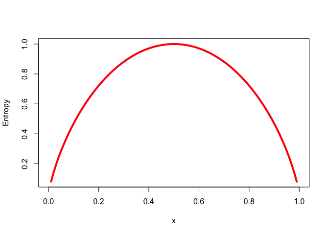

Divide and Conquer - Classification Using Decision Trees and Rules
================
Emma Grossman
4/19/2021

Decision Trees and rule learners make complex decisions form sets of
simple choices. The result is logical structures that require little
statistical knowledge, which is very useful for business strategy and
process improvement.

# Understanding decision trees

Called “decision trees” because of their **tree structure**, these
classifiers uses a structure of branches that channel examples into a
final predicted class value.

Decision trees begin with a **root node**, then moves to **decision
nodes**, both of which ask a binary question. With the question
answered, data are filtered by **branches** which indicate potential
outcomes of a decision. **Leaf nodes**, or **terminal nodes** as they
are also called, denote the action to be taken as a result of the
question answers.

The format of a decision tree is especially helpful for humans, since it
is very intuitive to understand. This means it is quite easy to identify
why a model works well or doesn’t. Additionally, if a model needs to be
transparent for legal reasons, like credit scoring models, marketing
studies, and diagnosis of medical conditions.

> Decision trees are the single most widely used machine learning
> technique, and can be applied for modeling almost any type of data -
> often with excellent out-of-the-box performance.

That being said, in cases where our data has many nominal features with
many levels or a large number of numeric data, decision trees might
generate a very complex tree and they already have a tendency to overfit
the data.

## Divide and conquer

**Divide and conquer**, also known as **recursive partitioning**, is the
method underlying decision trees because they split the data into
subsets, split those subsets into smaller subsets and so on until the
algorithm decides the subgroups are sufficiently homogeneous or another
stopping criterion is reached.

Ideally, the root node is a feature that is most predictive of the
target class, and a branch is created based on this node. The algorithm
continues to chose features for decision nodes until the stopping
criterion is reached. Some examples of stopping criterion are:

1.  most examples at the node have the same class
2.  all features have been used
3.  tree has grown to predetermined size limit

A drawback of decision trees is that it only considers one feature at a
time and thus can only make **axis-parallel splits** and not diagonal
splits.

# The C5.0 decision tree algorithm

The C5.0 decision tree algorithm is generally the industry standard for
computing decision trees.

Strengths:

  - does well on many types of problems
  - handles numeric, nominal and missing data well
  - excludes unimportant features
  - small and large data sets
  - model and be interpreted by folks with non-mathematical background
    (small trees)
  - more efficient than complex models

Weaknesses

  - biases toward models that split of features that have a large number
    of levels
  - easy to overfit or underfit
  - some relationships are difficult to model because of axis-parallel
    split restraint
  - sensitive to small changes in training data
  - large trees can be difficult to interpret and may be
    counterintuitive

## Chosing the best split

The first challenge of a decision tree is deciding where to split a
feature. Subsets that result in a single class are **pure** and subsets
are measured by their **purity**. C5.0 uses **entropy** to measure
purity. High entropy means data are diverse and provide little
information about other features. Entropy is typically measured in
**bits**; with two classes the range of possible values is 0 to 1 and
with all other classes the range is 0 to \(\log_2(n)\). For all cases,
lower values are better and 0 indicates homogeneity while the maximum
indicates the most diverse possible.

\[ \text{Engropy}(S) = \sum_{i=1}^{c} - p_i\log_2(p_i)\] S = a given
segment of our data \(c\) = number of class levels \(p_i\) = proportion
of values falling into class level i

For example, with two classes red (60%) and white (40%):

``` r
-.60*log2(0.6) - 0.4*log2(0.4)
```

    ## [1] 0.9709506

And we can visualize this as well:

``` r
curve(-x *log2(x)-(1-x)*log2(1-x),
      col = "red", xlab = "x", ylab = "Entropy", lwd = 4)
```

<!-- -->

In order to use entropy to find the best feature to split on, the
algorithm calculates **information gain** which is the change in
homogeneity that results from a split on each possible feature. To
calculate the information gain for feature \(F\), we find the distance
between the entropy of the segment before the split (\(S_1\)) and the
partitions resulting from the split (\(S_2\)): $ (F) = (S\_1) - (S\_2)$.

This can be complicated, though, if after the split, the data is divided
into more than one partition. We would then need to consider the total
entropy across all partitions. To do this, each partition’s entropy is
weighted according to the proportion of all records falling into that
partition. The formula is then $ (S) = \_{i=1}^{n}w\_i(P\_i)$.

The higher the information gain, the better a feature is a creating
homogeneous groups

## Pruning the decision tree

In order to avoid overfitting the training data, we **prune** the
decision tree. One way to prune is to tell the tree to stop growing once
a certain number of decisions have been made, called **early stopping**
or **pre-pruning**. The result is that the tree doesn’t perform needless
tasks but it could also miss subtle but important patterns by stopping
early. The other way to prune is **post-pruning**, which allows a large
tree to grow, then prunes leaf nodes to reduce the size of the tree.
This is generally more effective than pre-pruning.

The C5.0 algorithm does most of the work for us and will prune leaves or
branches with fairly reasonable defaults. The process of removing entire
branches and replacing them with smaller decisions is known as **subtree
raising** and **subtree replacement**.

# Example - identifying risky bank loans using C5.0 decision trees

``` r
credit <- read.csv("https://raw.githubusercontent.com/stedy/Machine-Learning-with-R-datasets/master/credit.csv", header = TRUE)
```

## Step 2 - exploring and preparing the data

``` r
str(credit)
```

    ## 'data.frame':    1000 obs. of  21 variables:
    ##  $ checking_balance    : Factor w/ 4 levels "< 0 DM","> 200 DM",..: 1 3 4 1 1 4 4 3 4 3 ...
    ##  $ months_loan_duration: int  6 48 12 42 24 36 24 36 12 30 ...
    ##  $ credit_history      : Factor w/ 5 levels "critical","delayed",..: 1 5 1 5 2 5 5 5 5 1 ...
    ##  $ purpose             : Factor w/ 10 levels "business","car (new)",..: 8 8 5 6 2 5 6 3 8 2 ...
    ##  $ amount              : int  1169 5951 2096 7882 4870 9055 2835 6948 3059 5234 ...
    ##  $ savings_balance     : Factor w/ 5 levels "< 100 DM","> 1000 DM",..: 5 1 1 1 1 5 4 1 2 1 ...
    ##  $ employment_length   : Factor w/ 5 levels "> 7 yrs","0 - 1 yrs",..: 1 3 4 4 3 3 1 3 4 5 ...
    ##  $ installment_rate    : int  4 2 2 2 3 2 3 2 2 4 ...
    ##  $ personal_status     : Factor w/ 4 levels "divorced male",..: 4 2 4 4 4 4 4 4 1 3 ...
    ##  $ other_debtors       : Factor w/ 3 levels "co-applicant",..: 3 3 3 2 3 3 3 3 3 3 ...
    ##  $ residence_history   : int  4 2 3 4 4 4 4 2 4 2 ...
    ##  $ property            : Factor w/ 4 levels "building society savings",..: 3 3 3 1 4 4 1 2 3 2 ...
    ##  $ age                 : int  67 22 49 45 53 35 53 35 61 28 ...
    ##  $ installment_plan    : Factor w/ 3 levels "bank","none",..: 2 2 2 2 2 2 2 2 2 2 ...
    ##  $ housing             : Factor w/ 3 levels "for free","own",..: 2 2 2 1 1 1 2 3 2 2 ...
    ##  $ existing_credits    : int  2 1 1 1 2 1 1 1 1 2 ...
    ##  $ default             : int  1 2 1 1 2 1 1 1 1 2 ...
    ##  $ dependents          : int  1 1 2 2 2 2 1 1 1 1 ...
    ##  $ telephone           : Factor w/ 2 levels "none","yes": 2 1 1 1 1 2 1 2 1 1 ...
    ##  $ foreign_worker      : Factor w/ 2 levels "no","yes": 2 2 2 2 2 2 2 2 2 2 ...
    ##  $ job                 : Factor w/ 4 levels "mangement self-employed",..: 2 2 4 2 2 4 2 1 4 1 ...

``` r
credit <- credit %>%
  mutate(
    default = as.factor(ifelse(default==1,"no","yes")),
    existing_credits = as.factor(existing_credits),
    dependents = as.factor(dependents)
  )
```

There are some variables that seem likely to predict a default and we
can check those out with `table()`.

``` r
table(credit$checking_balance)
```

    ## 
    ##     < 0 DM   > 200 DM 1 - 200 DM    unknown 
    ##        274         63        269        394

``` r
table(credit$savings_balance)
```

    ## 
    ##      < 100 DM     > 1000 DM  101 - 500 DM 501 - 1000 DM       unknown 
    ##           603            48           103            63           183

DM stands for Deutsche Mark, which was the currency used in Germany
(where this data originated from) before they adopted the Euro.

``` r
summary(credit$months_loan_duration)
```

    ##    Min. 1st Qu.  Median    Mean 3rd Qu.    Max. 
    ##     4.0    12.0    18.0    20.9    24.0    72.0

``` r
summary(credit$amount)
```

    ##    Min. 1st Qu.  Median    Mean 3rd Qu.    Max. 
    ##     250    1366    2320    3271    3972   18424

We can also look at whether folks defaulted on their loans:

``` r
table(credit$default)
```

    ## 
    ##  no yes 
    ## 700 300

### Data preperation - creating random training and test datasets

``` r
# we want 90% of the data in the training set and 10% in the testing set
set.seed(843)
train_sample <- sample(nrow(credit), nrow(credit)*0.9)
```

``` r
credit_train <- credit[train_sample,]
credit_test  <- credit[-train_sample,]
```

There should still be about 30% of folks defaulting on the loan for each
data set, so let’s make sure that is the case:

``` r
prop.table(table(credit_train$default))
```

    ## 
    ##        no       yes 
    ## 0.6977778 0.3022222

``` r
prop.table(table(credit_test$default))
```

    ## 
    ##   no  yes 
    ## 0.72 0.28

That is satisfactory.

## Step 3 - training a model on the data

``` r
# install.packages("C50")
library(C50)
```

Creating the C5.0 model

``` r
credit_model <- C5.0(credit_train[-17], credit_train$default)
credit_model
```

    ## 
    ## Call:
    ## C5.0.default(x = credit_train[-17], y = credit_train$default)
    ## 
    ## Classification Tree
    ## Number of samples: 900 
    ## Number of predictors: 20 
    ## 
    ## Tree size: 64 
    ## 
    ## Non-standard options: attempt to group attributes

To see the tree’s decisions we can use `summary()`

``` r
summary(credit_model)
```

    ## 
    ## Call:
    ## C5.0.default(x = credit_train[-17], y = credit_train$default)
    ## 
    ## 
    ## C5.0 [Release 2.07 GPL Edition]      Wed Apr 21 10:00:18 2021
    ## -------------------------------
    ## 
    ## Class specified by attribute `outcome'
    ## 
    ## Read 900 cases (21 attributes) from undefined.data
    ## 
    ## Decision tree:
    ## 
    ## checking_balance in {> 200 DM,unknown}: no (411/54)
    ## checking_balance in {< 0 DM,1 - 200 DM}:
    ## :...months_loan_duration <= 22:
    ##     :...other_debtors = co-applicant:
    ##     :   :...age <= 39: no (8/1)
    ##     :   :   age > 39: yes (2)
    ##     :   other_debtors = guarantor:
    ##     :   :...purpose in {business,car (used),domestic appliances,education,
    ##     :   :   :           furniture,others,radio/tv,repairs,retraining}: no (23)
    ##     :   :   purpose = car (new):
    ##     :   :   :...credit_history in {critical,delayed,fully repaid,
    ##     :   :       :                  fully repaid this bank}: yes (3)
    ##     :   :       credit_history = repaid: no (1)
    ##     :   other_debtors = none:
    ##     :   :...credit_history in {critical,delayed}: no (76/13)
    ##     :       credit_history = fully repaid this bank: yes (15/2)
    ##     :       credit_history in {fully repaid,repaid}:
    ##     :       :...savings_balance in {> 1000 DM,501 - 1000 DM}: no (16/1)
    ##     :           savings_balance in {< 100 DM,101 - 500 DM,unknown}:
    ##     :           :...job = mangement self-employed:
    ##     :               :...amount <= 7582: no (10/1)
    ##     :               :   amount > 7582: yes (3)
    ##     :               job = unemployed non-resident:
    ##     :               :...savings_balance in {< 100 DM,
    ##     :               :   :                   101 - 500 DM}: yes (3)
    ##     :               :   savings_balance = unknown: no (3/1)
    ##     :               job = unskilled resident:
    ##     :               :...installment_plan = none: no (28/8)
    ##     :               :   installment_plan = stores: yes (1)
    ##     :               :   installment_plan = bank:
    ##     :               :   :...checking_balance = < 0 DM: no (1)
    ##     :               :       checking_balance = 1 - 200 DM: yes (3)
    ##     :               job = skilled employee:
    ##     :               :...personal_status = divorced male: yes (3/1)
    ##     :                   personal_status = married male:
    ##     :                   :...telephone = none: yes (6/1)
    ##     :                   :   telephone = yes: no (4)
    ##     :                   personal_status = single male:
    ##     :                   :...savings_balance in {101 - 500 DM,
    ##     :                   :   :                   unknown}: no (10/1)
    ##     :                   :   savings_balance = < 100 DM:
    ##     :                   :   :...existing_credits = 1: no (15/6)
    ##     :                   :       existing_credits in {2,3,4}: yes (4)
    ##     :                   personal_status = female:
    ##     :                   :...residence_history <= 1:
    ##     :                       :...checking_balance = < 0 DM: no (4)
    ##     :                       :   checking_balance = 1 - 200 DM:
    ##     :                       :   :...amount <= 1424: yes (2)
    ##     :                       :       amount > 1424: no (2)
    ##     :                       residence_history > 1:
    ##     :                       :...residence_history <= 3: yes (14)
    ##     :                           residence_history > 3:
    ##     :                           :...amount <= 2273: yes (10/2)
    ##     :                               amount > 2273: no (6/1)
    ##     months_loan_duration > 22:
    ##     :...savings_balance in {> 1000 DM,unknown}:
    ##         :...checking_balance = < 0 DM:
    ##         :   :...existing_credits = 4: yes (0)
    ##         :   :   existing_credits in {2,3}: no (3)
    ##         :   :   existing_credits = 1:
    ##         :   :   :...installment_rate <= 2: no (3/1)
    ##         :   :       installment_rate > 2: yes (8/1)
    ##         :   checking_balance = 1 - 200 DM:
    ##         :   :...amount <= 9960: no (17)
    ##         :       amount > 9960:
    ##         :       :...installment_rate <= 1: yes (2)
    ##         :           installment_rate > 1: no (2)
    ##         savings_balance in {< 100 DM,101 - 500 DM,501 - 1000 DM}:
    ##         :...months_loan_duration > 42: yes (36/6)
    ##             months_loan_duration <= 42:
    ##             :...other_debtors = co-applicant: yes (11/3)
    ##                 other_debtors = guarantor:
    ##                 :...checking_balance = < 0 DM: no (5)
    ##                 :   checking_balance = 1 - 200 DM: yes (2)
    ##                 other_debtors = none:
    ##                 :...purpose in {domestic appliances,others,repairs,
    ##                     :           retraining}: yes (2)
    ##                     purpose = car (used):
    ##                     :...age <= 28: yes (6/1)
    ##                     :   age > 28: no (14/1)
    ##                     purpose = education:
    ##                     :...employment_length in {0 - 1 yrs,4 - 7 yrs}: no (3)
    ##                     :   employment_length in {> 7 yrs,1 - 4 yrs,
    ##                     :                         unemployed}: yes (4)
    ##                     purpose = furniture:
    ##                     :...installment_plan in {bank,none}: yes (22/5)
    ##                     :   installment_plan = stores: no (3)
    ##                     purpose = car (new):
    ##                     :...savings_balance = 501 - 1000 DM: yes (0)
    ##                     :   savings_balance = < 100 DM:
    ##                     :   :...installment_rate <= 2: no (3/1)
    ##                     :   :   installment_rate > 2: yes (16/1)
    ##                     :   savings_balance = 101 - 500 DM:
    ##                     :   :...job = mangement self-employed: yes (1)
    ##                     :       job in {skilled employee,unemployed non-resident,
    ##                     :               unskilled resident}: no (4)
    ##                     purpose = business:
    ##                     :...savings_balance = 501 - 1000 DM: yes (0)
    ##                     :   savings_balance = 101 - 500 DM:
    ##                     :   :...personal_status = female: yes (1)
    ##                     :   :   personal_status in {divorced male,married male,
    ##                     :   :                       single male}: no (4)
    ##                     :   savings_balance = < 100 DM:
    ##                     :   :...telephone = none: no (3)
    ##                     :       telephone = yes:
    ##                     :       :...dependents = 1: yes (8)
    ##                     :           dependents = 2: no (3/1)
    ##                     purpose = radio/tv:
    ##                     :...dependents = 2: yes (4)
    ##                         dependents = 1:
    ##                         :...employment_length in {> 7 yrs,4 - 7 yrs,
    ##                             :                     unemployed}: no (7)
    ##                             employment_length in {0 - 1 yrs,1 - 4 yrs}:
    ##                             :...amount <= 2708: yes (9)
    ##                                 amount > 2708:
    ##                                 :...job in {mangement self-employed,
    ##                                     :       unemployed non-resident,
    ##                                     :       unskilled resident}: no (2)
    ##                                     job = skilled employee:
    ##                                     :...installment_rate <= 2: no (2)
    ##                                         installment_rate > 2: yes (3)
    ## 
    ## 
    ## Evaluation on training data (900 cases):
    ## 
    ##      Decision Tree   
    ##    ----------------  
    ##    Size      Errors  
    ## 
    ##      61  114(12.7%)   <<
    ## 
    ## 
    ##     (a)   (b)    <-classified as
    ##    ----  ----
    ##     605    23    (a): class no
    ##      91   181    (b): class yes
    ## 
    ## 
    ##  Attribute usage:
    ## 
    ##  100.00% checking_balance
    ##   54.33% months_loan_duration
    ##   46.44% other_debtors
    ##   40.11% savings_balance
    ##   27.00% credit_history
    ##   16.78% purpose
    ##   16.00% job
    ##    9.44% personal_status
    ##    7.78% amount
    ##    6.44% installment_plan
    ##    4.33% installment_rate
    ##    4.22% residence_history
    ##    4.22% dependents
    ##    3.67% existing_credits
    ##    3.33% employment_length
    ##    3.33% age
    ##    2.67% telephone
    ## 
    ## 
    ## Time: 0.0 secs

Interpreting the first few lines in plain language:

1.  If the checking account balance is unknown or greater than 200 DM,
    then classify as “not likely to default”
2.  Otherwise, if the checking account balance is less than zero DM or
    between one and 200 DM…
3.  … and the credit history is perfect or very good, the classify as
    “likely to default”

The numbers in the parentheses indicate the number of correct and
incorrect examples in that decision. So for (411/54), it means that 411
were correctly classified by the decision and 54 defaulted when it
predicted they would not.

A confusion matrix is also produced. The model correctly classified all
by 114 cases, which is an error rater of 12.7%. 23 cases were classified
as default when they did not default while 91 folks who were predicted
not to default did.

Decision trees have a tendency to overfit the data, so the error rate
produced by this confusion matrix might be optimistic.

## Step 4 - evaluating model performance

``` r
credit_pred <- predict(credit_model, credit_test)
```

``` r
library(gmodels)
CrossTable(credit_test$default, credit_pred,
           prop.chisq = FALSE, prop.c = FALSE, prop.r = FALSE,
             dnn = c("actual default", "predicted default"))
```

    ## 
    ##  
    ##    Cell Contents
    ## |-------------------------|
    ## |                       N |
    ## |         N / Table Total |
    ## |-------------------------|
    ## 
    ##  
    ## Total Observations in Table:  100 
    ## 
    ##  
    ##                | predicted default 
    ## actual default |        no |       yes | Row Total | 
    ## ---------------|-----------|-----------|-----------|
    ##             no |        66 |         6 |        72 | 
    ##                |     0.660 |     0.060 |           | 
    ## ---------------|-----------|-----------|-----------|
    ##            yes |        14 |        14 |        28 | 
    ##                |     0.140 |     0.140 |           | 
    ## ---------------|-----------|-----------|-----------|
    ##   Column Total |        80 |        20 |       100 | 
    ## ---------------|-----------|-----------|-----------|
    ## 
    ## 

The model correctly classified 66 cases as not defaulting and 14 as
defaulting. It incorrectly predicted that 6 people would default who
didn’t and 14 people as not defaulting but did. Let’s see if we can
improve this.

## Step 5 - improving model performance

### Boosting the accuracy of decision trees

We can boost performance by combining several models. By using the
`trials` argument of the `C5.0()` function, we can ask the function to
create several trees and use the boosted team. It is an upper limit, so
if the algorithm determines that it has enough trees before reaching the
`trials` number, it will stop. 10 is fairly standard to start with.

``` r
credit_boost10 <- C5.0(credit_train[-17], credit_train$default,
                       trials = 10)
credit_boost10
```

    ## 
    ## Call:
    ## C5.0.default(x = credit_train[-17], y = credit_train$default, trials = 10)
    ## 
    ## Classification Tree
    ## Number of samples: 900 
    ## Number of predictors: 20 
    ## 
    ## Number of boosting iterations: 10 
    ## Average tree size: 50.5 
    ## 
    ## Non-standard options: attempt to group attributes

Our tree size shrunk from 64 to 50.5, which is a large decrease. Let’s
take a look at the confusion matrix.

``` r
# summary(credit_boost10)

# (a)   (b)    <-classified as
# ----  ----
#  628          (a): class 1
#   19   253    (b): class 2
```

Only 19 mistakes were made, which is an improvement.

``` r
credit_boost_pred10 <- predict(credit_boost10, credit_test)

CrossTable(credit_test$default, credit_boost_pred10,
           prop.chisq = FALSE, prop.c = FALSE, prop.r = FALSE,
             dnn = c("actual default", "predicted default"))
```

    ## 
    ##  
    ##    Cell Contents
    ## |-------------------------|
    ## |                       N |
    ## |         N / Table Total |
    ## |-------------------------|
    ## 
    ##  
    ## Total Observations in Table:  100 
    ## 
    ##  
    ##                | predicted default 
    ## actual default |        no |       yes | Row Total | 
    ## ---------------|-----------|-----------|-----------|
    ##             no |        65 |         7 |        72 | 
    ##                |     0.650 |     0.070 |           | 
    ## ---------------|-----------|-----------|-----------|
    ##            yes |        12 |        16 |        28 | 
    ##                |     0.120 |     0.160 |           | 
    ## ---------------|-----------|-----------|-----------|
    ##   Column Total |        77 |        23 |       100 | 
    ## ---------------|-----------|-----------|-----------|
    ## 
    ## 

While this is an improvement, we are still not doing super well at
predicting defaults, with only 16/28 = 57% predicted correctly.

Why do we automatically apply boosting, if it is so helpful? A couple
reasons, (1) they can take a lot of time and (2) if our data is noisy
sometimes it won’t improve our results at all.

### Making some mistakes cost more than others

We could mitigate the false negatives by rejecting more people who are
on the cusp of default/non-default. The C5.0 algorithm allows us to
weigh the errors differently, so that a tree will not make costly
mistakes. A **cost matrix** specifies how much more costly each error is
relative to any other.

``` r
matrix_dimensions <- list(c("no", "yes"), c("no", "yes"))
names(matrix_dimensions) <- c("predicted", "actual")
matrix_dimensions
```

    ## $predicted
    ## [1] "no"  "yes"
    ## 
    ## $actual
    ## [1] "no"  "yes"

We can now fill in the costs, though the ordering is specific and we
should be careful.

``` r
error_cost <- matrix(c(0,1,4,0), nrow = 2,
                     dimnames = matrix_dimensions)
error_cost
```

    ##          actual
    ## predicted no yes
    ##       no   0   4
    ##       yes  1   0

There is no cost associated with correct interpretations, but false
negatives cost 4 times more than false positives. Let’s apply this to
our decision tree.

``` r
credit_cost <- C5.0(credit_train[-17], credit_train$default,
                    costs = error_cost)
credit_cost_pred <- predict(credit_cost, credit_test)
CrossTable(credit_test$default, credit_cost_pred,
           prop.chisq = FALSE, prop.c = FALSE, prop.r = FALSE,
             dnn = c("actual default", "predicted default"))
```

    ## 
    ##  
    ##    Cell Contents
    ## |-------------------------|
    ## |                       N |
    ## |         N / Table Total |
    ## |-------------------------|
    ## 
    ##  
    ## Total Observations in Table:  100 
    ## 
    ##  
    ##                | predicted default 
    ## actual default |        no |       yes | Row Total | 
    ## ---------------|-----------|-----------|-----------|
    ##             no |        40 |        32 |        72 | 
    ##                |     0.400 |     0.320 |           | 
    ## ---------------|-----------|-----------|-----------|
    ##            yes |         7 |        21 |        28 | 
    ##                |     0.070 |     0.210 |           | 
    ## ---------------|-----------|-----------|-----------|
    ##   Column Total |        47 |        53 |       100 | 
    ## ---------------|-----------|-----------|-----------|
    ## 
    ## 

There are more overall mistakes for this tree, but there are less folks
given loans who default on them. Now, 21/28 = 75% of actual defaults
were correctly classified.

## Understanding classification rules

There are two components of classification: the **antecedent** and the
**consequent**, which forms the statement “if this happens, then that
happens”.

Rule learners are similar to decision trees and can be used for
applications that generate knowledge for future action. The are more
simple, direct and more easily understood than decision trees. Rule
learners excel at identifying rare events and are often used when
features are primarily nominal.

### Separate and conquer

Rule learners create many rules that classify data. The rules seem to
cover portions of the data and because of that, are often called
**covering algorithms** and the rules called covering rules.

### The 1R algorithm

**ZeroR** is the simplest classifier that considers no features and
learns no rules. It always predicts the most common class (similar to
k-NN with k equal to n?).

In contrast, the **1R algorithm** (or **One Rule** or **OneR**) selects
a single rule and performs better than you might expect.

Strengths:

  - single, easy to understand rule
  - performs surprising well
  - benchmark to compare more complex algorithms

Weaknesses:

  - only one feature
  - overly simple

### The RIPPER algorithm

Early rule learning algorithms were slow (and thus ineffective with
large datasets) and generally inaccurate with noisy data.

To solve these issues, the **incremental reduced error pruning (IREP)
algorithm** was created and used pre-pruning and post-pruning with
complex rules and before separating the instances from the full dataset.
Though this helped, decision trees still performed better.

The next step was the **repeated incremental pruning to produce error
reduction (RIPPER) algorithm** which improved IREP to generate rules
that match/exceed the performance of decision trees.

Strengths:

  - easy to understand with human readable rules
  - efficient on large and noisy datasets
  - generally, smpler model than a comparable decision tree

Weaknesses:

  - rules may seem to defy common sense
  - not ideal for numeric data
  - may not perform as well as some complex models

Generally, RIPPER is a three step process:

1.  Grow
2.  Prune
3.  Optimize

To grow, the separate and conquer technique adds conditions to a rule
until it perfectly classifies as subset/runes out of attributes for
splitting. Information gain is used to identify each splitting
attribute. A rule is immediately pruned when increasing its specificity
no longer reduces entropy.

### Rules from decision trees

By following each branch down to the decision node, a rule can be
created from a decision tree. If we use decision trees to generate
rules, the resulting rules tend to be more complex than would be found
by a rule learner but it can be computationally efficient to generate
rules from trees.

### What makes trees and rules greedy?

Both decision trees ad rule learners are **greedy learners**. This is
because data is used on a first come first service basis. The downside
of greedy learners is that they are not guaranteed to produce the best
(optimal, most accurate, or smallest number of rules) model.

Rule learners can re-conquer data but decision trees can only further
subdivide. The computational cost of rule learners is somewhat higher
than decision trees.

# Example - identifying poisonous mushrooms with rule learners

## Step 1 - collecting data

``` r
mushrooms <- read.csv("https://raw.githubusercontent.com/stedy/Machine-Learning-with-R-datasets/master/mushrooms.csv", header = TRUE, stringsAsFactors = TRUE)
```

## Step 2 - exploring and preparing the data

``` r
str(mushrooms)
```

    ## 'data.frame':    8124 obs. of  23 variables:
    ##  $ type                    : Factor w/ 2 levels "e","p": 2 1 1 2 1 1 1 1 2 1 ...
    ##  $ cap_shape               : Factor w/ 6 levels "b","c","f","k",..: 6 6 1 6 6 6 1 1 6 1 ...
    ##  $ cap_surface             : Factor w/ 4 levels "f","g","s","y": 3 3 3 4 3 4 3 4 4 3 ...
    ##  $ cap_color               : Factor w/ 10 levels "b","c","e","g",..: 5 10 9 9 4 10 9 9 9 10 ...
    ##  $ bruises                 : Factor w/ 2 levels "f","t": 2 2 2 2 1 2 2 2 2 2 ...
    ##  $ odor                    : Factor w/ 9 levels "a","c","f","l",..: 7 1 4 7 6 1 1 4 7 1 ...
    ##  $ gill_attachment         : Factor w/ 2 levels "a","f": 2 2 2 2 2 2 2 2 2 2 ...
    ##  $ gill_spacing            : Factor w/ 2 levels "c","w": 1 1 1 1 2 1 1 1 1 1 ...
    ##  $ gill_size               : Factor w/ 2 levels "b","n": 2 1 1 2 1 1 1 1 2 1 ...
    ##  $ gill_color              : Factor w/ 12 levels "b","e","g","h",..: 5 5 6 6 5 6 3 6 8 3 ...
    ##  $ stalk_shape             : Factor w/ 2 levels "e","t": 1 1 1 1 2 1 1 1 1 1 ...
    ##  $ stalk_root              : Factor w/ 5 levels "?","b","c","e",..: 4 3 3 4 4 3 3 3 4 3 ...
    ##  $ stalk_surface_above_ring: Factor w/ 4 levels "f","k","s","y": 3 3 3 3 3 3 3 3 3 3 ...
    ##  $ stalk_surface_below_ring: Factor w/ 4 levels "f","k","s","y": 3 3 3 3 3 3 3 3 3 3 ...
    ##  $ stalk_color_above_ring  : Factor w/ 9 levels "b","c","e","g",..: 8 8 8 8 8 8 8 8 8 8 ...
    ##  $ stalk_color_below_ring  : Factor w/ 9 levels "b","c","e","g",..: 8 8 8 8 8 8 8 8 8 8 ...
    ##  $ veil_type               : Factor w/ 1 level "p": 1 1 1 1 1 1 1 1 1 1 ...
    ##  $ veil_color              : Factor w/ 4 levels "n","o","w","y": 3 3 3 3 3 3 3 3 3 3 ...
    ##  $ ring_number             : Factor w/ 3 levels "n","o","t": 2 2 2 2 2 2 2 2 2 2 ...
    ##  $ ring_type               : Factor w/ 5 levels "e","f","l","n",..: 5 5 5 5 1 5 5 5 5 5 ...
    ##  $ spore_print_color       : Factor w/ 9 levels "b","h","k","n",..: 3 4 4 3 4 3 3 4 3 3 ...
    ##  $ population              : Factor w/ 6 levels "a","c","n","s",..: 4 3 3 4 1 3 3 4 5 4 ...
    ##  $ habitat                 : Factor w/ 7 levels "d","g","l","m",..: 6 2 4 6 2 2 4 4 2 4 ...

We’re going to drop `mushrooms$veil_type` since it is a factor with only
one level.

``` r
mushrooms$veil_type <- NULL
```

And let’s look at the distribution of mushroom type, our response.

``` r
table(mushrooms$type)
```

    ## 
    ##    e    p 
    ## 4208 3916

52% are edible, 48% are poisonous.

An important assumption that we are going to make is that our set of
mushrooms is exhaustive. We are not trying to classify unknown mushrooms
but trying to discover rules that will inform our complete set of
mushrooms. Thus, we do not need to create a training and testing set.

## Step 3 - training a model on the data

If we used a ZeroR model, which classifies based only on most likely
group, we would find that all mushrooms are edible. Not what we need,
but we would be correct 52% of the time. This will be our benchmark for
comparison.

We’ll first implement a 1R algorithm.

``` r
# install.packages("OneR")
library(OneR)
```

``` r
(mushroom_1R <- OneR(type~., data = mushrooms))
```

    ## 
    ## Call:
    ## OneR.formula(formula = type ~ ., data = mushrooms)
    ## 
    ## Rules:
    ## If odor = a then type = e
    ## If odor = c then type = p
    ## If odor = f then type = p
    ## If odor = l then type = e
    ## If odor = m then type = p
    ## If odor = n then type = e
    ## If odor = p then type = p
    ## If odor = s then type = p
    ## If odor = y then type = p
    ## 
    ## Accuracy:
    ## 8004 of 8124 instances classified correctly (98.52%)

The algorithm found that `odor` was the optimal feature to split on. If
a mushroom smells unappetizing, don’t eat it, is essentially the rule we
found.

## Step 4 - evaluating model performance

Nearly 99% of cases were classified correctly, but that 1% leads to
someone being poisoned, so we need to do better. Let’s create a
confusion matrix and see what is being misclassified.

``` r
mushroom_1R_pred <- predict(mushroom_1R, mushrooms)
table(actual = mushrooms$type, predicted = mushroom_1R_pred)
```

    ##       predicted
    ## actual    e    p
    ##      e 4208    0
    ##      p  120 3796

So, 120 mushrooms that were poisonous were classified as edible,
certainly not ideal.

Not bad for only using one rule, but we can improve this by adding more,
so let’s do that.

## Step 5 - improving model performance

``` r
# install.packages("RWeka")
library(RWeka)
```

    ## 
    ## Attaching package: 'RWeka'

    ## The following object is masked from 'package:OneR':
    ## 
    ##     OneR

``` r
(mushroom_JRip <- JRip(type~., data = mushrooms))
```

    ## JRIP rules:
    ## ===========
    ## 
    ## (odor = f) => type=p (2160.0/0.0)
    ## (gill_size = n) and (gill_color = b) => type=p (1152.0/0.0)
    ## (gill_size = n) and (odor = p) => type=p (256.0/0.0)
    ## (odor = c) => type=p (192.0/0.0)
    ## (spore_print_color = r) => type=p (72.0/0.0)
    ## (stalk_surface_below_ring = y) and (stalk_surface_above_ring = k) => type=p (68.0/0.0)
    ## (habitat = l) and (cap_color = w) => type=p (8.0/0.0)
    ## (stalk_color_above_ring = y) => type=p (8.0/0.0)
    ##  => type=e (4208.0/0.0)
    ## 
    ## Number of Rules : 9

A total of 9 rules were found and these can be read as ifelse
statements. The last rule being that if none of the other rules apply,
the mushroom is edible.

``` r
mushroom_JRip_pred <- predict(mushroom_JRip, mushrooms)
table(actual = mushrooms$type, predicted = mushroom_JRip_pred)
```

    ##       predicted
    ## actual    e    p
    ##      e 4208    0
    ##      p    0 3916

All of the mushrooms were correctly classified.
