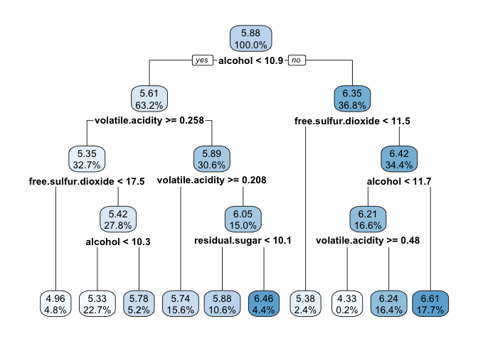

Forcasting Numeric Data - Regression Methods
================
Emma Grossman
4/26/2021

# Understanding Regression

Regression is “surely to most widely used machine learning method.”

Strengths:

  - most common approach for modeling numeric data
  - can be adapted to model almost any task
  - returns estimates of size and strength of the relationships

Weaknesses:

  - strong assumptions about the data
  - model’s form must be specified by user in advance
  - does not handle missing data
  - only works with numeric features, categorical data requires
    additional prep
  - some knowledge of stats needed to understand the model

# Understanding regression trees and model trees

There are two types of trees used for numeric prediction. The first is
**classification and regression tree** algorithm, which make predictions
based on the average value of examples that reach that leaf. The second
is **model trees**, which are less widely known but perhaps more
powerful. At each leaf of a model tree, a multiple linear regression
model is built from the examples at each node, meaning that there are
potentially 10s or 100s of models built for a single tree. They are more
difficult to understand, but may be more accurate.

## Adding regression to trees

Strengths:

  - combines strengths of decision trees with ability to model numeric
    data
  - model does not need to be specified in advance
  - features are selected automatically
  - some types of data may fit better than linear regression
  - does not require statistical knowledge to interpret

Weaknesses:

  - not as well-known as linear regression
  - large amount of data is required to train the model
  - difficult to assess impact of individual features
  - can be difficult to interpret

One criterion that is commonly used to split data for a tree is
**standard deviation reduction (SDR)**:

\[ \textbf{SDR} = sd(T) - \sum_i \frac{|T_i|}{|T|}* sd(T_i)\] Here,
\(T_i\) are sets of values resulting from a split and \(|T|\) is number
of observations in set T. An example:

``` r
tee <- c(1,1,1,2,2,3,4,5,5,6,6,7,7,7,7)
at1 <- c(1,1,1,2,2,3,4,5,5)
at2 <- c(6,6,7,7,7,7)
bt1 <- c(1,1,1,2,2,3,4)
bt2 <- c(5,5,6,6,7,7,7,7)
sdr_a <- sd(tee)- (length(at1)/length(tee)*sd(at1) + length(at2)/length(tee)*sd(at2))
sdr_b <- sd(tee)- (length(bt1)/length(tee)*sd(bt1) + length(bt2)/length(tee)*sd(bt2))
```

So, the SDR of A is 1.2028 and the SDR of B is 1.3928.

> Since the standard deviation was reduced more for the split on B, the
> decision tree would use B first. It results in slightly more
> homogeneous sets than does A.

A regression tree, if we decided to use only one split, would be done
here. It would take the average of each mode as the predicted value for
the response. The prediction for 1, 2, 3, or 4 would be *mean(bt1) = 2*
and *mean(bt2) = 6.25* for values of 5, 6, or 7. A model tree would go
further and fit a linear regression line for each group.

# Example - estimating the quality of wines with regression trees and model trees

## Step 2 - exploring and preparing the data

``` r
wine <- read.csv("https://raw.githubusercontent.com/stedy/Machine-Learning-with-R-datasets/master/whitewines.csv", header = TRUE)
```

``` r
str(wine)
```

    ## 'data.frame':    4898 obs. of  12 variables:
    ##  $ fixed.acidity       : num  7 6.3 8.1 7.2 7.2 8.1 6.2 7 6.3 8.1 ...
    ##  $ volatile.acidity    : num  0.27 0.3 0.28 0.23 0.23 0.28 0.32 0.27 0.3 0.22 ...
    ##  $ citric.acid         : num  0.36 0.34 0.4 0.32 0.32 0.4 0.16 0.36 0.34 0.43 ...
    ##  $ residual.sugar      : num  20.7 1.6 6.9 8.5 8.5 6.9 7 20.7 1.6 1.5 ...
    ##  $ chlorides           : num  0.045 0.049 0.05 0.058 0.058 0.05 0.045 0.045 0.049 0.044 ...
    ##  $ free.sulfur.dioxide : num  45 14 30 47 47 30 30 45 14 28 ...
    ##  $ total.sulfur.dioxide: num  170 132 97 186 186 97 136 170 132 129 ...
    ##  $ density             : num  1.001 0.994 0.995 0.996 0.996 ...
    ##  $ pH                  : num  3 3.3 3.26 3.19 3.19 3.26 3.18 3 3.3 3.22 ...
    ##  $ sulphates           : num  0.45 0.49 0.44 0.4 0.4 0.44 0.47 0.45 0.49 0.45 ...
    ##  $ alcohol             : num  8.8 9.5 10.1 9.9 9.9 10.1 9.6 8.8 9.5 11 ...
    ##  $ quality             : int  6 6 6 6 6 6 6 6 6 6 ...

Another advantage of trees is that we do not need to standardize or
normalize the data.

``` r
ggplot(wine)+
  geom_histogram(aes(x = quality), binwidth = 1)
```

<!-- -->

Let’s split the data into a training and testing set.

``` r
set.seed(158)
train_sample <- sample(nrow(wine), nrow(wine)*0.75)

wine_train <- wine[ train_sample, ]
wine_test  <- wine[-train_sample, ]
```

## Step 3 - training a model on the data

``` r
library(rpart)
```

``` r
m_rpart <- rpart(quality~., data = wine_train)
m_rpart
```

    ## n= 3673 
    ## 
    ## node), split, n, deviance, yval
    ##       * denotes terminal node
    ## 
    ##  1) root 3673 2904.42500 5.882657  
    ##    2) alcohol< 10.85 2323 1426.20700 5.610848  
    ##      4) volatile.acidity>=0.2575 1200  587.00000 5.350000  
    ##        8) free.sulfur.dioxide< 17.5 178   88.72472 4.960674 *
    ##        9) free.sulfur.dioxide>=17.5 1022  466.59590 5.417808  
    ##         18) alcohol< 10.25 832  311.11060 5.334135 *
    ##         19) alcohol>=10.25 190  124.15260 5.784211 *
    ##      5) volatile.acidity< 0.2575 1123  670.30810 5.889581  
    ##       10) volatile.acidity>=0.2075 572  277.13810 5.736014 *
    ##       11) volatile.acidity< 0.2075 551  365.67700 6.049002  
    ##         22) residual.sugar< 10.1 391  222.58820 5.882353 *
    ##         23) residual.sugar>=10.1 160  105.69370 6.456250 *
    ##    3) alcohol>=10.85 1350 1011.27500 6.350370  
    ##      6) free.sulfur.dioxide< 11.5 88   94.62500 5.375000 *
    ##      7) free.sulfur.dioxide>=11.5 1262  827.09350 6.418384  
    ##       14) alcohol< 11.74167 611  383.18490 6.209493  
    ##         28) volatile.acidity>=0.48 9    8.00000 4.333333 *
    ##         29) volatile.acidity< 0.48 602  343.03160 6.237542 *
    ##       15) alcohol>=11.74167 651  392.22430 6.614439 *

The variable `alcohol` is the single most important feature in the data
because it was used first. The \* symbol denotes a node that results in
a prediction.

``` r
summary(m_rpart)
```

    ## Call:
    ## rpart(formula = quality ~ ., data = wine_train)
    ##   n= 3673 
    ## 
    ##           CP nsplit rel error    xerror       xstd
    ## 1 0.16076978      0 1.0000000 1.0007475 0.02433030
    ## 2 0.05815213      1 0.8392302 0.8498085 0.02294626
    ## 3 0.03083444      2 0.7810781 0.7914849 0.02213564
    ## 4 0.01779501      3 0.7502436 0.7603507 0.02063061
    ## 5 0.01117054      4 0.7324486 0.7433480 0.01997999
    ## 6 0.01107048      6 0.7101076 0.7266906 0.01948731
    ## 7 0.01090728      7 0.6990371 0.7248717 0.01943779
    ## 8 0.01078791      8 0.6881298 0.7216990 0.01940954
    ## 9 0.01000000      9 0.6773419 0.7061731 0.01882180
    ## 
    ## Variable importance
    ##              alcohol              density     volatile.acidity 
    ##                   32                   21                   13 
    ##            chlorides total.sulfur.dioxide  free.sulfur.dioxide 
    ##                    9                    8                    7 
    ##       residual.sugar          citric.acid                   pH 
    ##                    5                    2                    1 
    ##            sulphates 
    ##                    1 
    ## 
    ## Node number 1: 3673 observations,    complexity param=0.1607698
    ##   mean=5.882657, MSE=0.7907501 
    ##   left son=2 (2323 obs) right son=3 (1350 obs)
    ##   Primary splits:
    ##       alcohol              < 10.85    to the left,  improve=0.16076980, (0 missing)
    ##       density              < 0.991935 to the right, improve=0.11052970, (0 missing)
    ##       chlorides            < 0.0395   to the right, improve=0.07694915, (0 missing)
    ##       free.sulfur.dioxide  < 11.75    to the left,  improve=0.04334984, (0 missing)
    ##       total.sulfur.dioxide < 158.5    to the right, improve=0.03877032, (0 missing)
    ##   Surrogate splits:
    ##       density              < 0.99197  to the right, agree=0.870, adj=0.647, (0 split)
    ##       chlorides            < 0.0375   to the right, agree=0.757, adj=0.339, (0 split)
    ##       total.sulfur.dioxide < 115.25   to the right, agree=0.698, adj=0.178, (0 split)
    ##       residual.sugar       < 4.775    to the right, agree=0.671, adj=0.106, (0 split)
    ##       sulphates            < 0.375    to the right, agree=0.646, adj=0.037, (0 split)
    ## 
    ## Node number 2: 2323 observations,    complexity param=0.05815213
    ##   mean=5.610848, MSE=0.6139503 
    ##   left son=4 (1200 obs) right son=5 (1123 obs)
    ##   Primary splits:
    ##       volatile.acidity    < 0.2575   to the right, improve=0.11842500, (0 missing)
    ##       free.sulfur.dioxide < 13.5     to the left,  improve=0.04464485, (0 missing)
    ##       citric.acid         < 0.235    to the left,  improve=0.03871007, (0 missing)
    ##       alcohol             < 10.15    to the left,  improve=0.03095635, (0 missing)
    ##       pH                  < 3.325    to the left,  improve=0.02319823, (0 missing)
    ##   Surrogate splits:
    ##       citric.acid          < 0.265    to the left,  agree=0.595, adj=0.162, (0 split)
    ##       total.sulfur.dioxide < 159.5    to the right, agree=0.591, adj=0.155, (0 split)
    ##       alcohol              < 9.716667 to the left,  agree=0.561, adj=0.093, (0 split)
    ##       pH                   < 3.325    to the left,  agree=0.552, adj=0.074, (0 split)
    ##       density              < 0.99423  to the right, agree=0.549, adj=0.068, (0 split)
    ## 
    ## Node number 3: 1350 observations,    complexity param=0.03083444
    ##   mean=6.35037, MSE=0.7490925 
    ##   left son=6 (88 obs) right son=7 (1262 obs)
    ##   Primary splits:
    ##       free.sulfur.dioxide  < 11.5     to the left,  improve=0.08855784, (0 missing)
    ##       alcohol              < 11.74167 to the left,  improve=0.06617111, (0 missing)
    ##       total.sulfur.dioxide < 67.5     to the left,  improve=0.03039813, (0 missing)
    ##       fixed.acidity        < 7.35     to the right, improve=0.02805517, (0 missing)
    ##       density              < 0.989925 to the right, improve=0.02398609, (0 missing)
    ##   Surrogate splits:
    ##       total.sulfur.dioxide < 53.5     to the left,  agree=0.944, adj=0.148, (0 split)
    ##       volatile.acidity     < 0.8725   to the right, agree=0.936, adj=0.023, (0 split)
    ## 
    ## Node number 4: 1200 observations,    complexity param=0.01090728
    ##   mean=5.35, MSE=0.4891667 
    ##   left son=8 (178 obs) right son=9 (1022 obs)
    ##   Primary splits:
    ##       free.sulfur.dioxide < 17.5     to the left,  improve=0.05396830, (0 missing)
    ##       pH                  < 3.325    to the left,  improve=0.04356231, (0 missing)
    ##       alcohol             < 10.25    to the left,  improve=0.04200950, (0 missing)
    ##       volatile.acidity    < 0.3025   to the right, improve=0.03813271, (0 missing)
    ##       chlorides           < 0.0495   to the right, improve=0.03688762, (0 missing)
    ##   Surrogate splits:
    ##       total.sulfur.dioxide < 98.5     to the left,  agree=0.882, adj=0.202, (0 split)
    ##       residual.sugar       < 0.95     to the left,  agree=0.857, adj=0.034, (0 split)
    ##       density              < 0.99107  to the left,  agree=0.854, adj=0.017, (0 split)
    ##       sulphates            < 0.285    to the left,  agree=0.853, adj=0.011, (0 split)
    ## 
    ## Node number 5: 1123 observations,    complexity param=0.01117054
    ##   mean=5.889581, MSE=0.5968906 
    ##   left son=10 (572 obs) right son=11 (551 obs)
    ##   Primary splits:
    ##       volatile.acidity    < 0.2075   to the right, improve=0.04101553, (0 missing)
    ##       free.sulfur.dioxide < 13.5     to the left,  improve=0.02674340, (0 missing)
    ##       fixed.acidity       < 6.45     to the left,  improve=0.02219562, (0 missing)
    ##       residual.sugar      < 12.525   to the left,  improve=0.01994670, (0 missing)
    ##       citric.acid         < 0.255    to the left,  improve=0.01597738, (0 missing)
    ##   Surrogate splits:
    ##       residual.sugar       < 6.875    to the right, agree=0.612, adj=0.209, (0 split)
    ##       density              < 0.99533  to the right, agree=0.584, adj=0.152, (0 split)
    ##       total.sulfur.dioxide < 130.5    to the right, agree=0.581, adj=0.145, (0 split)
    ##       free.sulfur.dioxide  < 34.5     to the right, agree=0.579, adj=0.142, (0 split)
    ##       pH                   < 3.255    to the left,  agree=0.571, adj=0.125, (0 split)
    ## 
    ## Node number 6: 88 observations
    ##   mean=5.375, MSE=1.075284 
    ## 
    ## Node number 7: 1262 observations,    complexity param=0.01779501
    ##   mean=6.418384, MSE=0.6553831 
    ##   left son=14 (611 obs) right son=15 (651 obs)
    ##   Primary splits:
    ##       alcohol        < 11.74167 to the left,  improve=0.06248905, (0 missing)
    ##       fixed.acidity  < 7.35     to the right, improve=0.02591900, (0 missing)
    ##       chlorides      < 0.0395   to the right, improve=0.02436373, (0 missing)
    ##       density        < 0.98996  to the right, improve=0.02236333, (0 missing)
    ##       residual.sugar < 1.225    to the left,  improve=0.02050916, (0 missing)
    ##   Surrogate splits:
    ##       density              < 0.990855 to the right, agree=0.722, adj=0.426, (0 split)
    ##       chlorides            < 0.0365   to the right, agree=0.634, adj=0.244, (0 split)
    ##       volatile.acidity     < 0.2675   to the left,  agree=0.630, adj=0.236, (0 split)
    ##       total.sulfur.dioxide < 130.5    to the right, agree=0.574, adj=0.119, (0 split)
    ##       residual.sugar       < 1.65     to the left,  agree=0.564, adj=0.100, (0 split)
    ## 
    ## Node number 8: 178 observations
    ##   mean=4.960674, MSE=0.4984535 
    ## 
    ## Node number 9: 1022 observations,    complexity param=0.01078791
    ##   mean=5.417808, MSE=0.4565518 
    ##   left son=18 (832 obs) right son=19 (190 obs)
    ##   Primary splits:
    ##       alcohol              < 10.25    to the left,  improve=0.06715165, (0 missing)
    ##       pH                   < 3.335    to the left,  improve=0.05236372, (0 missing)
    ##       chlorides            < 0.0495   to the right, improve=0.04884440, (0 missing)
    ##       volatile.acidity     < 0.3025   to the right, improve=0.03448882, (0 missing)
    ##       total.sulfur.dioxide < 160.5    to the right, improve=0.03045997, (0 missing)
    ##   Surrogate splits:
    ##       density             < 0.99218  to the right, agree=0.833, adj=0.100, (0 split)
    ##       chlorides           < 0.0305   to the right, agree=0.821, adj=0.037, (0 split)
    ##       free.sulfur.dioxide < 104      to the left,  agree=0.815, adj=0.005, (0 split)
    ## 
    ## Node number 10: 572 observations
    ##   mean=5.736014, MSE=0.4845072 
    ## 
    ## Node number 11: 551 observations,    complexity param=0.01117054
    ##   mean=6.049002, MSE=0.6636605 
    ##   left son=22 (391 obs) right son=23 (160 obs)
    ##   Primary splits:
    ##       residual.sugar      < 10.1     to the left,  improve=0.10226230, (0 missing)
    ##       density             < 0.99788  to the left,  improve=0.09729216, (0 missing)
    ##       alcohol             < 9.05     to the right, improve=0.07459879, (0 missing)
    ##       free.sulfur.dioxide < 10.5     to the left,  improve=0.04902217, (0 missing)
    ##       chlorides           < 0.0555   to the left,  improve=0.03153064, (0 missing)
    ##   Surrogate splits:
    ##       density             < 0.99663  to the left,  agree=0.938, adj=0.788, (0 split)
    ##       alcohol             < 9.15     to the right, agree=0.820, adj=0.381, (0 split)
    ##       pH                  < 3.01     to the right, agree=0.751, adj=0.144, (0 split)
    ##       free.sulfur.dioxide < 44.5     to the left,  agree=0.731, adj=0.075, (0 split)
    ##       sulphates           < 0.765    to the left,  agree=0.724, adj=0.050, (0 split)
    ## 
    ## Node number 14: 611 observations,    complexity param=0.01107048
    ##   mean=6.209493, MSE=0.6271439 
    ##   left son=28 (9 obs) right son=29 (602 obs)
    ##   Primary splits:
    ##       volatile.acidity     < 0.48     to the right, improve=0.08391087, (0 missing)
    ##       residual.sugar       < 0.975    to the left,  improve=0.02819004, (0 missing)
    ##       fixed.acidity        < 7.35     to the right, improve=0.02625684, (0 missing)
    ##       total.sulfur.dioxide < 191.5    to the right, improve=0.02358596, (0 missing)
    ##       citric.acid          < 0.235    to the left,  improve=0.01888565, (0 missing)
    ##   Surrogate splits:
    ##       total.sulfur.dioxide < 279.25   to the right, agree=0.989, adj=0.222, (0 split)
    ## 
    ## Node number 15: 651 observations
    ##   mean=6.614439, MSE=0.602495 
    ## 
    ## Node number 18: 832 observations
    ##   mean=5.334135, MSE=0.373931 
    ## 
    ## Node number 19: 190 observations
    ##   mean=5.784211, MSE=0.6534349 
    ## 
    ## Node number 22: 391 observations
    ##   mean=5.882353, MSE=0.5692794 
    ## 
    ## Node number 23: 160 observations
    ##   mean=6.45625, MSE=0.6605859 
    ## 
    ## Node number 28: 9 observations
    ##   mean=4.333333, MSE=0.8888889 
    ## 
    ## Node number 29: 602 observations
    ##   mean=6.237542, MSE=0.5698199

### Visualizing decision trees

``` r
library(rpart.plot)
rpart.plot(m_rpart, digits = 3)
```

<!-- -->

``` r
rpart.plot(m_rpart, digits = 4, fallen.leaves = TRUE, type = 3, extra = 101)
```

<!-- -->

`fallen.leaves` forces alignment at the bottom; `type` and `extra`
determine the way the decisions and nodes are labeled.

## Step 4 - evaluating model performance

``` r
p_rpart <- predict(m_rpart, wine_test)
```

``` r
summary(p_rpart)
```

    ##    Min. 1st Qu.  Median    Mean 3rd Qu.    Max. 
    ##   4.333   5.334   5.882   5.892   6.238   6.614

``` r
summary(wine_test$quality)
```

    ##    Min. 1st Qu.  Median    Mean 3rd Qu.    Max. 
    ##   3.000   5.000   6.000   5.864   6.000   9.000

The predicted range is much narrower than the actual values, which could
pose a problem.

``` r
cor(p_rpart, wine_test$quality)
```

    ## [1] 0.5015757

That’s not bad.

### Measuring performance with mean absolute error

We can measure how far the prediction was from the true value with
**mean absolute error (MAE)**:

\[ \textbf{MAE} = \frac{1}{n} \sum_{i=1}^{n} |e_i| \]

We can create this function easily:

``` r
MAE <- function(actual, predicted){
  mean(abs(actual-predicted))
}
```

``` r
MAE(p_rpart, wine_test$quality)
```

    ## [1] 0.6017273

On average, the difference between our model’s predictions and the true
quality score is about 0.59.

The average score of wine of our training data is:

``` r
mean(wine_train$quality)
```

    ## [1] 5.882657

We can look at the MAE if we predicted every single value to be the mean
of our training dataset.

``` r
MAE(mean(wine_train$quality), wine_test$quality)
```

    ## [1] 0.6610774

So, our model is better, but not by much.

## Step 5 - improving model performance

Let’s try implementing a model tree algorithm, more specifically the
**Cubist** algorithm.

``` r
library(Cubist)
```

    ## Loading required package: lattice

``` r
m_cubist <- cubist(x = wine_train[-12], y = wine_train$quality)
m_cubist
```

    ## 
    ## Call:
    ## cubist.default(x = wine_train[-12], y = wine_train$quality)
    ## 
    ## Number of samples: 3673 
    ## Number of predictors: 11 
    ## 
    ## Number of committees: 1 
    ## Number of rules: 16

Eight rules were generated to model wine quality.

``` r
summary(m_cubist)
```

    ## 
    ## Call:
    ## cubist.default(x = wine_train[-12], y = wine_train$quality)
    ## 
    ## 
    ## Cubist [Release 2.07 GPL Edition]  Mon Apr 26 14:45:32 2021
    ## ---------------------------------
    ## 
    ##     Target attribute `outcome'
    ## 
    ## Read 3673 cases (12 attributes) from undefined.data
    ## 
    ## Model:
    ## 
    ##   Rule 1: [84 cases, mean 5.2, range 3 to 7, est err 0.5]
    ## 
    ##     if
    ##  fixed.acidity > 7.3
    ##  volatile.acidity > 0.205
    ##  alcohol <= 9.1
    ##     then
    ##  outcome = 6.4 - 3.21 volatile.acidity - 1.66 pH + 0.155 alcohol
    ##            - 1.37 citric.acid - 6 chlorides + 0.04 fixed.acidity
    ##            + 0.004 residual.sugar + 4 density
    ## 
    ##   Rule 2: [200 cases, mean 5.3, range 3 to 8, est err 0.5]
    ## 
    ##     if
    ##  fixed.acidity <= 7.3
    ##  volatile.acidity > 0.205
    ##  density <= 0.9985
    ##  alcohol <= 9.1
    ##     then
    ##  outcome = -2.2 + 0.946 alcohol + 0.3 fixed.acidity - 0.93 pH
    ##            - 1.17 volatile.acidity + 0.44 citric.acid
    ##            + 0.002 residual.sugar
    ## 
    ##   Rule 3: [165 cases, mean 5.4, range 4 to 7, est err 0.5]
    ## 
    ##     if
    ##  volatile.acidity <= 0.345
    ##  citric.acid > 0.37
    ##  chlorides <= 0.09
    ##  free.sulfur.dioxide > 15
    ##  alcohol > 9.1
    ##  alcohol <= 9.75
    ##     then
    ##  outcome = 100.5 - 98 density - 10.8 chlorides + 0.042 residual.sugar
    ##            - 1.12 volatile.acidity + 0.51 pH + 0.053 alcohol
    ##            + 0.06 fixed.acidity + 0.27 sulphates
    ##            + 0.0013 free.sulfur.dioxide
    ## 
    ##   Rule 4: [380 cases, mean 5.5, range 3 to 8, est err 0.6]
    ## 
    ##     if
    ##  free.sulfur.dioxide <= 15
    ##  alcohol > 9.1
    ##     then
    ##  outcome = 30.1 + 0.0829 free.sulfur.dioxide + 0.285 alcohol
    ##            - 2.3 volatile.acidity + 0.044 residual.sugar
    ##            - 0.11 fixed.acidity - 28 density + 0.14 pH + 0.08 sulphates
    ## 
    ##   Rule 5: [351 cases, mean 5.6, range 4 to 7, est err 0.5]
    ## 
    ##     if
    ##  volatile.acidity <= 0.345
    ##  citric.acid <= 0.37
    ##  chlorides <= 0.09
    ##  free.sulfur.dioxide > 15
    ##  alcohol > 9.1
    ##  alcohol <= 9.75
    ##     then
    ##  outcome = 12.3 - 12.7 chlorides + 2.31 citric.acid
    ##            - 2.82 volatile.acidity - 6 density + 0.003 residual.sugar
    ## 
    ##   Rule 6: [54 cases, mean 5.8, range 5 to 8, est err 0.5]
    ## 
    ##     if
    ##  volatile.acidity <= 0.345
    ##  chlorides > 0.09
    ##  free.sulfur.dioxide > 15
    ##     then
    ##  outcome = 2.9 + 1.09 pH - 1.43 volatile.acidity
    ## 
    ##   Rule 7: [117 cases, mean 5.8, range 4 to 7, est err 0.6]
    ## 
    ##     if
    ##  fixed.acidity <= 7.3
    ##  density > 0.9985
    ##  alcohol <= 9.1
    ##     then
    ##  outcome = -11.8 + 1.564 alcohol - 0.113 residual.sugar
    ##            - 2.43 volatile.acidity + 0.03 fixed.acidity + 6 density
    ## 
    ##   Rule 8: [148 cases, mean 5.9, range 3 to 8, est err 0.5]
    ## 
    ##     if
    ##  residual.sugar > 10.1
    ##  chlorides > 0.039
    ##  pH <= 3.44
    ##  alcohol > 9.75
    ##     then
    ##  outcome = 65.7 - 62 density + 0.028 residual.sugar + 0.35 pH
    ##            - 0.51 volatile.acidity + 0.03 alcohol + 0.04 fixed.acidity
    ##            + 0.18 sulphates + 0.0009 free.sulfur.dioxide
    ## 
    ##   Rule 9: [498 cases, mean 5.9, range 3 to 9, est err 0.6]
    ## 
    ##     if
    ##  volatile.acidity > 0.345
    ##  free.sulfur.dioxide > 15
    ##  alcohol > 9.1
    ##     then
    ##  outcome = 225.3 - 229 density + 0.106 residual.sugar + 0.218 alcohol
    ##            + 1.43 pH - 1.83 volatile.acidity + 0.18 fixed.acidity
    ##            + 0.1 sulphates
    ## 
    ##   Rule 10: [39 cases, mean 5.9, range 4 to 7, est err 0.6]
    ## 
    ##     if
    ##  volatile.acidity <= 0.205
    ##  density <= 0.99804
    ##  alcohol <= 9.1
    ##     then
    ##  outcome = 222.1 + 0.155 residual.sugar - 219 density + 9.6 chlorides
    ##            - 0.0096 free.sulfur.dioxide + 1.21 volatile.acidity
    ##            + 0.04 fixed.acidity
    ## 
    ##   Rule 11: [1317 cases, mean 6.1, range 3 to 9, est err 0.5]
    ## 
    ##     if
    ##  volatile.acidity <= 0.345
    ##  residual.sugar <= 10.1
    ##  free.sulfur.dioxide > 15
    ##  density > 0.99024
    ##  alcohol > 9.75
    ##     then
    ##  outcome = 6
    ## 
    ##   Rule 12: [906 cases, mean 6.1, range 4 to 9, est err 0.6]
    ## 
    ##     if
    ##  fixed.acidity > 6.4
    ##  volatile.acidity <= 0.345
    ##  residual.sugar <= 10.1
    ##  free.sulfur.dioxide > 15
    ##  density > 0.99024
    ##  alcohol > 9.75
    ##     then
    ##  outcome = 236.7 - 239 density + 0.115 residual.sugar + 1.52 pH
    ##            - 2.15 volatile.acidity + 0.131 alcohol + 0.51 sulphates
    ##            + 0.0032 free.sulfur.dioxide + 0.01 fixed.acidity
    ## 
    ##   Rule 13: [174 cases, mean 6.1, range 4 to 8, est err 0.6]
    ## 
    ##     if
    ##  free.sulfur.dioxide > 15
    ##  pH > 3.44
    ##     then
    ##  outcome = 382.2 - 382 density + 0.134 residual.sugar
    ##            + 0.49 fixed.acidity
    ## 
    ##   Rule 14: [238 cases, mean 6.4, range 4 to 8, est err 0.5]
    ## 
    ##     if
    ##  volatile.acidity <= 0.345
    ##  free.sulfur.dioxide > 15
    ##  density <= 0.99024
    ##  pH <= 3.44
    ##     then
    ##  outcome = 64.2 + 0.076 residual.sugar + 0.291 alcohol - 63 density
    ##            - 1.89 volatile.acidity + 0.0069 free.sulfur.dioxide + 0.38 pH
    ##            - 0.06 fixed.acidity + 0.19 sulphates
    ## 
    ##   Rule 15: [64 cases, mean 6.6, range 5 to 9, est err 0.5]
    ## 
    ##     if
    ##  volatile.acidity <= 0.345
    ##  residual.sugar > 10.1
    ##  chlorides <= 0.039
    ##  free.sulfur.dioxide > 15
    ##  alcohol > 9.75
    ##     then
    ##  outcome = 116.2 + 65.8 chlorides - 7.59 volatile.acidity + 2.68 pH
    ##            - 120 density - 0.0055 total.sulfur.dioxide + 0.172 alcohol
    ##            - 0.84 sulphates
    ## 
    ##   Rule 16: [62 cases, mean 6.9, range 5 to 8, est err 0.5]
    ## 
    ##     if
    ##  volatile.acidity <= 0.205
    ##  density > 0.99804
    ##  alcohol <= 9.1
    ##     then
    ##  outcome = 169.7 + 16.51 volatile.acidity - 164 density
    ##            + 0.089 residual.sugar - 1.46 pH + 0.19 fixed.acidity
    ##            - 0.0034 free.sulfur.dioxide
    ## 
    ## 
    ## Evaluation on training data (3673 cases):
    ## 
    ##     Average  |error|                0.4
    ##     Relative |error|               0.66
    ##     Correlation coefficient        0.66
    ## 
    ## 
    ##  Attribute usage:
    ##    Conds  Model
    ## 
    ##     90%    58%    alcohol
    ##     86%    40%    free.sulfur.dioxide
    ##     83%    69%    volatile.acidity
    ##     60%    67%    density
    ##     51%    70%    residual.sugar
    ##     27%    63%    fixed.acidity
    ##     16%    15%    chlorides
    ##     12%    58%    pH
    ##     11%    13%    citric.acid
    ##            50%    sulphates
    ##             1%    total.sulfur.dioxide
    ## 
    ## 
    ## Time: 0.3 secs

Let’s take a look at how this predicts on new data.

``` r
p_cubist <- predict(m_cubist, wine_test)
summary(p_cubist)
```

    ##    Min. 1st Qu.  Median    Mean 3rd Qu.    Max. 
    ##   3.761   5.490   5.952   5.830   6.125   7.621

Already we can see that a wider range of values is being predicted. We
can also look at the correlation:

``` r
cor(p_cubist, wine_test$quality)
```

    ## [1] 0.5177494

That’s a bit higher, which is a good sign. Let’s check the MAE as well.

``` r
MAE(wine_test$quality, p_cubist)
```

    ## [1] 0.5553199

Again, a slightly better MAE as well.
