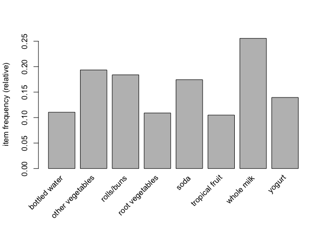
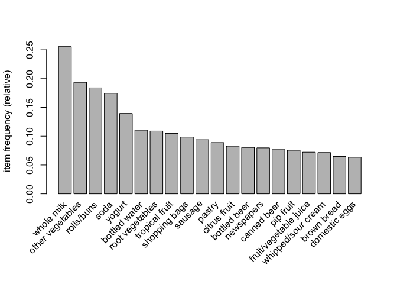
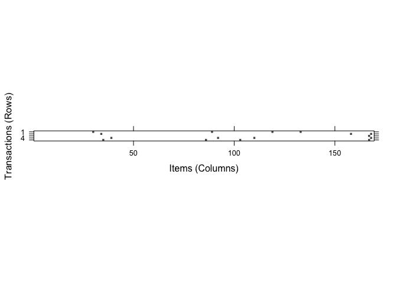
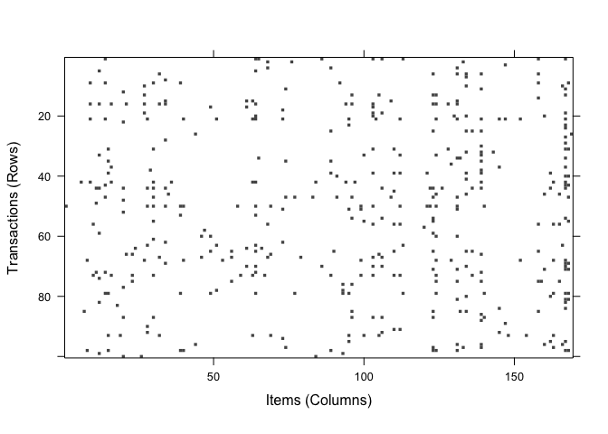

Finding Patterns - Market Basket Analysis Using Association Rules
================
Emma Grossman
5/5/2021

# Understanding association rules

A set, or **itemset** is formed by groups of one or more items that
appear in the data with some regularity. The result of **market basket
analysis** is a collection of **association rules** that depict patterns
found in the relationships among items in the itemsets. For example, an
itemset like {bread, peanut butter, jelly } might create an association
rule like {peanut butter, jelly } \(\rightarrow\) {bread}. So, if peanut
butter and jelly are purchased together, that implies that bread is also
likely to be purchased.

Association rules are not used for prediction. Another characteristic of
market basket is that there is no need to train the data; the program is
unleashed on the data and hopefully, interesting associations will be
found. Because of this, it is difficult to measure how well the market
basket algorithm performs.

## The Apriori algorithm for association rule learning

With 100 items, there would be \(2^{100}\) possible itemsets, so to
eliminate too much work, extremely rare events are ignored.

The **Apriori** algorithm searches large datasets fo rules.

Strengths:

  - can work with large amounts of data
  - rules are understandable
  - helpful in data mining and discovering unexpected knowledge in
    databases

Weaknesses:

  - not helpful for small databases
  - effort to separate true insight from common sense
  - could draw spurious conclusions from random patterns

## Measuring rule interest - support and confidence

An *interesting* association rule is determined by support and
confidence, and if we apply minimum thresholds to these measures, we can
easily limit the number of rules reported.

The **support** measures how frequently an itemset/rule occurs in the
data. A rule’s **confidence** measures its predictive power. It is the
proportion of transactions where the presence of an item or itemset X
results in the presents of an item or itemset Y.

Rules that have high support and high confidence are **strong rules**

## Building a set of rules with the Apriori principle

Creating rules has two phases:

1.  identify all itemsets that meet minimum support threshold
2.  create rules from those itemsets that meet a minimum confidence
    threshold

# Example - identifying frequently purchased groceries with association rules

``` r
# install.packages("arules")
library(arules)
```

    ## Loading required package: Matrix

    ## 
    ## Attaching package: 'arules'

    ## The following objects are masked from 'package:base':
    ## 
    ##     abbreviate, write

### Data preperation - creating a sparse matrix for transaction data

``` r
groceries <- read.transactions("https://raw.githubusercontent.com/stedy/Machine-Learning-with-R-datasets/master/groceries.csv", sep = ",")
summary(groceries)
```

    ## transactions as itemMatrix in sparse format with
    ##  9835 rows (elements/itemsets/transactions) and
    ##  169 columns (items) and a density of 0.02609146 
    ## 
    ## most frequent items:
    ##       whole milk other vegetables       rolls/buns             soda 
    ##             2513             1903             1809             1715 
    ##           yogurt          (Other) 
    ##             1372            34055 
    ## 
    ## element (itemset/transaction) length distribution:
    ## sizes
    ##    1    2    3    4    5    6    7    8    9   10   11   12   13   14   15   16 
    ## 2159 1643 1299 1005  855  645  545  438  350  246  182  117   78   77   55   46 
    ##   17   18   19   20   21   22   23   24   26   27   28   29   32 
    ##   29   14   14    9   11    4    6    1    1    1    1    3    1 
    ## 
    ##    Min. 1st Qu.  Median    Mean 3rd Qu.    Max. 
    ##   1.000   2.000   3.000   4.409   6.000  32.000 
    ## 
    ## includes extended item information - examples:
    ##             labels
    ## 1 abrasive cleaner
    ## 2 artif. sweetener
    ## 3   baby cosmetics

We can look at the sparse matrix with `inspect()`.

``` r
inspect(groceries[1:5])
```

    ##     items                     
    ## [1] {citrus fruit,            
    ##      margarine,               
    ##      ready soups,             
    ##      semi-finished bread}     
    ## [2] {coffee,                  
    ##      tropical fruit,          
    ##      yogurt}                  
    ## [3] {whole milk}              
    ## [4] {cream cheese,            
    ##      meat spreads,            
    ##      pip fruit,               
    ##      yogurt}                  
    ## [5] {condensed milk,          
    ##      long life bakery product,
    ##      other vegetables,        
    ##      whole milk}

`itemFrequency()` allows us to view the proportion of transactions that
contain a specified item.

``` r
itemFrequency(groceries[, 1:3])
```

    ## abrasive cleaner artif. sweetener   baby cosmetics 
    ##     0.0035587189     0.0032536858     0.0006100661

#### Visualizing item support - item frequency plots

``` r
itemFrequencyPlot(groceries, support = 0.10)
```

<!-- -->

These are items in the groceries with at least 10% support. We can also
ask for a specific number of items:

``` r
itemFrequencyPlot(groceries, topN = 20)
```

<!-- -->

#### Visualizing the transaction data - plotting the sparse matrix

``` r
image(groceries[1:5])
```

<!-- -->

``` r
image(sample(groceries, 100))
```

<!-- -->

## Step 3 - training a model on the data

We need to find a balance of the right threshold values of the support
and confidence. Too high and we may not find any interesting rules. Too
low and we might get too many rules. The default for the `apriori()`
function in the `arules` package is support = 0.1 and confidence = 0.8,
but this results in no rules for our `groceries` data.

``` r
apriori(groceries)
```

    ## Apriori
    ## 
    ## Parameter specification:
    ##  confidence minval smax arem  aval originalSupport maxtime support minlen
    ##         0.8    0.1    1 none FALSE            TRUE       5     0.1      1
    ##  maxlen target  ext
    ##      10  rules TRUE
    ## 
    ## Algorithmic control:
    ##  filter tree heap memopt load sort verbose
    ##     0.1 TRUE TRUE  FALSE TRUE    2    TRUE
    ## 
    ## Absolute minimum support count: 983 
    ## 
    ## set item appearances ...[0 item(s)] done [0.00s].
    ## set transactions ...[169 item(s), 9835 transaction(s)] done [0.01s].
    ## sorting and recoding items ... [8 item(s)] done [0.00s].
    ## creating transaction tree ... done [0.00s].
    ## checking subsets of size 1 2 done [0.00s].
    ## writing ... [0 rule(s)] done [0.00s].
    ## creating S4 object  ... done [0.00s].

    ## set of 0 rules

According to the author that is. My data differs a bit, since a rule was
returned. Another argument is **minlen**, setting that to 2 will
eliminate rules that contain fewer than two items, to prevent
uninteresting rules from appearing.

``` r
groceryrules <- apriori(groceries, parameter = list(support = 0.006,
                                                    confidence = 0.25,
                                                    minlen = 2))
```

    ## Apriori
    ## 
    ## Parameter specification:
    ##  confidence minval smax arem  aval originalSupport maxtime support minlen
    ##        0.25    0.1    1 none FALSE            TRUE       5   0.006      2
    ##  maxlen target  ext
    ##      10  rules TRUE
    ## 
    ## Algorithmic control:
    ##  filter tree heap memopt load sort verbose
    ##     0.1 TRUE TRUE  FALSE TRUE    2    TRUE
    ## 
    ## Absolute minimum support count: 59 
    ## 
    ## set item appearances ...[0 item(s)] done [0.00s].
    ## set transactions ...[169 item(s), 9835 transaction(s)] done [0.01s].
    ## sorting and recoding items ... [109 item(s)] done [0.00s].
    ## creating transaction tree ... done [0.00s].
    ## checking subsets of size 1 2 3 4 done [0.00s].
    ## writing ... [463 rule(s)] done [0.00s].
    ## creating S4 object  ... done [0.01s].

``` r
groceryrules
```

    ## set of 463 rules

Our result is now 463 association rules.

## Step 4 - evaluating model performance

``` r
summary(groceryrules)
```

    ## set of 463 rules
    ## 
    ## rule length distribution (lhs + rhs):sizes
    ##   2   3   4 
    ## 150 297  16 
    ## 
    ##    Min. 1st Qu.  Median    Mean 3rd Qu.    Max. 
    ##   2.000   2.000   3.000   2.711   3.000   4.000 
    ## 
    ## summary of quality measures:
    ##     support           confidence        coverage             lift       
    ##  Min.   :0.006101   Min.   :0.2500   Min.   :0.009964   Min.   :0.9932  
    ##  1st Qu.:0.007117   1st Qu.:0.2971   1st Qu.:0.018709   1st Qu.:1.6229  
    ##  Median :0.008744   Median :0.3554   Median :0.024809   Median :1.9332  
    ##  Mean   :0.011539   Mean   :0.3786   Mean   :0.032608   Mean   :2.0351  
    ##  3rd Qu.:0.012303   3rd Qu.:0.4495   3rd Qu.:0.035892   3rd Qu.:2.3565  
    ##  Max.   :0.074835   Max.   :0.6600   Max.   :0.255516   Max.   :3.9565  
    ##      count      
    ##  Min.   : 60.0  
    ##  1st Qu.: 70.0  
    ##  Median : 86.0  
    ##  Mean   :113.5  
    ##  3rd Qu.:121.0  
    ##  Max.   :736.0  
    ## 
    ## mining info:
    ##       data ntransactions support confidence
    ##  groceries          9835   0.006       0.25

There are 150 rules that have 2 items, 297 that have 3 items, and 16
that have 4 items. Rule size is calculated for both sides of the
equation, so {bread} =\> {butter} has two items and {peanut butter,
jelly} =\> {bread} has three items.

The **lift** of a rule measures how much more likely one item or itemset
is to be purchased relative to its typical rate of purchase, given you
know another item has been purchased.

Let’s take a look at the first three rules.

``` r
inspect(groceryrules[1:3])
```

    ##     lhs             rhs               support     confidence coverage  
    ## [1] {pot plants} => {whole milk}      0.006914082 0.4000000  0.01728521
    ## [2] {pasta}      => {whole milk}      0.006100661 0.4054054  0.01504830
    ## [3] {herbs}      => {root vegetables} 0.007015760 0.4312500  0.01626843
    ##     lift     count
    ## [1] 1.565460 68   
    ## [2] 1.586614 60   
    ## [3] 3.956477 69

The first rule implies that if a customer buys potted plants, they will
also buy whole milk. This doesn’t seem like a terribly useful rule,
though. We can split association rules into three categories:

1.  actionable
2.  trivial
3.  inexplicable

**Actionable** rules are clear and insightful, **trivial** rules are
obvious, so clear but not useful, and **inexplicable** if the connection
between items is unclear and the information gained cannot be used.

## Step 5 - improving model performance

### Sorting the set of association rules

``` r
inspect(sort(groceryrules, by = "lift")[1:5])
```

    ##     lhs                   rhs                      support confidence   coverage     lift count
    ## [1] {herbs}            => {root vegetables}    0.007015760  0.4312500 0.01626843 3.956477    69
    ## [2] {berries}          => {whipped/sour cream} 0.009049314  0.2721713 0.03324860 3.796886    89
    ## [3] {other vegetables,                                                                         
    ##      tropical fruit,                                                                           
    ##      whole milk}       => {root vegetables}    0.007015760  0.4107143 0.01708185 3.768074    69
    ## [4] {beef,                                                                                     
    ##      other vegetables} => {root vegetables}    0.007930859  0.4020619 0.01972547 3.688692    78
    ## [5] {other vegetables,                                                                         
    ##      tropical fruit}   => {pip fruit}          0.009456024  0.2634561 0.03589222 3.482649    93

A lift of about 3.96 implies that people who buy herbs are nearly four
times more likely to buy root vegetables than the typical customer.

### Taking subsets of association rules

We can filter our rules to only include a particular item of interest.

``` r
berryrules <- subset(groceryrules, items %in% "berries")
inspect(berryrules)
```

    ##     lhs          rhs                  support     confidence coverage  lift    
    ## [1] {berries} => {whipped/sour cream} 0.009049314 0.2721713  0.0332486 3.796886
    ## [2] {berries} => {yogurt}             0.010574479 0.3180428  0.0332486 2.279848
    ## [3] {berries} => {other vegetables}   0.010269446 0.3088685  0.0332486 1.596280
    ## [4] {berries} => {whole milk}         0.011794611 0.3547401  0.0332486 1.388328
    ##     count
    ## [1]  89  
    ## [2] 104  
    ## [3] 101  
    ## [4] 116
