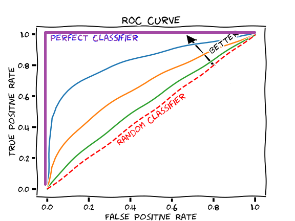

Evaluating Model Performance
================
Emma Grossman
5/11/2021

# Measuring performance for classification

Accuracy of a model can be observed by taking the number of correct
predictions and dividing by the total number of predictions, which is
the proportion of cases in which the learner is right or wrong.

This is not always the best measure, because of **class imbalance
problems**, which occur when a majority of the data belong to a single
class. For example, if one level of an event is very rare, a model might
just choose the other class every single time and a decent accuracy.

# Understanding a classifier’s predictions

Classifiers generally have a degree of confidence for its predictions. A
classifier might be 99% about one prediction, but only 51% certain about
another.

> If two models make the same number of mistakes, but one is more able
> to accurately assess its uncertainty, then it is a smarter model.

Using the `predict()` function, we can ask R to return the prediction
probability using the `type` argument. For example,

``` r
predicted_prob <- predict(credit_model, credit_test, type = "prob")
sms_test_prob <- predict(sms_classifier, sms_test, type = "raw")
```

# A closter look at confusion matrices

## Using confusion matrices to measure performance

**success rate**:

\[ \text{accuracy} = \frac{\text{TP + TN}}{\text{TP + TN + FP + FN}} \]

Where TP = True Positive, TN = True Negative, FP = False Positive and FN
= False Negative.

In contrast, the **error rate** is the opposite of the success rate.
\[ \text{error rate} = \frac{\text{FP + FN}}{\text{TP + TN + FP + FN}}  = \text{1 - accuracy}\]

# Beyond accuracy - other measures of performance

The `caret` package by Max Kuhn includes many performance measure
functions.

``` r
# install.packages("caret")
library(caret)
```

    ## Loading required package: lattice

    ## 
    ## Attaching package: 'caret'

    ## The following object is masked from 'package:purrr':
    ## 
    ##     lift

``` r
confusionMatrix(sms_test_pred, sms_test_labels, positive = "spam")
```

    ## Confusion Matrix and Statistics
    ## 
    ##           Reference
    ## Prediction ham spam
    ##       ham  680   17
    ##       spam   2   97
    ##                                          
    ##                Accuracy : 0.9761         
    ##                  95% CI : (0.963, 0.9856)
    ##     No Information Rate : 0.8568         
    ##     P-Value [Acc > NIR] : < 2.2e-16      
    ##                                          
    ##                   Kappa : 0.8971         
    ##                                          
    ##  Mcnemar's Test P-Value : 0.001319       
    ##                                          
    ##             Sensitivity : 0.8509         
    ##             Specificity : 0.9971         
    ##          Pos Pred Value : 0.9798         
    ##          Neg Pred Value : 0.9756         
    ##              Prevalence : 0.1432         
    ##          Detection Rate : 0.1219         
    ##    Detection Prevalence : 0.1244         
    ##       Balanced Accuracy : 0.9240         
    ##                                          
    ##        'Positive' Class : spam           
    ## 

## The kappa statistic

> The **kappa statistic** adjusts accuracy by accounting for the
> possibility of a correct prediction by chance alone.

It is especially important for instances when there is severe class
imbalance.

The built in `kappa()` function is unrelated to the kappa statistic.

## Sensitivity and specificity

**Sensitivity**, or the **true positive rate**, measures positive
examples that were correctly classified.

\[ \text{sensitivity} = \frac{\text{TP}}{\text{TP+FN}}\]

**Specificity**, or the **true negative rate**, measures negative
examples that were correctly classified.

\[ \text{specificity} = \frac{\text{TN}}{\text{TN+FP}}\]

So 85% of spam messages were correctly classified and 99% of non-spam
were correctly classified.

## Precision and recall

> Used primarily in the context of information retrieval, these
> statistics are intended to indicate how interesting and relevant a
> model’s results are, or whether the predictions are diluted by
> meaningless noise.

**Precision** (or **positive predictive value**) is the proportion of
positive examples that are truly positive. In essence: when a model
predicts a positive class, how often is is correct? A precise model is
very trustworthy.

\[ \text{precision} = \frac{\text{TP}}{\text{TP+FP}}\]

In contrast, **recall** uses the same formula as sensitivity, but the
interpretation differs. High recall indicates a model has wide breadth
and will capture a large proportion of positive results.

\[ \text{recall} = \frac{\text{TP}}{\text{TP+FN}}\]

A model with both high precision and high recall is difficult to
achieve.

## The F-measure

The **F-measure** is a single number that combines both precision and
recall, using the **harmonic mean** (generally used for rates of
change).

\[ \text{F-measure} = \frac{\text{2 * precision * recall}}{\text{recall + precision}} = 
\frac{\text{2 * TP}}{\text{2*TP + FP + FN}}\]

This is a convenient way to directly compare two models, but it assumes
equal weight for both precision and recall, which may not be desirable.

# Visualizing performance tradeoffs with ROC curves

> The **receiver operating characteristic (ROC) curve** is commonly used
> to examine the tradefoff between the detection of true positives while
> avoiding the false positives.



Another statistic can be obtained from the ROC curve, which is the
**area under the ROC curve (AUC)**. It ranges from 0.5 (no predictive
value) to 1 (perfect classifier).

The `pROC` package can be used to plot a ROC curve.

# Estimating future performance

The purpose of confusion matrices and performance measures is to
estimate a model’s **resubstitution error** which is when the training
data is incorrectly predicted.

When we have a very small sample size, it is not ideal to split the data
into testing and training sets. If this is the case, the `caret` package
provides measures that estimate future performance.

## The holdout method

Using a testing & training set is called the **holdout method**. Best
practice is to split the data three ways, into testing, training and
validation datasets. Usually split 50%, 25%, and 25%.

In some cases, when randomly splitting the data into the different sets,
if one case is very small it might not make it into the training set.
This is bad, since the model will not be able to learn that class. To
combat this, **stratified random sampling** can be used. It guarantees
that all partitions have the same proportion of each class. The `caret`
package includes a function called `createDataParition()`, which can be
used to create partitions based on stratified sampling.

Another technique exists, called **repeated holdout** in which several
random holdout samples are evaluated, and the average result is
obtained.

## Cross-validation

Repeated holdout is the underlying technique used for **k-fold
cross-validation (k-fold CV)**, which is typically the industry standard
for estimating model performance.

Generally, 10 completely separate random partitions, called**folds**,
are created from the data. Each fold is used as a testing set, with the
remaining 90% of the data used to train the model. This is repeated for
the all other folds, totaling 10 models and the average performance
across them is reported.

The `createFolds()` function from the `caret` package can be used to
split the data into 10 vectors. The below function can be used to
implement a model 10 times:

``` r
cv_results <- lapply(folds, function(x){
  credit_train <- credit[-x, ]
  credit_test <- credit[x, ]
  credit_model <- C5.0(default~., data  = credit_train)
  credit_pred <-  predict(credit_model, credit_test)
  credit_actual <- credit_test$default
  kappa <- kappa2(data.frame(credit_actual, credit_pred))$value
  return(kappa)
})

mean(unlist(cv_results))
```

## Bootstrap sampling

**Bootstrap sampling** is an alternative to k-fold CV but is less
popular. It differs from k-fold CV in that is **samples with
replacement**. It only uses 63.2% of the available data, compared to 90%
using k-fold CV.

The advantage of bootstrapping over k-fold CV, is that it works better
when we have a small dataset.
