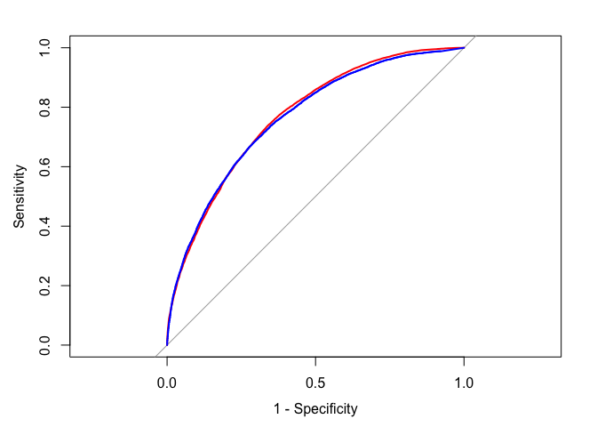

Improving Model Performance
================
Emma Grossman
5/25/2021

# Tuning stock models for better performance

For an example, we’ll be returning to the `credit` data from chapter 5.
Though the accuracy was about 82%, the kappa statistic was only 0.28,
which is fairly poor.

The process of adjusting the model options to identify the best fit is
called **parameter tuning**.

## Using caret for automated parameter tuning

> Rather than choosing arbitrary values for each of the model’s
> parameters - a task that is not only tedious but also somewhat
> unscientific - it is better to conduct a search through many possible
> parameter values to find the best combination.

The `caret` package has tools that automate parameter tuning.

Three questions generated by automated parameter tuning are:

1.  What type of machine learning model (and specific implementation)
    should be trained on the data?
2.  Which model parameters can be adjusted and how extensively should
    they be tuned to find the optimal settings?
3.  What criteria should be used to evaluate the models to find the best
    candidate?

To view the tuning parameters for specific models, `modelLookup()` can
be used.

``` r
library(caret)
```

    ## Loading required package: lattice

    ## 
    ## Attaching package: 'caret'

    ## The following object is masked from 'package:purrr':
    ## 
    ##     lift

``` r
modelLookup("C5.0")
```

    ##   model parameter                 label forReg forClass probModel
    ## 1  C5.0    trials # Boosting Iterations  FALSE     TRUE      TRUE
    ## 2  C5.0     model            Model Type  FALSE     TRUE      TRUE
    ## 3  C5.0    winnow                Winnow  FALSE     TRUE      TRUE

When parameter tuning, the `caret` package tries at most 3 values for
each parameter. After fitting all of the combinations of parameters, the
best model is identified.

## Creating a simple tuned model

``` r
credit <- read.csv("https://raw.githubusercontent.com/stedy/Machine-Learning-with-R-datasets/master/credit.csv", header = TRUE)
credit <- credit %>%
  mutate(
    default = as.factor(ifelse(default==1,"no","yes")),
    existing_credits = as.factor(existing_credits),
    dependents = as.factor(dependents)
  )

RNGversion("3.5.2")
```

    ## Warning in RNGkind("Mersenne-Twister", "Inversion", "Rounding"): non-uniform
    ## 'Rounding' sampler used

``` r
set.seed(300)
m <- caret::train(default~., data = credit, method = "C5.0")
```

``` r
m
```

    ## C5.0 
    ## 
    ## 1000 samples
    ##   20 predictor
    ##    2 classes: 'no', 'yes' 
    ## 
    ## No pre-processing
    ## Resampling: Bootstrapped (25 reps) 
    ## Summary of sample sizes: 1000, 1000, 1000, 1000, 1000, 1000, ... 
    ## Resampling results across tuning parameters:
    ## 
    ##   model  winnow  trials  Accuracy   Kappa    
    ##   rules  FALSE    1      0.6898850  0.2648971
    ##   rules  FALSE   10      0.7237554  0.3336163
    ##   rules  FALSE   20      0.7354077  0.3572697
    ##   rules   TRUE    1      0.6874599  0.2650651
    ##   rules   TRUE   10      0.7182136  0.3351206
    ##   rules   TRUE   20      0.7338473  0.3586705
    ##   tree   FALSE    1      0.6911260  0.2523297
    ##   tree   FALSE   10      0.7256022  0.3015571
    ##   tree   FALSE   20      0.7342762  0.3183359
    ##   tree    TRUE    1      0.6878845  0.2482310
    ##   tree    TRUE   10      0.7275689  0.3123451
    ##   tree    TRUE   20      0.7323572  0.3252113
    ## 
    ## Accuracy was used to select the optimal model using the largest value.
    ## The final values used for the model were trials = 20, model = rules and
    ##  winnow = FALSE.

The best model is stored in `m` as `finalModel`, but we rarely need to
access it directly.

``` r
p <- predict(m, credit)
table(p, credit$default)
```

    ##      
    ## p      no yes
    ##   no  700   3
    ##   yes   0 297

``` r
head(predict(m, credit))
```

    ## [1] no  yes no  no  yes no 
    ## Levels: no yes

``` r
head(predict(m, credit, type = "prob"))
```

    ##           no        yes
    ## 1 0.97041222 0.02958778
    ## 2 0.04038194 0.95961806
    ## 3 0.93323060 0.06676940
    ## 4 0.81170725 0.18829275
    ## 5 0.13399182 0.86600818
    ## 6 0.90323863 0.09676137

## Customizing the tuning process

A **control object** is a set of configuration options, the function in
`caret` is `trainControl()`. It modifies a tuning experiment; parameters
`method` (sets the resampling method) and `selectionFunction` (specifies
the funtion that will choose the optimal model among various candidates)
are particularly useful.

``` r
ctrl <- trainControl(method = "cv", number = 10, selectionFunction = "oneSE")
```

``` r
grid <- expand.grid(model = "tree",
                    trials = c(1, seq(5, 35, by = 5)),
                    winnow = FALSE)

grid
```

    ##   model trials winnow
    ## 1  tree      1  FALSE
    ## 2  tree      5  FALSE
    ## 3  tree     10  FALSE
    ## 4  tree     15  FALSE
    ## 5  tree     20  FALSE
    ## 6  tree     25  FALSE
    ## 7  tree     30  FALSE
    ## 8  tree     35  FALSE

``` r
set.seed(300)
m <- train(default~., data = credit, method = "C5.0",
           metric = "Kappa",
           trControl = ctrl,
           tuneGrid = grid)
m
```

    ## C5.0 
    ## 
    ## 1000 samples
    ##   20 predictor
    ##    2 classes: 'no', 'yes' 
    ## 
    ## No pre-processing
    ## Resampling: Cross-Validated (10 fold) 
    ## Summary of sample sizes: 900, 900, 900, 900, 900, 900, ... 
    ## Resampling results across tuning parameters:
    ## 
    ##   trials  Accuracy  Kappa    
    ##    1      0.711     0.2883345
    ##    5      0.724     0.3142483
    ##   10      0.733     0.3286073
    ##   15      0.743     0.3527225
    ##   20      0.740     0.3536652
    ##   25      0.746     0.3638316
    ##   30      0.742     0.3484806
    ##   35      0.754     0.3739717
    ## 
    ## Tuning parameter 'model' was held constant at a value of tree
    ## Tuning
    ##  parameter 'winnow' was held constant at a value of FALSE
    ## Kappa was used to select the optimal model using  the one SE rule.
    ## The final values used for the model were trials = 15, model = tree and winnow
    ##  = FALSE.

# Improving model performance with meta-learning

This involves combining several models to form a powerful team.
**Meta-learning** methods are techniques that involve learning how to
learn, and includes the task of combining and managing multiple models.

## Understanding ensembles

> The meta-learninga pproach that utilizes a similar principle of
> creating a varied team of experts is known as an **ensemble**.

Training data is split between models based on an **allocation
function**. A **combination function** determines how disagreements
among model predictions are resolved. **Stacking** is the method in
which predictions of several models train a final arbiter model.

Benefits of ensembles are:

  - better generalizability to future problems
  - improved performance on massive or minuscule datasets
  - the ability to synthesize data from distinct domains
  - a more nuanced understanding of difficult learning tasks

## Bagging

**Bootstrap aggregating** or **bagging** was one of the first ensemble
methods to gain popularity and widespread usage after introduction in
1994.

Bagging performs well when the models that comprise it are **unstable**,
meaning they change substantially when input data changes slightly. An
example of an unstable method is a decision tree.

``` r
library(ipred)
set.seed(300)
mybag <- bagging(default~., data = credit, nbagg = 25)
```

``` r
credit_pred <- predict(mybag, credit)
table(credit_pred, credit$default)
```

    ##            
    ## credit_pred  no yes
    ##         no  700   0
    ##         yes   0 300

``` r
library(caret)
ctrl <- trainControl(method  = "cv", number = 10)
train(default~., data = credit, method = "treebag",
      trControl = ctrl)
```

    ## Bagged CART 
    ## 
    ## 1000 samples
    ##   20 predictor
    ##    2 classes: 'no', 'yes' 
    ## 
    ## No pre-processing
    ## Resampling: Cross-Validated (10 fold) 
    ## Summary of sample sizes: 900, 900, 900, 900, 900, 900, ... 
    ## Resampling results:
    ## 
    ##   Accuracy  Kappa    
    ##   0.74      0.3478201

## Boosting

**Boosting** is another common ensemble method, named such because it
*boosts* the performance of weak learners.

There are two main differences between bagging and boosting:

1.  the resampled datasets in boosting are constructed specifically to
    generated complementary learners
2.  each learner’s vote is weighted on their past performance

**AdaBoost** or **adaptive boosting** trains data on difficult (hard to
classify) examples and generally performs very well.

``` r
# install.packages("adabag")
library(adabag)
```

    ## Loading required package: rpart

    ## Loading required package: foreach

    ## 
    ## Attaching package: 'foreach'

    ## The following objects are masked from 'package:purrr':
    ## 
    ##     accumulate, when

    ## Loading required package: doParallel

    ## Loading required package: iterators

    ## Loading required package: parallel

    ## 
    ## Attaching package: 'adabag'

    ## The following object is masked from 'package:ipred':
    ## 
    ##     bagging

``` r
m_adaboost <- boosting(default~., data = credit)
```

``` r
p_adaboost <- predict(m_adaboost, credit)
head(p_adaboost$class)
```

    ## [1] "no"  "yes" "no"  "no"  "yes" "no"

``` r
p_adaboost$confusion
```

    ##                Observed Class
    ## Predicted Class  no yes
    ##             no  700   0
    ##             yes   0 300

Though this seems to have classified perfectly, it is based on the
training data and is overfitting. We can combine this with k-fold CV:

``` r
adaboost_cv <- boosting.cv(default~., data = credit)
```

    ## i:  1 Tue May 25 16:20:46 2021 
    ## i:  2 Tue May 25 16:21:28 2021 
    ## i:  3 Tue May 25 16:22:09 2021 
    ## i:  4 Tue May 25 16:22:51 2021 
    ## i:  5 Tue May 25 16:23:32 2021 
    ## i:  6 Tue May 25 16:24:18 2021 
    ## i:  7 Tue May 25 16:24:59 2021 
    ## i:  8 Tue May 25 16:25:40 2021 
    ## i:  9 Tue May 25 16:26:20 2021 
    ## i:  10 Tue May 25 16:27:03 2021

``` r
adaboost_cv$confusion
```

    ##                Observed Class
    ## Predicted Class  no yes
    ##             no  603 142
    ##             yes  97 158

``` r
library(vcd)
```

    ## Loading required package: grid

``` r
Kappa(adaboost_cv$confusion)
```

    ##             value     ASE     z  Pr(>|z|)
    ## Unweighted 0.4055 0.03182 12.74 3.429e-37
    ## Weighted   0.4055 0.03182 12.74 3.429e-37

## Random forests

This is another ensemble method specific to decision trees. It combines
bagging methods with random feature selection. Only a small, random
portion of the full feature set is used so the “curse of dimensionality”
is not a problem. They are easier to use and don’t overfit as much.

Strengths:

  - performs well for most problems
  - works well with noisy or missing data, categorical or continuous
    data
  - selects only most important features
  - used for extremely large number of features

Weaknesses:

  - not easy to interpret

### Training random forests

``` r
# install.packages("randomForest")
library(randomForest)
```

    ## randomForest 4.6-14

    ## Type rfNews() to see new features/changes/bug fixes.

    ## 
    ## Attaching package: 'randomForest'

    ## The following object is masked from 'package:dplyr':
    ## 
    ##     combine

    ## The following object is masked from 'package:ggplot2':
    ## 
    ##     margin

``` r
rf <- randomForest(default~., data = credit)
rf
```

    ## 
    ## Call:
    ##  randomForest(formula = default ~ ., data = credit) 
    ##                Type of random forest: classification
    ##                      Number of trees: 500
    ## No. of variables tried at each split: 4
    ## 
    ##         OOB estimate of  error rate: 23.4%
    ## Confusion matrix:
    ##      no yes class.error
    ## no  641  59  0.08428571
    ## yes 175 125  0.58333333

``` r
Kappa(rf$confusion[1:2,1:2])
```

    ##             value     ASE     z  Pr(>|z|)
    ## Unweighted 0.3737 0.03217 11.61 3.466e-31
    ## Weighted   0.3737 0.03217 11.61 3.466e-31

### Evaluating random forest performance in a simulated competition

``` r
ctrl <- trainControl(method = "repeatedcv",
                     number = 10, repeats = 10,
                     selectionFunction = "best",
                     savePredictions = TRUE,
                     classProbs = TRUE,
                     summaryFunction = twoClassSummary)

grid_rf <- expand.grid(mtry = c(2, 4, 8, 16))
```

``` r
set.seed(300)
m_rf <- train(default~., data = credit, method = "rf",
              metric = "ROC", trControl = ctrl,
              tuneGrid = grid_rf)
```

``` r
grid_c50 <- expand.grid(model = "tree",
                        trials = c(10, 25, 50, 100),
                        winnow = FALSE)
set.seed(300)
m_c50 <- train(default~., data = credit, method = "C5.0",
              metric = "ROC", trControl = ctrl,
              tuneGrid = grid_c50)
```

``` r
m_rf
```

    ## Random Forest 
    ## 
    ## 1000 samples
    ##   20 predictor
    ##    2 classes: 'no', 'yes' 
    ## 
    ## No pre-processing
    ## Resampling: Cross-Validated (10 fold, repeated 10 times) 
    ## Summary of sample sizes: 900, 900, 900, 900, 900, 900, ... 
    ## Resampling results across tuning parameters:
    ## 
    ##   mtry  ROC        Sens       Spec      
    ##    2    0.7730143  0.9964286  0.06166667
    ##    4    0.7837333  0.9537143  0.26933333
    ##    8    0.7850762  0.9228571  0.35833333
    ##   16    0.7827619  0.9000000  0.41866667
    ## 
    ## ROC was used to select the optimal model using the largest value.
    ## The final value used for the model was mtry = 8.

``` r
m_c50
```

    ## C5.0 
    ## 
    ## 1000 samples
    ##   20 predictor
    ##    2 classes: 'no', 'yes' 
    ## 
    ## No pre-processing
    ## Resampling: Cross-Validated (10 fold, repeated 10 times) 
    ## Summary of sample sizes: 900, 900, 900, 900, 900, 900, ... 
    ## Resampling results across tuning parameters:
    ## 
    ##   trials  ROC        Sens       Spec     
    ##    10     0.7538524  0.8585714  0.4533333
    ##    25     0.7669786  0.8580000  0.4770000
    ##    50     0.7730190  0.8652857  0.4686667
    ##   100     0.7756810  0.8717143  0.4660000
    ## 
    ## Tuning parameter 'model' was held constant at a value of tree
    ## Tuning
    ##  parameter 'winnow' was held constant at a value of FALSE
    ## ROC was used to select the optimal model using the largest value.
    ## The final values used for the model were trials = 100, model = tree and
    ##  winnow = FALSE.

``` r
library(pROC)
```

    ## Type 'citation("pROC")' for a citation.

    ## 
    ## Attaching package: 'pROC'

    ## The following objects are masked from 'package:stats':
    ## 
    ##     cov, smooth, var

``` r
roc_rf <- roc(m_rf$pred$obs, m_rf$pred$yes)
```

    ## Setting levels: control = no, case = yes

    ## Setting direction: controls < cases

``` r
roc_c50 <- roc(m_c50$pred$obs, m_c50$pred$yes)
```

    ## Setting levels: control = no, case = yes
    ## Setting direction: controls < cases

``` r
plot(roc_rf, col = "red", legacy.axes = TRUE)
plot(roc_c50, col = "blue", add = TRUE)
```

<!-- -->
