Exploratory Data Analysis
================
Emma Grossman
3/31/2021

## Chapter 5: Exploratory Data Analysis

### What is EDA?

  - like the name suggests, it is a way to explore data using
    visualizations and transformations systematically
  - the steps are:

> 1.  Generate questions about your data.
> 2.  Search for answers by visualizaing, transforming, and modeling
>     your data.
> 3.  Use what you learn to refine your questions and/or generate new
>     questions.

  - EDA is free form: in early stages, we can investigate all ideas but
    eventually we’ll narrow it down to the a few that are particularly
    productive and will be communicated to other folks
  - even if questions are handed to you, should still use EDA to look
    into quality of data
  - EDA is a creative process with the goal of understanding the data
  - need to ask a lot of questions to arrive at the important questions
    (quantity leads to quality)
  - two very useful questions:

> 1.  What type of variation occurs within my variables?
> 2.  What type of covariation occurs between my variables?

  - the act of measurement introduces error and measuring a continuous
    variable twice will likely result in different answers

### Visualizing Distributions

``` r
ggplot(data = diamonds) +
  geom_bar(mapping = aes(x = cut))
```

<!-- -->

In R, categorical variables like `diamonds$cut` are generally factors or
character vectors.

To manually count the number of observations in each cut type, we can
use `dplyr::count()`

``` r
diamonds %>%
  count(cut)
```

    ## # A tibble: 5 x 2
    ##   cut           n
    ##   <ord>     <int>
    ## 1 Fair       1610
    ## 2 Good       4906
    ## 3 Very Good 12082
    ## 4 Premium   13791
    ## 5 Ideal     21551

Continuous variables are visualized with a histogram:

``` r
ggplot(data = diamonds) +
  geom_histogram(mapping = aes(x = carat), binwidth = 0.5)
```

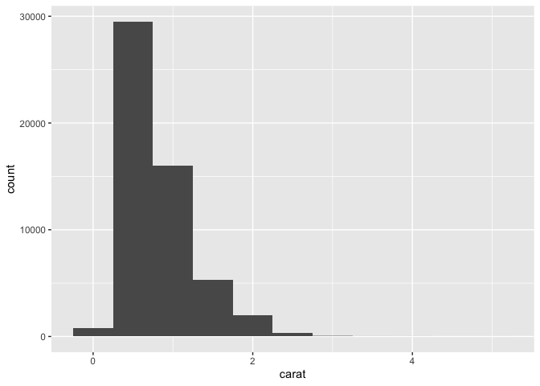<!-- -->

We can find the height of the bins of our histogram with
`dplyr::count()` and `ggplot2::cut_width()`

``` r
diamonds %>%
  count(cut_width(carat, 0.5))
```

    ## # A tibble: 11 x 2
    ##    `cut_width(carat, 0.5)`     n
    ##    <fct>                   <int>
    ##  1 [-0.25,0.25]              785
    ##  2 (0.25,0.75]             29498
    ##  3 (0.75,1.25]             15977
    ##  4 (1.25,1.75]              5313
    ##  5 (1.75,2.25]              2002
    ##  6 (2.25,2.75]               322
    ##  7 (2.75,3.25]                32
    ##  8 (3.25,3.75]                 5
    ##  9 (3.75,4.25]                 4
    ## 10 (4.25,4.75]                 1
    ## 11 (4.75,5.25]                 1

The `binwidth` argument of `geom_histogram()` is measured in the units
of the x variable. Exploring bin size can be informative and reveal
different patterns.

``` r
smaller <- diamonds %>%
  filter(carat < 3)

ggplot(data = smaller, mapping = aes(x = carat))+
  geom_histogram(binwidth = 0.1)
```

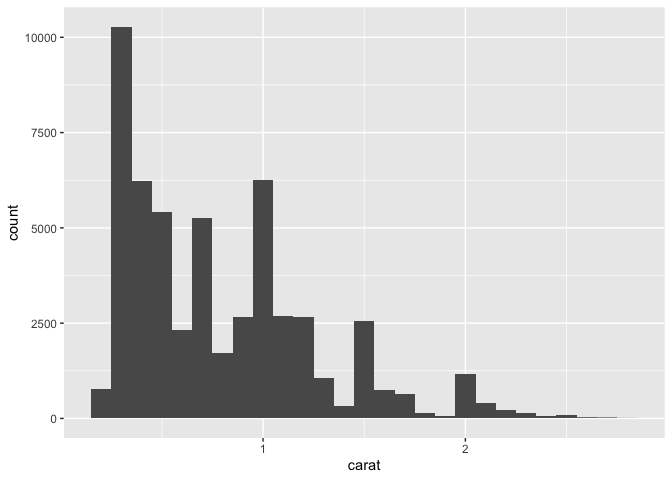<!-- -->

To display multiple histograms in the same plot, `geom_frepoly()` is a
good option: it performs the same calculation as `geom_histogram()` but
uses lines rather than bars, which can be easier to understand when
looking at several histograms.

``` r
ggplot(data = smaller, mapping = aes(x = carat, color = cut))+
  geom_freqpoly(binwidth = 0.1)
```

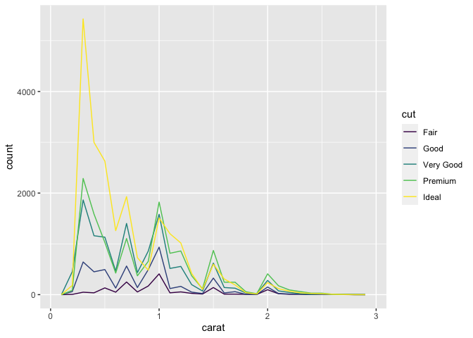<!-- -->

### Typical Values

Some good questions to ask when viewing a histogram are:

> Which values are the most common? Why? Which values are rare? Why?
> Does that match your expectations? Can you see any unusualy patterns?
> What might explain them?

``` r
ggplot(data = smaller, mapping = aes(x = carat))+
  geom_histogram(binwidth = 0.01)
```

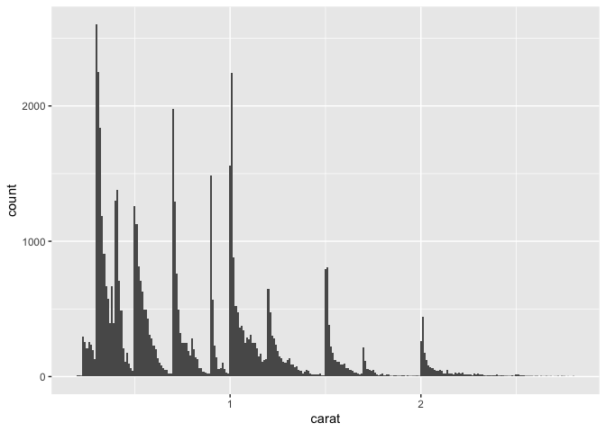<!-- -->

When we have clusters of similar values, that implies the presents of
subgroups in our data. An example of data with clustering is the Old
Faithful Geyser in Yellowstone National Park:

``` r
ggplot(data = faithful, mapping = aes(x = eruptions))+
  geom_histogram(binwidth = 0.25)
```

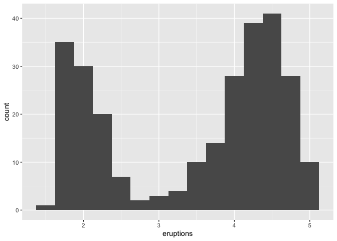<!-- -->
\#\#\# Unusual Values

Outliers can be data entry errors or potentially important observations.
They can be hard to detect on histograms, sometimes only evidenced by a
wide limit value, like the y limit below.

``` r
ggplot(diamonds)+
  geom_histogram(mapping = aes(x=y), binwidth = 0.5)
```

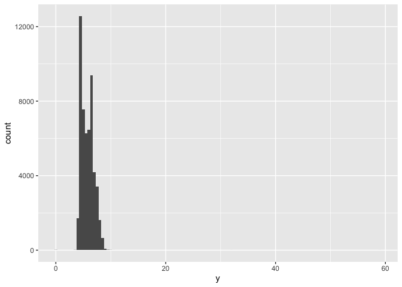<!-- -->

To see these values better, we can zoom:

``` r
ggplot(diamonds)+
  geom_histogram(mapping = aes(x = y), binwidth = 0.5)+
  coord_cartesian(ylim = c(0, 50))
```

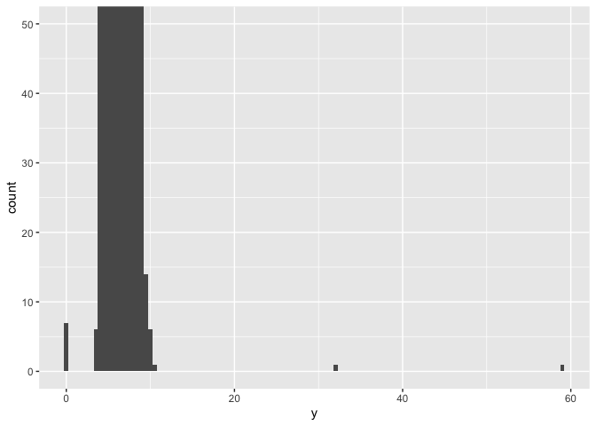<!-- -->

We could also have used `xlim` and `ylim` but these two functions throw
away the values, rather than zooming as `cartesian_coord()` does. We can
examine closer our unusual values:

``` r
unusual <- diamonds %>%
  filter(y < 3 | y > 20) %>%
  arrange(y)
unusual
```

    ## # A tibble: 9 x 10
    ##   carat cut       color clarity depth table price     x     y     z
    ##   <dbl> <ord>     <ord> <ord>   <dbl> <dbl> <int> <dbl> <dbl> <dbl>
    ## 1  1    Very Good H     VS2      63.3    53  5139  0      0    0   
    ## 2  1.14 Fair      G     VS1      57.5    67  6381  0      0    0   
    ## 3  1.56 Ideal     G     VS2      62.2    54 12800  0      0    0   
    ## 4  1.2  Premium   D     VVS1     62.1    59 15686  0      0    0   
    ## 5  2.25 Premium   H     SI2      62.8    59 18034  0      0    0   
    ## 6  0.71 Good      F     SI2      64.1    60  2130  0      0    0   
    ## 7  0.71 Good      F     SI2      64.1    60  2130  0      0    0   
    ## 8  0.51 Ideal     E     VS1      61.8    55  2075  5.15  31.8  5.12
    ## 9  2    Premium   H     SI2      58.9    57 12210  8.09  58.9  8.06

Diamonds cannot have a width of 0 mm, so these values are clearly
incorrect; in addition values 31.8 and 58.9 seem implausible, since
diamonds that large would be worth much more than their stated price
value.

If outliers cause as substantial effect on the analysis, we cannot drop
them without justification; any removal should be recorded in a
write-up.

### Exercises:

``` r
ggplot(diamonds)+
  geom_histogram(aes(x = price), binwidth = 100)+
  coord_cartesian(ylim = c(0,500))
```

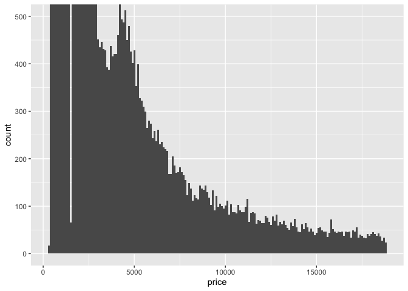<!-- -->

``` r
carat_0.99 <- diamonds %>%
                filter(carat == 0.99)

carat_1.0 <- diamonds %>%
                filter(carat == 1)

length(carat_0.99$carat)
```

    ## [1] 23

``` r
length(carat_1.0$carat)
```

    ## [1] 1558

### Missing Values

We have two options for unusual values: 1. drop the entire row of data

``` r
diamonds2 <- diamonds %>%
  filter(between(y,3,20)) # between is a shortcut for x >= left & x <= right
```

Or, 2. replace the unusual values with missing values

``` r
diamonds2 <- diamonds %>%
  mutate(y = ifelse(y<3|y>20, NA, y))

# another way to do the same thing:
diamonds2 <- diamonds %>%
  mutate(y = ifelse(between(y,3,20), y, NA))
```

Missing values should never go missing silently. We always want to
remain aware that some values are missing. `ggplot2` warns us if we try
to plot a variable that contains missing values.

``` r
ggplot(data = diamonds2, mapping = aes(x = x, y = y))+
  geom_point()
```

    ## Warning: Removed 9 rows containing missing values (geom_point).

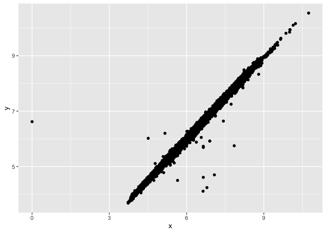<!-- -->

Sometimes we want to understand what makes missing values different than
non-missing values. In the data set `nycflights13::flights`, `NA` values
indicate that a flight was canceled.

``` r
nycflights13::flights %>%
  mutate(cancelled = is.na(dep_time),
         sched_hour = sched_dep_time %/% 100,
         sched_min = sched_dep_time %% 100,
         sched_dep_time = sched_hour + sched_min/60) %>%
  ggplot(mapping = aes(sched_dep_time))+
    geom_freqpoly(
      mapping = aes(color = cancelled),
      binwidth = 1/4
    )
```

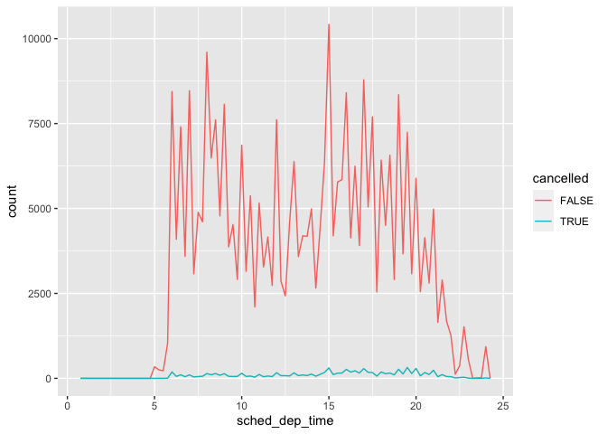<!-- -->

### Exercises

``` r
diamonds2 %>%
  ggplot()+
    geom_histogram(aes(x = y))
```

    ## `stat_bin()` using `bins = 30`. Pick better value with `binwidth`.

    ## Warning: Removed 9 rows containing non-finite values (stat_bin).

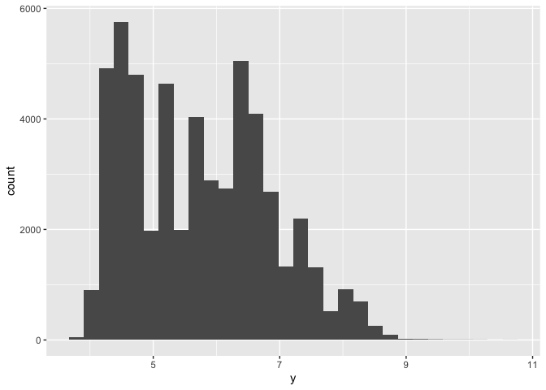<!-- -->

In a histogram, rows are removed and a warning is provided.

### Covariation

``` r
ggplot(data = diamonds, mapping = aes(x = price))+
  geom_freqpoly(mapping = aes(color = cut), binwidth = 500)
```

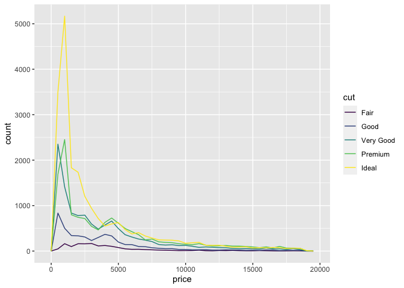<!-- --> It
can be difficult to identify differences because the number of diamonds
in each level of cut are not the same. We can combat this by plotting
the density, “which is the standardized so that the area under the
prequency polygon is one:”

``` r
ggplot(data = diamonds, mapping = aes(x = price, y = ..density..))+
  geom_freqpoly(mapping = aes(color = cut), binwidth = 500)
```

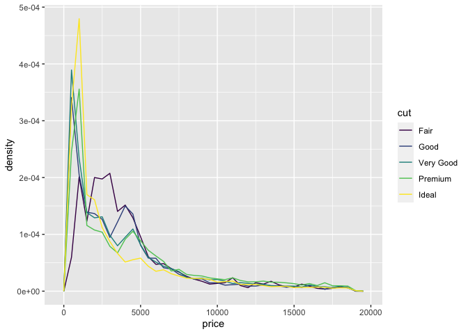<!-- --> This
plot suggests that Fair diamonds (the lowest quality) have the largest
mean price. We can also visualize these with box plots.

``` r
ggplot(data = diamonds, mapping = aes(x = cut, y = price))+
  geom_boxplot()
```

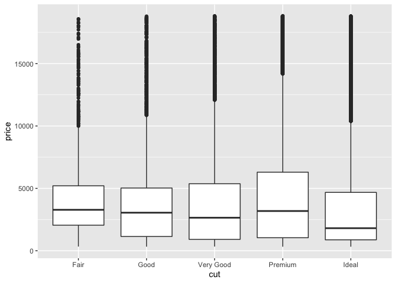<!-- -->

Cut has an ordering built in, but that’s not always the case. In the
`mpg` dataset, there is no inherent ordering for class of car.

``` r
ggplot(data = mpg, mapping = aes(x = class, y = hwy))+
  geom_boxplot()
```

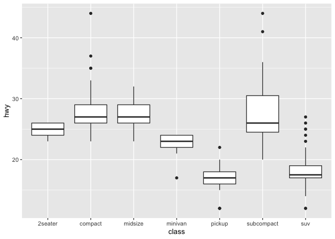<!-- -->

We can make the trend easier to see by ordering the box plots by their
medians.

``` r
ggplot(data = mpg)+
  geom_boxplot(
    mapping = aes(
      x = reorder(class, hwy, FUN = median),
      y = hwy
    )
  )
```

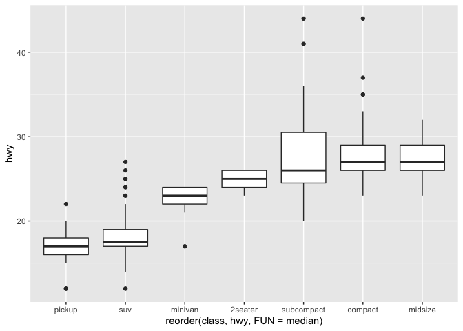<!-- -->

We can also flip the orientation of our boxplots, which is useful if we
have long names:

``` r
ggplot(data = mpg)+
  geom_boxplot(
    mapping = aes(
      x = reorder(class, hwy, FUN = median),
      y = hwy
    )
  )+
  coord_flip()
```

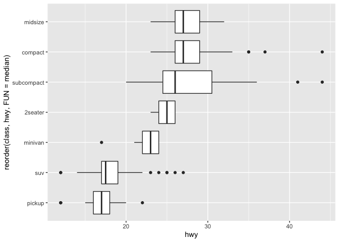<!-- -->

If we have two categorical variables, we need to count the observations
for each combination.

``` r
ggplot(data = diamonds)+
  geom_count(mapping = aes(x = cut, y = color))
```

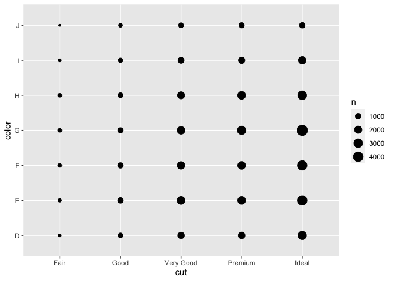<!-- -->

We can also use `dplyr` to accomplish this.

``` r
head(diamonds %>%
  count(color, cut))
```

    ## # A tibble: 6 x 3
    ##   color cut           n
    ##   <ord> <ord>     <int>
    ## 1 D     Fair        163
    ## 2 D     Good        662
    ## 3 D     Very Good  1513
    ## 4 D     Premium    1603
    ## 5 D     Ideal      2834
    ## 6 E     Fair        224

And visualize with `geom_tile()`.

``` r
diamonds %>%
  count(color, cut) %>%
  ggplot(mapping = aes(x = color, y = cut))+
    geom_tile(mapping = aes(fill =  n))
```

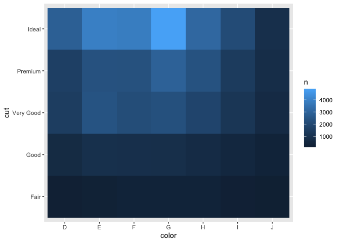<!-- -->

When we have two continuous variables, we can visualize them with a
scatterplot.

``` r
ggplot(data = diamonds)+
  geom_point(mapping = aes(x = carat, y = price))
```

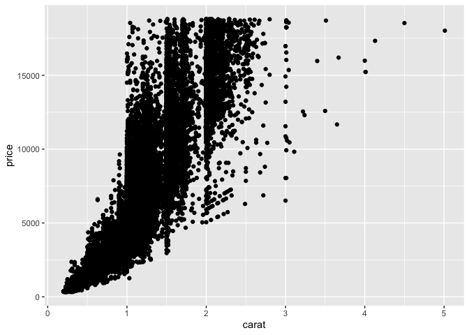<!-- -->

We have so many data that it is difficult to distinguish the points.
This can be mitigated somewhat by making the points transparent, so when
they overlap the points are darker.

``` r
ggplot(data = diamonds)+
  geom_point(
    mapping = aes(x = carat, y = price),
    alpha = 1/100
  )
```

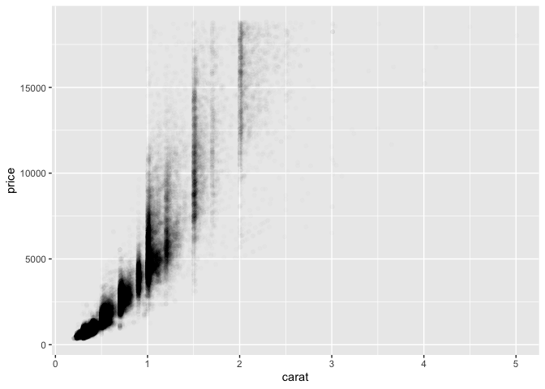<!-- -->

We could also use bin.

``` r
ggplot(data = smaller)+
  geom_bin2d(mapping = aes(x = carat, y = price))
```

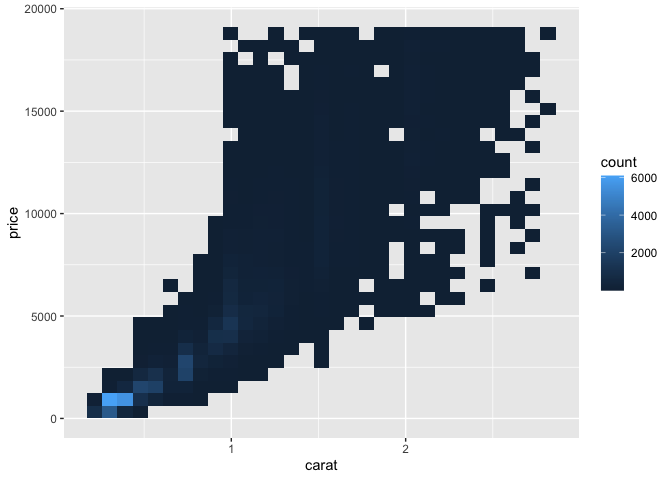<!-- -->

``` r
ggplot(data = smaller)+
  geom_hex(mapping = aes(x = carat, y = price))
```

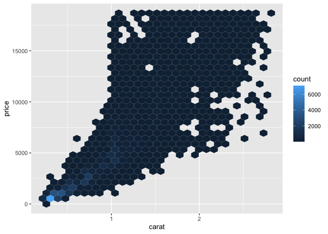<!-- -->

We could also bin one of the continuous variables, so it acts like a
categorical variable.

``` r
ggplot(data = smaller, mapping = aes(x = carat, y = price))+
  geom_boxplot(mapping = aes(group = cut_width(carat, 0.1)))
```

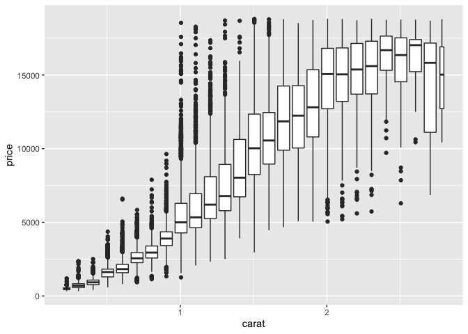<!-- -->

This makes it difficult to tell, however, that each box plot may have a
different number of observations. We can remedy that with

``` r
ggplot(data = smaller, mapping = aes(x = carat, y = price))+
  geom_boxplot(mapping = aes(group = cut_number(carat, 20)))
```

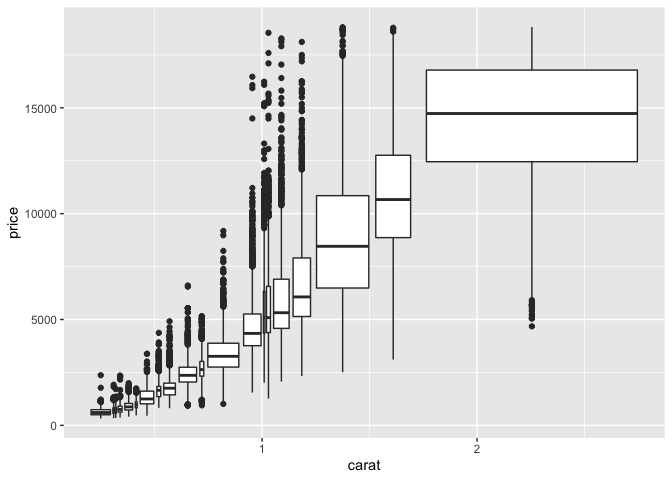<!-- -->

### Patterns and Models

Patterns we see in the data tell us about relationships between
variables. If we look at the Old Faithful eruption again, we can see
that longer waittimes are associated with longer eruptions.

``` r
ggplot(data = faithful)+
  geom_point(mapping = aes(x = eruptions, y = waiting))
```

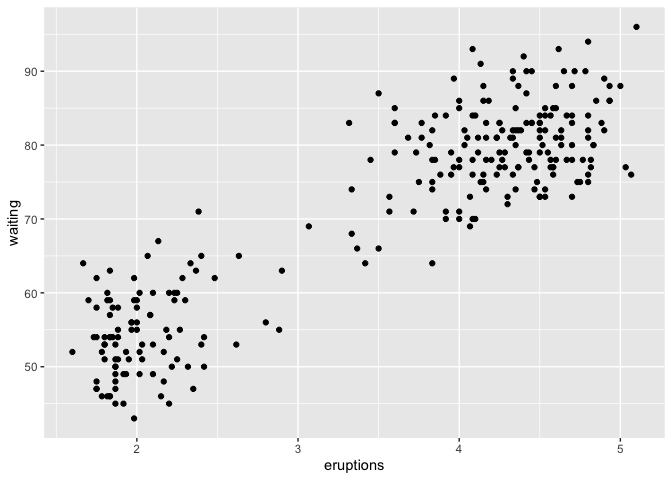<!-- -->

> If you think of variation as a phenomenon that creaes uncertainty,
> covariation is a phenomenon that reduces it. If two variables covary,
> you can use the vales of one variable to make better predictions about
> the values of the second. If the covariation is due to a causal
> relationship (a special case), then you can use the value of one
> variable to control the value of the second.

``` r
library(modelr)

mod <- lm(log(price)~ log(carat), data = diamonds)

diamonds2 <- diamonds %>%
  add_residuals(mod) %>%
  mutate(resid = exp(resid))

ggplot(data = diamonds2)+
  geom_point(mapping = aes(x = carat, y = resid))
```

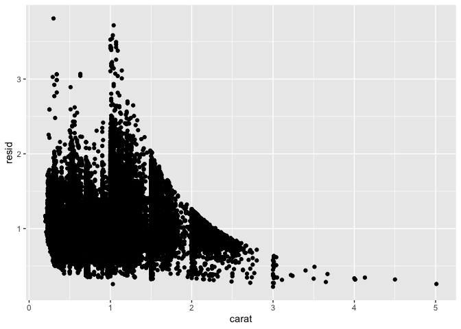<!-- -->
