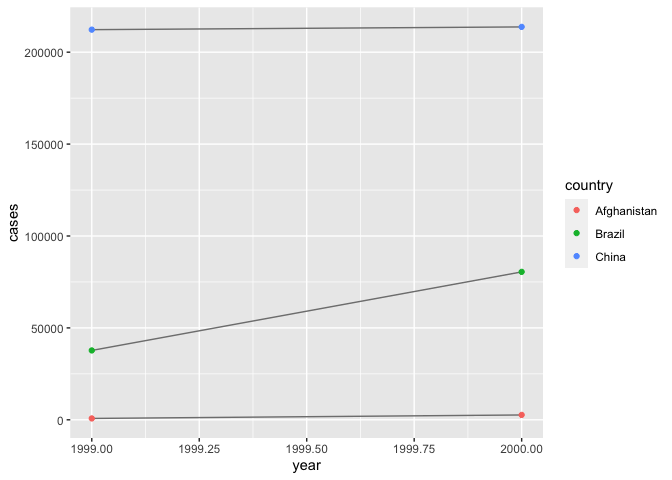

Tidy Data with tidyr
================
Emma Grossman
4/21/2021

# Tidy Data

``` r
table1
```

    ## # A tibble: 6 x 4
    ##   country      year  cases population
    ##   <chr>       <int>  <int>      <int>
    ## 1 Afghanistan  1999    745   19987071
    ## 2 Afghanistan  2000   2666   20595360
    ## 3 Brazil       1999  37737  172006362
    ## 4 Brazil       2000  80488  174504898
    ## 5 China        1999 212258 1272915272
    ## 6 China        2000 213766 1280428583

``` r
table2
```

    ## # A tibble: 12 x 4
    ##    country      year type            count
    ##    <chr>       <int> <chr>           <int>
    ##  1 Afghanistan  1999 cases             745
    ##  2 Afghanistan  1999 population   19987071
    ##  3 Afghanistan  2000 cases            2666
    ##  4 Afghanistan  2000 population   20595360
    ##  5 Brazil       1999 cases           37737
    ##  6 Brazil       1999 population  172006362
    ##  7 Brazil       2000 cases           80488
    ##  8 Brazil       2000 population  174504898
    ##  9 China        1999 cases          212258
    ## 10 China        1999 population 1272915272
    ## 11 China        2000 cases          213766
    ## 12 China        2000 population 1280428583

Three rules make a dataset tidy:

1.  each variable is a column
2.  each observation has a row
3.  each value has a cell

table1 is tidy, table2 is not. We can work with tidy data easily:

``` r
# rate per 10,000
table1 %>%
  mutate(rate = cases/population*10000)
```

    ## # A tibble: 6 x 5
    ##   country      year  cases population  rate
    ##   <chr>       <int>  <int>      <int> <dbl>
    ## 1 Afghanistan  1999    745   19987071 0.373
    ## 2 Afghanistan  2000   2666   20595360 1.29 
    ## 3 Brazil       1999  37737  172006362 2.19 
    ## 4 Brazil       2000  80488  174504898 4.61 
    ## 5 China        1999 212258 1272915272 1.67 
    ## 6 China        2000 213766 1280428583 1.67

``` r
# Cases per year
table1 %>%
  count(year, wt = cases)
```

    ## # A tibble: 2 x 2
    ##    year      n
    ##   <int>  <int>
    ## 1  1999 250740
    ## 2  2000 296920

``` r
# Visualize changes over time
ggplot(table1, aes(year, cases))+
  geom_line(aes(group = country), color = "gray50")+
  geom_point(aes(color = country))
```

<!-- -->

## Spreading and Gathering

There are usually two main problems: (1) one variable might be spread
across multiple columns, or (2) one observations in multiple rows and
bonus (3) both. Luckily, we have two functions in the `tidyverse`
package, `gather()` and `spread()`.

### Gathering

`gather()` is helpful when column names are not the names of variables,
but the values of other variables. For example, in `table4a`, the column
names are the values of the `year` variable.

``` r
table4a
```

    ## # A tibble: 3 x 3
    ##   country     `1999` `2000`
    ## * <chr>        <int>  <int>
    ## 1 Afghanistan    745   2666
    ## 2 Brazil       37737  80488
    ## 3 China       212258 213766

``` r
table4a <- table4a %>%
  gather(`1999`, `2000`, key = "year", value = "cases")

table4b <- table4b %>%
  gather(`1999`, `2000`, key = "year", value = "population")
```

We can combine these two datasets into one to create our tidy data:

``` r
left_join(table4a, table4b)
```

    ## Joining, by = c("country", "year")

    ## # A tibble: 6 x 4
    ##   country     year   cases population
    ##   <chr>       <chr>  <int>      <int>
    ## 1 Afghanistan 1999     745   19987071
    ## 2 Brazil      1999   37737  172006362
    ## 3 China       1999  212258 1272915272
    ## 4 Afghanistan 2000    2666   20595360
    ## 5 Brazil      2000   80488  174504898
    ## 6 China       2000  213766 1280428583

### Spreading

Spreading is the opposite of gathering. An observation is scattered
across multiple rows, like `table2`.

``` r
table2
```

    ## # A tibble: 12 x 4
    ##    country      year type            count
    ##    <chr>       <int> <chr>           <int>
    ##  1 Afghanistan  1999 cases             745
    ##  2 Afghanistan  1999 population   19987071
    ##  3 Afghanistan  2000 cases            2666
    ##  4 Afghanistan  2000 population   20595360
    ##  5 Brazil       1999 cases           37737
    ##  6 Brazil       1999 population  172006362
    ##  7 Brazil       2000 cases           80488
    ##  8 Brazil       2000 population  174504898
    ##  9 China        1999 cases          212258
    ## 10 China        1999 population 1272915272
    ## 11 China        2000 cases          213766
    ## 12 China        2000 population 1280428583

``` r
spread(table2, key = type, value = count)
```

    ## # A tibble: 6 x 4
    ##   country      year  cases population
    ##   <chr>       <int>  <int>      <int>
    ## 1 Afghanistan  1999    745   19987071
    ## 2 Afghanistan  2000   2666   20595360
    ## 3 Brazil       1999  37737  172006362
    ## 4 Brazil       2000  80488  174504898
    ## 5 China        1999 212258 1272915272
    ## 6 China        2000 213766 1280428583

## Separating and Pull

`table3` has yet another problem. Two variables are in one column of
data.

``` r
table3
```

    ## # A tibble: 6 x 3
    ##   country      year rate             
    ## * <chr>       <int> <chr>            
    ## 1 Afghanistan  1999 745/19987071     
    ## 2 Afghanistan  2000 2666/20595360    
    ## 3 Brazil       1999 37737/172006362  
    ## 4 Brazil       2000 80488/174504898  
    ## 5 China        1999 212258/1272915272
    ## 6 China        2000 213766/1280428583

``` r
table3 %>%
  separate(rate, into = c("cases", "population"))
```

    ## # A tibble: 6 x 4
    ##   country      year cases  population
    ##   <chr>       <int> <chr>  <chr>     
    ## 1 Afghanistan  1999 745    19987071  
    ## 2 Afghanistan  2000 2666   20595360  
    ## 3 Brazil       1999 37737  172006362 
    ## 4 Brazil       2000 80488  174504898 
    ## 5 China        1999 212258 1272915272
    ## 6 China        2000 213766 1280428583

By default, it separates where it doesn’t see an alphanumeric character,
like the forward slash above. We can also specify if need be:

``` r
table3 %>%
  separate(rate, into = c("cases", "population"), sep = "/")
```

    ## # A tibble: 6 x 4
    ##   country      year cases  population
    ##   <chr>       <int> <chr>  <chr>     
    ## 1 Afghanistan  1999 745    19987071  
    ## 2 Afghanistan  2000 2666   20595360  
    ## 3 Brazil       1999 37737  172006362 
    ## 4 Brazil       2000 80488  174504898 
    ## 5 China        1999 212258 1272915272
    ## 6 China        2000 213766 1280428583

If we look at variables `cases` and `population`, though, they are
character vectors instead of numeric vectors, so we should change that.

``` r
table3 %>%
  separate(rate, 
           into = c("cases", "population"), 
           convert = TRUE)
```

    ## # A tibble: 6 x 4
    ##   country      year  cases population
    ##   <chr>       <int>  <int>      <int>
    ## 1 Afghanistan  1999    745   19987071
    ## 2 Afghanistan  2000   2666   20595360
    ## 3 Brazil       1999  37737  172006362
    ## 4 Brazil       2000  80488  174504898
    ## 5 China        1999 212258 1272915272
    ## 6 China        2000 213766 1280428583

`convert` attempts to change the variable type into more fitting ones,
if there are any.

If we pass an integer into `sep`, it is interpreted as a position. For
example,

``` r
table3 %>%
  separate(year, into = c("century", "year"), sep = 2)
```

    ## # A tibble: 6 x 4
    ##   country     century year  rate             
    ##   <chr>       <chr>   <chr> <chr>            
    ## 1 Afghanistan 19      99    745/19987071     
    ## 2 Afghanistan 20      00    2666/20595360    
    ## 3 Brazil      19      99    37737/172006362  
    ## 4 Brazil      20      00    80488/174504898  
    ## 5 China       19      99    212258/1272915272
    ## 6 China       20      00    213766/1280428583

### Unite

Unite is the opposite of `separate`: it joins two columns.

``` r
table5 %>%
  unite(new, century, year)
```

    ## # A tibble: 6 x 3
    ##   country     new   rate             
    ##   <chr>       <chr> <chr>            
    ## 1 Afghanistan 19_99 745/19987071     
    ## 2 Afghanistan 20_00 2666/20595360    
    ## 3 Brazil      19_99 37737/172006362  
    ## 4 Brazil      20_00 80488/174504898  
    ## 5 China       19_99 212258/1272915272
    ## 6 China       20_00 213766/1280428583

If we want to remove the underscore, we can.

``` r
table5 %>%
  unite(new, century, year, sep = "")
```

    ## # A tibble: 6 x 3
    ##   country     new   rate             
    ##   <chr>       <chr> <chr>            
    ## 1 Afghanistan 1999  745/19987071     
    ## 2 Afghanistan 2000  2666/20595360    
    ## 3 Brazil      1999  37737/172006362  
    ## 4 Brazil      2000  80488/174504898  
    ## 5 China       1999  212258/1272915272
    ## 6 China       2000  213766/1280428583

## Missing Values

We have have explicitly missing data, flagged with `NA` or implicitly
missing data, which just isn’t present.

``` r
stocks <- tibble(
  year   = c(2015, 2015, 2015, 2015, 2016, 2016, 2016),
  qtr    = c(   1,    2,    3,    4,    2,    3,    4),
  return = c(1.88, 0.59, 0.35,   NA, 0.92, 0.17, 2.66)
)
```

We can make the implicit missing values explicit:

``` r
stocks %>%
  spread(year, return)
```

    ## # A tibble: 4 x 3
    ##     qtr `2015` `2016`
    ##   <dbl>  <dbl>  <dbl>
    ## 1     1   1.88  NA   
    ## 2     2   0.59   0.92
    ## 3     3   0.35   0.17
    ## 4     4  NA      2.66

Or, if our missing data isn’t important, we can make it implicit:

``` r
stocks %>%
  spread(year, return) %>%
  gather(year, return, `2015`:`2016`, na.rm = TRUE)
```

    ## # A tibble: 6 x 3
    ##     qtr year  return
    ##   <dbl> <chr>  <dbl>
    ## 1     1 2015    1.88
    ## 2     2 2015    0.59
    ## 3     3 2015    0.35
    ## 4     2 2016    0.92
    ## 5     3 2016    0.17
    ## 6     4 2016    2.66

We can also use `complete()`, which finds all unique combinations of
variables:

``` r
stocks %>%
  complete(year, qtr)
```

    ## # A tibble: 8 x 3
    ##    year   qtr return
    ##   <dbl> <dbl>  <dbl>
    ## 1  2015     1   1.88
    ## 2  2015     2   0.59
    ## 3  2015     3   0.35
    ## 4  2015     4  NA   
    ## 5  2016     1  NA   
    ## 6  2016     2   0.92
    ## 7  2016     3   0.17
    ## 8  2016     4   2.66

Another tool for missing variables is utilized when missing values
indicate that the previous value should be carried forward:

``` r
treatment <- tribble(
  ~person,           ~treatment, ~response,
  "Derrick Whitmore", 1,         7,
  NA,                 2,         10,
  NA,                 3,         9,
  "Katherine Burke",  1,         4
)
```

This can be solved with `fill()`.

``` r
treatment %>%
  fill(person)
```

    ## # A tibble: 4 x 3
    ##   person           treatment response
    ##   <chr>                <dbl>    <dbl>
    ## 1 Derrick Whitmore         1        7
    ## 2 Derrick Whitmore         2       10
    ## 3 Derrick Whitmore         3        9
    ## 4 Katherine Burke          1        4

# Case Study

``` r
tidyr::who
```

    ## # A tibble: 7,240 x 60
    ##    country  iso2  iso3   year new_sp_m014 new_sp_m1524 new_sp_m2534 new_sp_m3544
    ##    <chr>    <chr> <chr> <int>       <int>        <int>        <int>        <int>
    ##  1 Afghani… AF    AFG    1980          NA           NA           NA           NA
    ##  2 Afghani… AF    AFG    1981          NA           NA           NA           NA
    ##  3 Afghani… AF    AFG    1982          NA           NA           NA           NA
    ##  4 Afghani… AF    AFG    1983          NA           NA           NA           NA
    ##  5 Afghani… AF    AFG    1984          NA           NA           NA           NA
    ##  6 Afghani… AF    AFG    1985          NA           NA           NA           NA
    ##  7 Afghani… AF    AFG    1986          NA           NA           NA           NA
    ##  8 Afghani… AF    AFG    1987          NA           NA           NA           NA
    ##  9 Afghani… AF    AFG    1988          NA           NA           NA           NA
    ## 10 Afghani… AF    AFG    1989          NA           NA           NA           NA
    ## # … with 7,230 more rows, and 52 more variables: new_sp_m4554 <int>,
    ## #   new_sp_m5564 <int>, new_sp_m65 <int>, new_sp_f014 <int>,
    ## #   new_sp_f1524 <int>, new_sp_f2534 <int>, new_sp_f3544 <int>,
    ## #   new_sp_f4554 <int>, new_sp_f5564 <int>, new_sp_f65 <int>,
    ## #   new_sn_m014 <int>, new_sn_m1524 <int>, new_sn_m2534 <int>,
    ## #   new_sn_m3544 <int>, new_sn_m4554 <int>, new_sn_m5564 <int>,
    ## #   new_sn_m65 <int>, new_sn_f014 <int>, new_sn_f1524 <int>,
    ## #   new_sn_f2534 <int>, new_sn_f3544 <int>, new_sn_f4554 <int>,
    ## #   new_sn_f5564 <int>, new_sn_f65 <int>, new_ep_m014 <int>,
    ## #   new_ep_m1524 <int>, new_ep_m2534 <int>, new_ep_m3544 <int>,
    ## #   new_ep_m4554 <int>, new_ep_m5564 <int>, new_ep_m65 <int>,
    ## #   new_ep_f014 <int>, new_ep_f1524 <int>, new_ep_f2534 <int>,
    ## #   new_ep_f3544 <int>, new_ep_f4554 <int>, new_ep_f5564 <int>,
    ## #   new_ep_f65 <int>, newrel_m014 <int>, newrel_m1524 <int>,
    ## #   newrel_m2534 <int>, newrel_m3544 <int>, newrel_m4554 <int>,
    ## #   newrel_m5564 <int>, newrel_m65 <int>, newrel_f014 <int>,
    ## #   newrel_f1524 <int>, newrel_f2534 <int>, newrel_f3544 <int>,
    ## #   newrel_f4554 <int>, newrel_f5564 <int>, newrel_f65 <int>

Who is messy.

``` r
who1 <- who %>%
  gather(
    new_sp_m014:newrel_f65, key = "key",
    value = cases,
    na.rm = TRUE
  )
who1
```

    ## # A tibble: 76,046 x 6
    ##    country     iso2  iso3   year key         cases
    ##    <chr>       <chr> <chr> <int> <chr>       <int>
    ##  1 Afghanistan AF    AFG    1997 new_sp_m014     0
    ##  2 Afghanistan AF    AFG    1998 new_sp_m014    30
    ##  3 Afghanistan AF    AFG    1999 new_sp_m014     8
    ##  4 Afghanistan AF    AFG    2000 new_sp_m014    52
    ##  5 Afghanistan AF    AFG    2001 new_sp_m014   129
    ##  6 Afghanistan AF    AFG    2002 new_sp_m014    90
    ##  7 Afghanistan AF    AFG    2003 new_sp_m014   127
    ##  8 Afghanistan AF    AFG    2004 new_sp_m014   139
    ##  9 Afghanistan AF    AFG    2005 new_sp_m014   151
    ## 10 Afghanistan AF    AFG    2006 new_sp_m014   193
    ## # … with 76,036 more rows

``` r
who1 %>%
  count(key)
```

    ## # A tibble: 56 x 2
    ##    key              n
    ##    <chr>        <int>
    ##  1 new_ep_f014   1032
    ##  2 new_ep_f1524  1021
    ##  3 new_ep_f2534  1021
    ##  4 new_ep_f3544  1021
    ##  5 new_ep_f4554  1017
    ##  6 new_ep_f5564  1017
    ##  7 new_ep_f65    1014
    ##  8 new_ep_m014   1038
    ##  9 new_ep_m1524  1026
    ## 10 new_ep_m2534  1020
    ## # … with 46 more rows

``` r
who2 <- who1 %>%
  mutate(key = stringr::str_replace(key, "newrel", "new_rel"))
```

``` r
who3 <- who2 %>%
  separate(key, c("new", "type", "sexage"), sep = "_")
who3
```

    ## # A tibble: 76,046 x 8
    ##    country     iso2  iso3   year new   type  sexage cases
    ##    <chr>       <chr> <chr> <int> <chr> <chr> <chr>  <int>
    ##  1 Afghanistan AF    AFG    1997 new   sp    m014       0
    ##  2 Afghanistan AF    AFG    1998 new   sp    m014      30
    ##  3 Afghanistan AF    AFG    1999 new   sp    m014       8
    ##  4 Afghanistan AF    AFG    2000 new   sp    m014      52
    ##  5 Afghanistan AF    AFG    2001 new   sp    m014     129
    ##  6 Afghanistan AF    AFG    2002 new   sp    m014      90
    ##  7 Afghanistan AF    AFG    2003 new   sp    m014     127
    ##  8 Afghanistan AF    AFG    2004 new   sp    m014     139
    ##  9 Afghanistan AF    AFG    2005 new   sp    m014     151
    ## 10 Afghanistan AF    AFG    2006 new   sp    m014     193
    ## # … with 76,036 more rows

``` r
who3 %>%
  count(new)
```

    ## # A tibble: 1 x 2
    ##   new       n
    ##   <chr> <int>
    ## 1 new   76046

``` r
who4 <- who3 %>%
  select(-new, -iso2, -iso3)
```

``` r
who5 <- who4 %>%
  separate(sexage, c("sex", "age"), sep = 1)
who5
```

    ## # A tibble: 76,046 x 6
    ##    country      year type  sex   age   cases
    ##    <chr>       <int> <chr> <chr> <chr> <int>
    ##  1 Afghanistan  1997 sp    m     014       0
    ##  2 Afghanistan  1998 sp    m     014      30
    ##  3 Afghanistan  1999 sp    m     014       8
    ##  4 Afghanistan  2000 sp    m     014      52
    ##  5 Afghanistan  2001 sp    m     014     129
    ##  6 Afghanistan  2002 sp    m     014      90
    ##  7 Afghanistan  2003 sp    m     014     127
    ##  8 Afghanistan  2004 sp    m     014     139
    ##  9 Afghanistan  2005 sp    m     014     151
    ## 10 Afghanistan  2006 sp    m     014     193
    ## # … with 76,036 more rows
