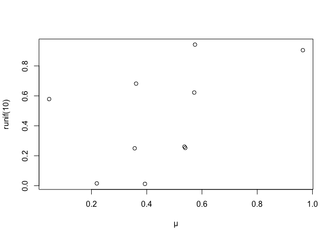

Strings with stringr
================
Emma Grossman
5/12/2021

The focus of this chapter is regex (I have experience with this from
Computational Linguistics).

## String Basics

``` r
string1 <- "This is a string"
string2 <- 'To put a "quote" inside a string, use single quotes'
```

We can use a backslash to “escape” a string:

``` r
double_quote <- "\""
single_quote <- '\''
```

So, to include a literal backslash, we need to double it.

``` r
x <- c("\"", "\\")
x
```

    ## [1] "\"" "\\"

``` r
writeLines(x)
```

    ## "
    ## \

Sometimes an odd string refers to a non-English character:

``` r
(x <- "\u00b5")
```

    ## [1] "µ"

``` r
plot(runif(10), runif(10), xlab ="\u00b5")
```

<!-- -->

``` r
# a way to have Greek letters on our plots without the package
# I used for my MS project
```

## String Length

Functions in the `stringr` generally begin with the prefix `str_`.

``` r
str_length(c("a", "R for data science", NA))
```

    ## [1]  1 18 NA

## Combining Strings

``` r
str_c("x", "y")
```

    ## [1] "xy"

``` r
str_c("x", "y", "z")
```

    ## [1] "xyz"

``` r
str_c("x", "y", sep = ", ")
```

    ## [1] "x, y"

Missing values are contagious.

``` r
x <- c("abc", NA)
str_c("|-", x, "-|")
```

    ## [1] "|-abc-|" NA

``` r
str_c("|-", str_replace_na(x), "-|")
```

    ## [1] "|-abc-|" "|-NA-|"

As shown above, it is a vectorized function and recycles strings:

``` r
str_c("prefix-", c("a", "b", "c"), "-suffix")
```

    ## [1] "prefix-a-suffix" "prefix-b-suffix" "prefix-c-suffix"

Objects of length 0 are dropped, which is useful with `if`.

``` r
name <- "Emma"
time_of_day <- "morning"
birthday <- FALSE

str_c(
  "Good ", time_of_day, " ", name,
  if(birthday) "and HAPPY BIRTHDAY",
  "."
)
```

    ## [1] "Good morning Emma."

We can collapse a vector of strings into just one with an argument:

``` r
str_c(c("x", "y", "z"), collapse = ", ")
```

    ## [1] "x, y, z"

``` r
str_c(c("x", "y", "z"), collapse = "")
```

    ## [1] "xyz"

## Subsetting strings

``` r
# str_sub(vector, start, end)
x <- c("Apple", "Banana", "Pear")
str_sub(x, 1, 3)
```

    ## [1] "App" "Ban" "Pea"

``` r
# negative numbers count backward
str_sub(x, -3, -1)
```

    ## [1] "ple" "ana" "ear"

If we try to subset with more characters than exist, the funciton will
return as many characters as it can:

``` r
str_sub("a", 1, 5)
```

    ## [1] "a"

Freaking cool:

``` r
str_sub(x, 1, 1) <- str_to_lower(str_sub(x, 1, 1))
x
```

    ## [1] "apple"  "banana" "pear"

## Locales

Changing from upper to lower case or vise versa can be complicated
because different languages use different rules to do so. The default
Locale used by R depends on the current locale provided by the operating
system of the computer.

Sometimes how letters are storted varies by region:

``` r
x <- c("apple", "eggplant", "banana")
str_sort(x, locale = "en") # english
```

    ## [1] "apple"    "banana"   "eggplant"

``` r
str_sort(x, locale = "haw") # hawiian
```

    ## [1] "apple"    "eggplant" "banana"

## Matching Patterns with Regular Expressions

### Basic Matches

Exact match:

``` r
x <- c("apple", "banana", "pear")
str_view(x, "an")
```

    ## PhantomJS not found. You can install it with webshot::install_phantomjs(). If it is installed, please make sure the phantomjs executable can be found via the PATH variable.

<div id="htmlwidget-15d18e75c7dfcdfc5d3f" style="width:960px;height:100%;" class="str_view html-widget"></div>
<script type="application/json" data-for="htmlwidget-15d18e75c7dfcdfc5d3f">{"x":{"html":"<ul>\n  <li>apple<\/li>\n  <li>b<span class='match'>an<\/span>ana<\/li>\n  <li>pear<\/li>\n<\/ul>"},"evals":[],"jsHooks":[]}</script>

`.` matches any character (except a new line)

``` r
str_view(x, ".a.")
```

<div id="htmlwidget-0d774bae852563e77774" style="width:960px;height:100%;" class="str_view html-widget"></div>
<script type="application/json" data-for="htmlwidget-0d774bae852563e77774">{"x":{"html":"<ul>\n  <li>apple<\/li>\n  <li><span class='match'>ban<\/span>ana<\/li>\n  <li>p<span class='match'>ear<\/span><\/li>\n<\/ul>"},"evals":[],"jsHooks":[]}</script>

Use a double backslash to escape using `.`’s special function and ask
for an exact match.

``` r
dot <- "\\."
writeLines(dot)
```

    ## \.

``` r
str_view(c("abc", "a.c", "bef"), "a\\.c")
```

<div id="htmlwidget-bd07a72f8dbe64158a00" style="width:960px;height:100%;" class="str_view html-widget"></div>
<script type="application/json" data-for="htmlwidget-bd07a72f8dbe64158a00">{"x":{"html":"<ul>\n  <li>abc<\/li>\n  <li><span class='match'>a.c<\/span><\/li>\n  <li>bef<\/li>\n<\/ul>"},"evals":[],"jsHooks":[]}</script>

To identify a literal backslash, we need four of them.

``` r
x <- "a\\b"
writeLines(x)
```

    ## a\b

``` r
str_view(x, "\\\\")
```

<div id="htmlwidget-9fd01330aaa607c38403" style="width:960px;height:100%;" class="str_view html-widget"></div>
<script type="application/json" data-for="htmlwidget-9fd01330aaa607c38403">{"x":{"html":"<ul>\n  <li>a<span class='match'>\\<\/span>b<\/li>\n<\/ul>"},"evals":[],"jsHooks":[]}</script>

### Anchors

`^` matches the start of a string `$` matches the end of a string

``` r
x <- c("apple", "banana", "pear")
str_view(x, "^a")
```

<div id="htmlwidget-cc2e31e947d974cb039b" style="width:960px;height:100%;" class="str_view html-widget"></div>
<script type="application/json" data-for="htmlwidget-cc2e31e947d974cb039b">{"x":{"html":"<ul>\n  <li><span class='match'>a<\/span>pple<\/li>\n  <li>banana<\/li>\n  <li>pear<\/li>\n<\/ul>"},"evals":[],"jsHooks":[]}</script>

``` r
str_view(x, "a$")
```

<div id="htmlwidget-e7f3325fde675f40b778" style="width:960px;height:100%;" class="str_view html-widget"></div>
<script type="application/json" data-for="htmlwidget-e7f3325fde675f40b778">{"x":{"html":"<ul>\n  <li>apple<\/li>\n  <li>banan<span class='match'>a<\/span><\/li>\n  <li>pear<\/li>\n<\/ul>"},"evals":[],"jsHooks":[]}</script>

We can force regex to only match a complete string by sandwiching it
between the anchors:

``` r
x <- c("apple pie", "apple", "apple cake")
str_view(x, "apple")
```

<div id="htmlwidget-a25a59bdc8a16f0a706b" style="width:960px;height:100%;" class="str_view html-widget"></div>
<script type="application/json" data-for="htmlwidget-a25a59bdc8a16f0a706b">{"x":{"html":"<ul>\n  <li><span class='match'>apple<\/span> pie<\/li>\n  <li><span class='match'>apple<\/span><\/li>\n  <li><span class='match'>apple<\/span> cake<\/li>\n<\/ul>"},"evals":[],"jsHooks":[]}</script>

``` r
str_view(x, "^apple$")
```

<div id="htmlwidget-b9f076bb6d325135da7f" style="width:960px;height:100%;" class="str_view html-widget"></div>
<script type="application/json" data-for="htmlwidget-b9f076bb6d325135da7f">{"x":{"html":"<ul>\n  <li>apple pie<\/li>\n  <li><span class='match'>apple<\/span><\/li>\n  <li>apple cake<\/li>\n<\/ul>"},"evals":[],"jsHooks":[]}</script>

### Character Classes and Alternatives

  - \\d matches any digit
  - \\s matches whitespace (space, tab, newline)
  - \[abc\] matches a, b or c
  - \[^abc\] maches anything except a, b or c

<!-- end list -->

``` r
str_view(c("gray", "grey"), "gr(e|a)y")
```

<div id="htmlwidget-0563dee433cea44da270" style="width:960px;height:100%;" class="str_view html-widget"></div>
<script type="application/json" data-for="htmlwidget-0563dee433cea44da270">{"x":{"html":"<ul>\n  <li><span class='match'>gray<\/span><\/li>\n  <li><span class='match'>grey<\/span><\/li>\n<\/ul>"},"evals":[],"jsHooks":[]}</script>

### Repetition

How many times a pattern is matched.

  - ?: 0 or 1
  - \+: 1 or more
  - \*: 0 or more

<!-- end list -->

``` r
x <- "1888 is the longest year in Roman numerals: MDCCCLXXXVIII"
str_view(x, "CC?")
```

<div id="htmlwidget-156c63eaf219f6f9e66f" style="width:960px;height:100%;" class="str_view html-widget"></div>
<script type="application/json" data-for="htmlwidget-156c63eaf219f6f9e66f">{"x":{"html":"<ul>\n  <li>1888 is the longest year in Roman numerals: MD<span class='match'>CC<\/span>CLXXXVIII<\/li>\n<\/ul>"},"evals":[],"jsHooks":[]}</script>

``` r
str_view(x, "CC+")
```

<div id="htmlwidget-c2656a36e69b1eebecc3" style="width:960px;height:100%;" class="str_view html-widget"></div>
<script type="application/json" data-for="htmlwidget-c2656a36e69b1eebecc3">{"x":{"html":"<ul>\n  <li>1888 is the longest year in Roman numerals: MD<span class='match'>CCC<\/span>LXXXVIII<\/li>\n<\/ul>"},"evals":[],"jsHooks":[]}</script>

``` r
str_view(x, "C[LX]+")
```

<div id="htmlwidget-c76e1dff2ac683d5c9f3" style="width:960px;height:100%;" class="str_view html-widget"></div>
<script type="application/json" data-for="htmlwidget-c76e1dff2ac683d5c9f3">{"x":{"html":"<ul>\n  <li>1888 is the longest year in Roman numerals: MDCC<span class='match'>CLXXX<\/span>VIII<\/li>\n<\/ul>"},"evals":[],"jsHooks":[]}</script>

We can utilize numbers as well. - {n}: exactly n times - {n,}: n or more
times - {,m}: at most m times - {n,m}: between n and m times

``` r
str_view(x, "C{2}")
```

<div id="htmlwidget-68496c52f112739ea214" style="width:960px;height:100%;" class="str_view html-widget"></div>
<script type="application/json" data-for="htmlwidget-68496c52f112739ea214">{"x":{"html":"<ul>\n  <li>1888 is the longest year in Roman numerals: MD<span class='match'>CC<\/span>CLXXXVIII<\/li>\n<\/ul>"},"evals":[],"jsHooks":[]}</script>

``` r
str_view(x, "C{2,}")
```

<div id="htmlwidget-0139249eb94e846aeb45" style="width:960px;height:100%;" class="str_view html-widget"></div>
<script type="application/json" data-for="htmlwidget-0139249eb94e846aeb45">{"x":{"html":"<ul>\n  <li>1888 is the longest year in Roman numerals: MD<span class='match'>CCC<\/span>LXXXVIII<\/li>\n<\/ul>"},"evals":[],"jsHooks":[]}</script>

``` r
str_view(x, "C{2,3}")
```

<div id="htmlwidget-bbbc4e0d281c1c7d85f3" style="width:960px;height:100%;" class="str_view html-widget"></div>
<script type="application/json" data-for="htmlwidget-bbbc4e0d281c1c7d85f3">{"x":{"html":"<ul>\n  <li>1888 is the longest year in Roman numerals: MD<span class='match'>CCC<\/span>LXXXVIII<\/li>\n<\/ul>"},"evals":[],"jsHooks":[]}</script>

By default, the longest match possible will always be returned, but this
can be changed by adding a `?` after them.

``` r
str_view(x, "C{2,3}?")
```

<div id="htmlwidget-8bc3721658797fa4ae67" style="width:960px;height:100%;" class="str_view html-widget"></div>
<script type="application/json" data-for="htmlwidget-8bc3721658797fa4ae67">{"x":{"html":"<ul>\n  <li>1888 is the longest year in Roman numerals: MD<span class='match'>CC<\/span>CLXXXVIII<\/li>\n<\/ul>"},"evals":[],"jsHooks":[]}</script>

Regex is powerful but complex, and it generally should not be the first
method to use when trying to solve a problem. It can be more trouble
than it is worth.

### Detect Matches

`str_detect` determines if a character expression matches a pattern.

``` r
x <- c("apple", "banana", "pear")
str_detect(x, "e")
```

    ## [1]  TRUE FALSE  TRUE

``` r
# How many common words start with t?
sum(str_detect(words, "^t"))
```

    ## [1] 65

``` r
# What proportion of common words end with a vowel?
mean(str_detect(words, "[aeiou]+$"))
```

    ## [1] 0.2765306

### Exact Matches

``` r
length(sentences)
```

    ## [1] 720

``` r
head(sentences)
```

    ## [1] "The birch canoe slid on the smooth planks." 
    ## [2] "Glue the sheet to the dark blue background."
    ## [3] "It's easy to tell the depth of a well."     
    ## [4] "These days a chicken leg is a rare dish."   
    ## [5] "Rice is often served in round bowls."       
    ## [6] "The juice of lemons makes fine punch."

``` r
colors <- c(
  "red", "orange", "yellow", "greeen", "blue", "purple"
)
color_match <- str_c(colors, collapse = "|")
color_match
```

    ## [1] "red|orange|yellow|greeen|blue|purple"

``` r
has_color <- str_subset(sentences, color_match)
matches <- str_extract(has_color, color_match)
head(matches)
```

    ## [1] "blue" "blue" "red"  "red"  "red"  "blue"

``` r
more <- sentences[str_count(sentences, color_match) > 1]
str_view_all(more, color_match)
```

<div id="htmlwidget-9c98509fb4c735852cc6" style="width:960px;height:100%;" class="str_view html-widget"></div>
<script type="application/json" data-for="htmlwidget-9c98509fb4c735852cc6">{"x":{"html":"<ul>\n  <li>It is hard to erase <span class='match'>blue<\/span> or <span class='match'>red<\/span> ink.<\/li>\n  <li>The sky in the west is tinged with <span class='match'>orange<\/span> <span class='match'>red<\/span>.<\/li>\n<\/ul>"},"evals":[],"jsHooks":[]}</script>

### Grouped Matches

``` r
noun <- "(a|the) ([^ ]+)"
has_noun <- sentences %>%
  str_subset(noun) %>%
  head(10)

has_noun %>%
  str_extract(noun)
```

    ##  [1] "the smooth" "the sheet"  "the depth"  "a chicken"  "the parked"
    ##  [6] "the sun"    "the huge"   "the ball"   "the woman"  "a helps"

We could also do this with `tibble`:

``` r
tibble(sentence = sentences) %>%
  tidyr::extract(
    sentence, c("article", "noun"), "(a|the) ([^ ]+)",
    remove = FALSE
  )
```

    ## # A tibble: 720 x 3
    ##    sentence                                    article noun   
    ##    <chr>                                       <chr>   <chr>  
    ##  1 The birch canoe slid on the smooth planks.  the     smooth 
    ##  2 Glue the sheet to the dark blue background. the     sheet  
    ##  3 It's easy to tell the depth of a well.      the     depth  
    ##  4 These days a chicken leg is a rare dish.    a       chicken
    ##  5 Rice is often served in round bowls.        <NA>    <NA>   
    ##  6 The juice of lemons makes fine punch.       <NA>    <NA>   
    ##  7 The box was thrown beside the parked truck. the     parked 
    ##  8 The hogs were fed chopped corn and garbage. <NA>    <NA>   
    ##  9 Four hours of steady work faced us.         <NA>    <NA>   
    ## 10 Large size in stockings is hard to sell.    <NA>    <NA>   
    ## # … with 710 more rows

### Replacing Matches

``` r
x <- c("apple", "pear", "banana")
str_replace(x, "[aeiou]", "-")
```

    ## [1] "-pple"  "p-ar"   "b-nana"

``` r
str_replace_all(x, "[aeiou]", "-")
```

    ## [1] "-ppl-"  "p--r"   "b-n-n-"

``` r
x <- c("1 house", "2 cars", "3 people")
str_replace_all(x, c("1" = "one", "2" = "two", "3" = "three"))
```

    ## [1] "one house"    "two cars"     "three people"

``` r
sentences %>%
  str_replace("([^ ]+) ([^ ]+) ([^ ]+)", "\\1 \\3 \\2") %>%
  head(5)
```

    ## [1] "The canoe birch slid on the smooth planks." 
    ## [2] "Glue sheet the to the dark blue background."
    ## [3] "It's to easy tell the depth of a well."     
    ## [4] "These a days chicken leg is a rare dish."   
    ## [5] "Rice often is served in round bowls."

### Splitting

``` r
sentences %>%
  head(5) %>%
  str_split(" ")
```

    ## [[1]]
    ## [1] "The"     "birch"   "canoe"   "slid"    "on"      "the"     "smooth" 
    ## [8] "planks."
    ## 
    ## [[2]]
    ## [1] "Glue"        "the"         "sheet"       "to"          "the"        
    ## [6] "dark"        "blue"        "background."
    ## 
    ## [[3]]
    ## [1] "It's"  "easy"  "to"    "tell"  "the"   "depth" "of"    "a"     "well."
    ## 
    ## [[4]]
    ## [1] "These"   "days"    "a"       "chicken" "leg"     "is"      "a"      
    ## [8] "rare"    "dish."  
    ## 
    ## [[5]]
    ## [1] "Rice"   "is"     "often"  "served" "in"     "round"  "bowls."

``` r
sentences %>%
  head(5) %>%
  str_split(" ", simplify = TRUE)
```

    ##      [,1]    [,2]    [,3]    [,4]      [,5]  [,6]    [,7]     [,8]         
    ## [1,] "The"   "birch" "canoe" "slid"    "on"  "the"   "smooth" "planks."    
    ## [2,] "Glue"  "the"   "sheet" "to"      "the" "dark"  "blue"   "background."
    ## [3,] "It's"  "easy"  "to"    "tell"    "the" "depth" "of"     "a"          
    ## [4,] "These" "days"  "a"     "chicken" "leg" "is"    "a"      "rare"       
    ## [5,] "Rice"  "is"    "often" "served"  "in"  "round" "bowls." ""           
    ##      [,9]   
    ## [1,] ""     
    ## [2,] ""     
    ## [3,] "well."
    ## [4,] "dish."
    ## [5,] ""

``` r
x <- "This is a sentence. This is another sentence."
str_view_all(x, boundary("word"))
```

<div id="htmlwidget-67a955cbe3ca5e158c44" style="width:960px;height:100%;" class="str_view html-widget"></div>
<script type="application/json" data-for="htmlwidget-67a955cbe3ca5e158c44">{"x":{"html":"<ul>\n  <li><span class='match'>This<\/span> <span class='match'>is<\/span> <span class='match'>a<\/span> <span class='match'>sentence<\/span>. <span class='match'>This<\/span> <span class='match'>is<\/span> <span class='match'>another<\/span> <span class='match'>sentence<\/span>.<\/li>\n<\/ul>"},"evals":[],"jsHooks":[]}</script>
