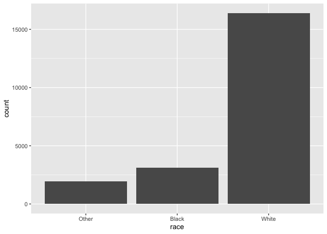
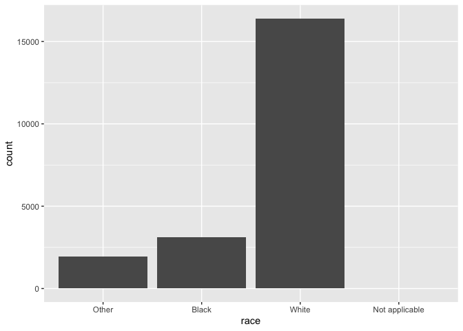
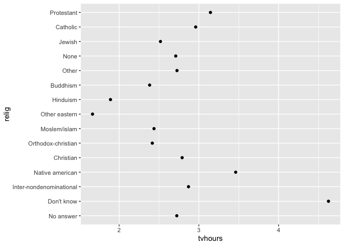
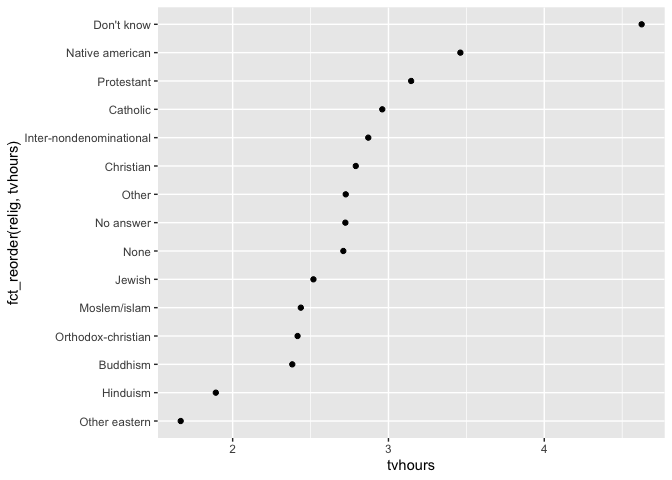
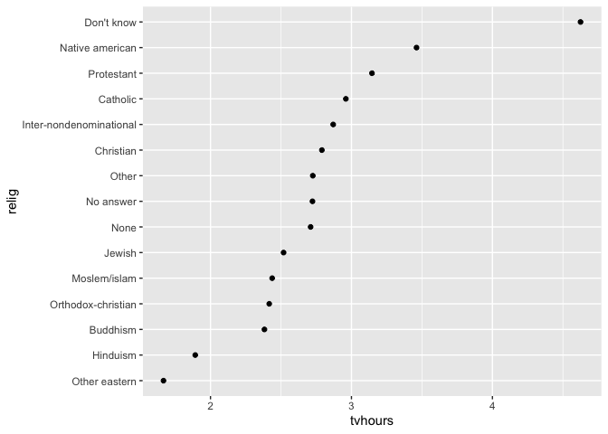
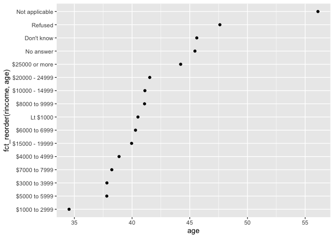
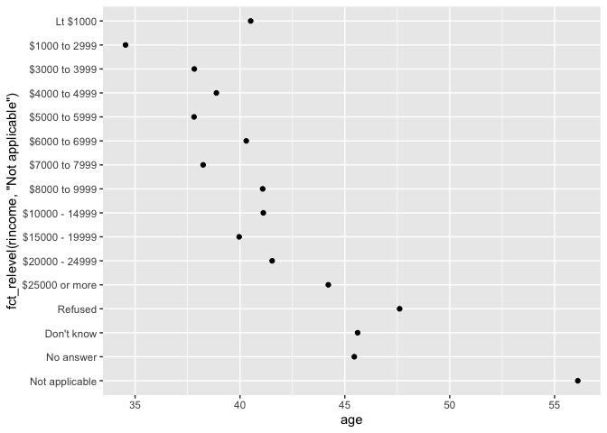
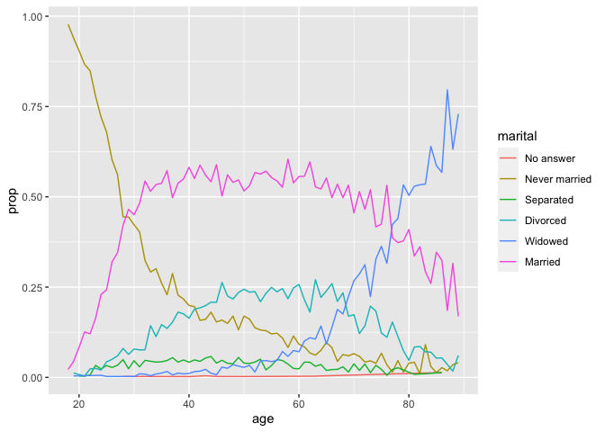
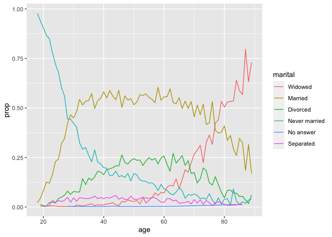

Factors with forcats
================
Emma Grossman
5/19/2021

Factors are used for categorical variables and were historically must
easier to work with than characters. For this reason, base R will
sometimes automatically convert strings to factors: `stringsAsFactors`
style.

# Creating Factors

``` r
x1 <- c("Dec", "Apr", "Jan", "Mar")
x2 <- c("Dec", "Apr", "Jam", "Mar")
```

Using a string could result in: (1) typos and (2) it doesn’t sort in a
useful way.

``` r
sort(x1)
```

    ## [1] "Apr" "Dec" "Jan" "Mar"

These problems can be fixed with a factor.

``` r
month_levels <- c(
  "Jan", "Feb", "Mar", "Apr", "May", "Jun",
  "Jul", "Aug", "Sep", "Oct", "Nov", "Dec"
)
y1 <- factor(x1, levels = month_levels)
y1
```

    ## [1] Dec Apr Jan Mar
    ## Levels: Jan Feb Mar Apr May Jun Jul Aug Sep Oct Nov Dec

``` r
sort(y1)
```

    ## [1] Jan Mar Apr Dec
    ## Levels: Jan Feb Mar Apr May Jun Jul Aug Sep Oct Nov Dec

``` r
y2 <- factor(x2, levels = month_levels)
y2
```

    ## [1] Dec  Apr  <NA> Mar 
    ## Levels: Jan Feb Mar Apr May Jun Jul Aug Sep Oct Nov Dec

``` r
y2 <- parse_factor(x2, levels = month_levels)
```

    ## Warning: 1 parsing failure.
    ## row col           expected actual
    ##   3  -- value in level set    Jam

``` r
# alphabetical
factor(x1)
```

    ## [1] Dec Apr Jan Mar
    ## Levels: Apr Dec Jan Mar

``` r
# order of appearance
f1 <- factor(x1, unique(x1))
f1
```

    ## [1] Dec Apr Jan Mar
    ## Levels: Dec Apr Jan Mar

``` r
# order of appearance (after the fact)
f2 <- x1 %>% factor %>% fct_inorder()
f2
```

    ## [1] Dec Apr Jan Mar
    ## Levels: Dec Apr Jan Mar

## General Social Survey

``` r
gss_cat
```

    ## # A tibble: 21,483 x 9
    ##     year marital     age race  rincome    partyid     relig     denom    tvhours
    ##    <int> <fct>     <int> <fct> <fct>      <fct>       <fct>     <fct>      <int>
    ##  1  2000 Never ma…    26 White $8000 to … Ind,near r… Protesta… Souther…      12
    ##  2  2000 Divorced     48 White $8000 to … Not str re… Protesta… Baptist…      NA
    ##  3  2000 Widowed      67 White Not appli… Independent Protesta… No deno…       2
    ##  4  2000 Never ma…    39 White Not appli… Ind,near r… Orthodox… Not app…       4
    ##  5  2000 Divorced     25 White Not appli… Not str de… None      Not app…       1
    ##  6  2000 Married      25 White $20000 - … Strong dem… Protesta… Souther…      NA
    ##  7  2000 Never ma…    36 White $25000 or… Not str re… Christian Not app…       3
    ##  8  2000 Divorced     44 White $7000 to … Ind,near d… Protesta… Luthera…      NA
    ##  9  2000 Married      44 White $25000 or… Not str de… Protesta… Other          0
    ## 10  2000 Married      47 White $25000 or… Strong rep… Protesta… Souther…       3
    ## # … with 21,473 more rows

``` r
gss_cat %>%
  count(race)
```

    ## # A tibble: 3 x 2
    ##   race      n
    ##   <fct> <int>
    ## 1 Other  1959
    ## 2 Black  3129
    ## 3 White 16395

``` r
ggplot(gss_cat, aes(race))+
  geom_bar()
```

<!-- -->

``` r
# ggplot drops levels w/o values but we can force them to display

ggplot(gss_cat, aes(race))+
  geom_bar()+
  scale_x_discrete(drop = FALSE)
```

<!-- -->

## Modifying Factor Order

``` r
relig <- gss_cat %>%
  group_by(relig) %>%
  summarize(
    age = mean(age, na.rm = TRUE),
    tvhours = mean(tvhours, na.rm = TRUE),
    n = n()
  )

ggplot(relig, aes(tvhours, relig)) + geom_point()
```

<!-- -->

``` r
ggplot(relig, aes(tvhours, fct_reorder(relig, tvhours))) + geom_point()
```

<!-- -->

``` r
relig %>%
  mutate(relig = fct_reorder(relig, tvhours)) %>%
  ggplot(aes(tvhours, relig))+
  geom_point()
```

<!-- -->

``` r
rincome <- gss_cat %>%
  group_by(rincome) %>%
  summarize(
    age = mean(age, na.rm = TRUE),
    tvhours = mean(tvhours, na.rm = TRUE),
    n = n()
  )

ggplot(rincome, aes(age, fct_reorder(rincome, age)))+
  geom_point()
```

<!-- -->

Not a good idea, because there is an inherent ordering to income. But,
we may want to pull not applicable to the front.

``` r
ggplot(rincome, aes(age, fct_relevel(rincome, "Not applicable")))+
  geom_point()
```

<!-- -->

> `fct_reorder2()` reorders the factor by the y values associated with
> the largest x values. This makes the plot easier to read because the
> line colors line up with the legend:

``` r
by_age <- gss_cat %>%
  filter(!is.na(age)) %>%
  count(age, marital) %>%
  group_by(age) %>%
  mutate(prop = n / sum(n))

ggplot(by_age, aes(age, prop, colour = marital)) +
  geom_line(na.rm = TRUE)
```

<!-- -->

``` r
ggplot(by_age, aes(age, prop, colour = fct_reorder2(marital, age, prop))) +
  geom_line() +
  labs(colour = "marital")
```

<!-- -->

``` r
gss_cat %>%
  mutate(marital = marital %>% fct_infreq() %>% fct_rev()) %>%
  ggplot(aes(marital))+
  geom_bar()
```

<!-- -->

## Modifying Factor Levels

`fct_recode()` is super helpful.

``` r
gss_cat %>%
  count(partyid)
```

    ## # A tibble: 10 x 2
    ##    partyid                n
    ##    <fct>              <int>
    ##  1 No answer            154
    ##  2 Don't know             1
    ##  3 Other party          393
    ##  4 Strong republican   2314
    ##  5 Not str republican  3032
    ##  6 Ind,near rep        1791
    ##  7 Independent         4119
    ##  8 Ind,near dem        2499
    ##  9 Not str democrat    3690
    ## 10 Strong democrat     3490

``` r
gss_cat %>%
  mutate(partyid = fct_recode(partyid,
    "Republican, strong"    = "Strong republican",
    "Republican, weak"      = "Not str republican",
    "Independent, near rep" = "Ind,near rep",
    "Independent, near dem" = "Ind,near dem",
    "Democrat, weak"        = "Not str democrat",
    "Democrat, strong"      = "Strong democrat"
  )) %>%
  count(partyid)
```

    ## # A tibble: 10 x 2
    ##    partyid                   n
    ##    <fct>                 <int>
    ##  1 No answer               154
    ##  2 Don't know                1
    ##  3 Other party             393
    ##  4 Republican, strong     2314
    ##  5 Republican, weak       3032
    ##  6 Independent, near rep  1791
    ##  7 Independent            4119
    ##  8 Independent, near dem  2499
    ##  9 Democrat, weak         3690
    ## 10 Democrat, strong       3490

``` r
gss_cat %>%
  mutate(partyid = fct_recode(partyid,
    "Republican, strong"    = "Strong republican",
    "Republican, weak"      = "Not str republican",
    "Independent, near rep" = "Ind,near rep",
    "Independent, near dem" = "Ind,near dem",
    "Democrat, weak"        = "Not str democrat",
    "Democrat, strong"      = "Strong democrat",
    "Other"                 = "No answer",
    "Other"                 = "Don't know",
    "Other"                 = "Other party"
  )) %>%
  count(partyid)
```

    ## # A tibble: 8 x 2
    ##   partyid                   n
    ##   <fct>                 <int>
    ## 1 Other                   548
    ## 2 Republican, strong     2314
    ## 3 Republican, weak       3032
    ## 4 Independent, near rep  1791
    ## 5 Independent            4119
    ## 6 Independent, near dem  2499
    ## 7 Democrat, weak         3690
    ## 8 Democrat, strong       3490

``` r
gss_cat %>%
  mutate(partyid = fct_collapse(partyid,
    other = c("No answer", "Don't know", "Other party"),
    rep = c("Strong republican", "Not str republican"),
    ind = c("Ind,near rep", "Independent", "Ind,near dem"),
    dem = c("Not str democrat", "Strong democrat")
  )) %>%
  count(partyid)
```

    ## # A tibble: 4 x 2
    ##   partyid     n
    ##   <fct>   <int>
    ## 1 other     548
    ## 2 rep      5346
    ## 3 ind      8409
    ## 4 dem      7180

``` r
gss_cat %>%
  mutate(relig = fct_lump(relig)) %>%
  count(relig)
```

    ## # A tibble: 2 x 2
    ##   relig          n
    ##   <fct>      <int>
    ## 1 Protestant 10846
    ## 2 Other      10637

``` r
gss_cat %>%
  mutate(relig = fct_lump(relig, n = 10)) %>%
  count(relig, sort = TRUE) %>%
  print(n = Inf)
```

    ## # A tibble: 10 x 2
    ##    relig                       n
    ##    <fct>                   <int>
    ##  1 Protestant              10846
    ##  2 Catholic                 5124
    ##  3 None                     3523
    ##  4 Christian                 689
    ##  5 Other                     458
    ##  6 Jewish                    388
    ##  7 Buddhism                  147
    ##  8 Inter-nondenominational   109
    ##  9 Moslem/islam              104
    ## 10 Orthodox-christian         95
