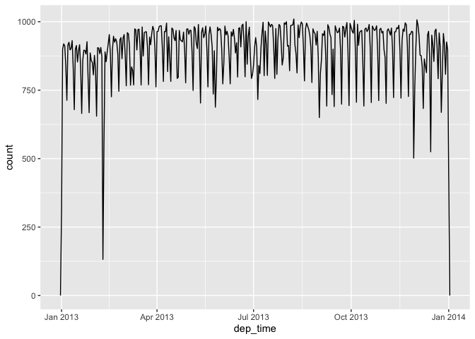
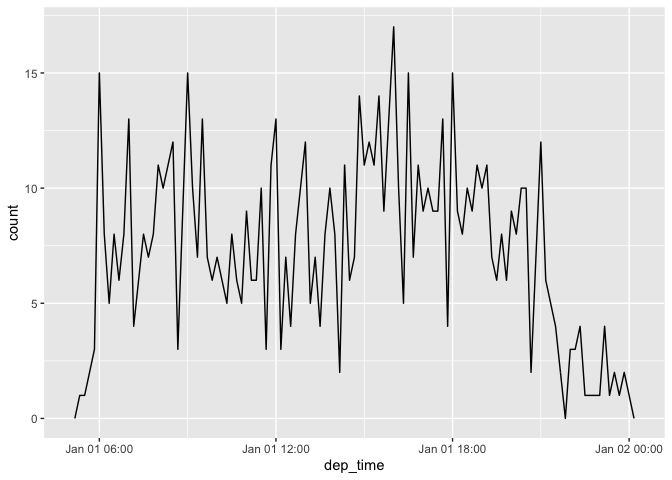
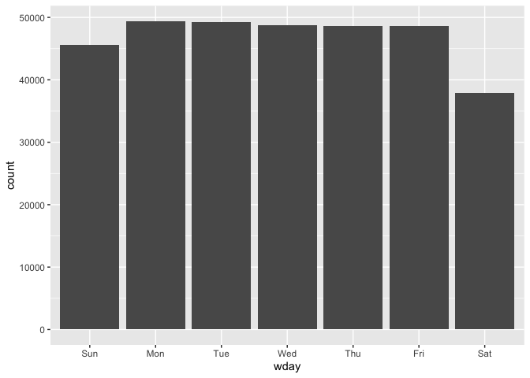
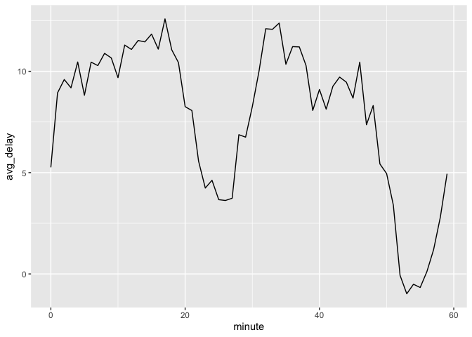
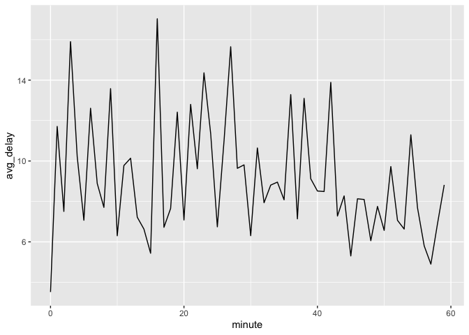
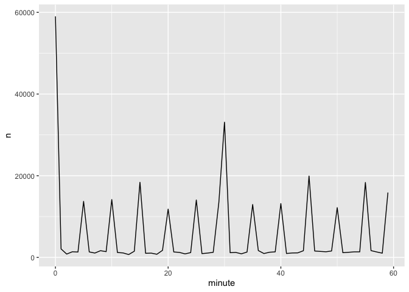
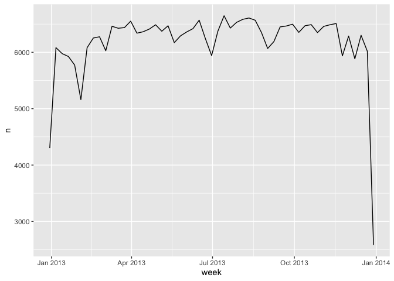
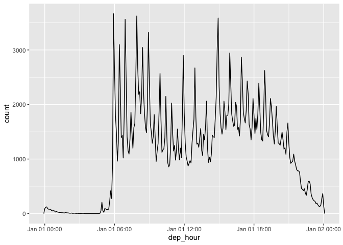

Dates and Times with lubridate
================
Emma Grossman
5/24/2021

## Creating Date/Times

When looking at date/time data we have three options (1) a date, (2) a
time, or (3) a date-time. R doesn’t have a base class for storing times,
so the `hms` packages functions well.

Good practice is to always uses the simplest measure of time as
possible.

``` r
today()
```

    ## [1] "2021-05-24"

``` r
now()
```

    ## [1] "2021-05-24 14:26:35 PDT"

### From Strings

A date/time generally is created via a string, from individual date-time
components or from existing date/time object.

``` r
ymd("2017-01-31")
```

    ## [1] "2017-01-31"

``` r
mdy("January 31st, 2017")
```

    ## [1] "2017-01-31"

``` r
dmy("31-Jan-2017")
```

    ## [1] "2017-01-31"

``` r
ymd(20170131)
```

    ## [1] "2017-01-31"

The above functions create dates, but we can also create date/times.

``` r
ymd_hms("2017-01-31 20:11:59")
```

    ## [1] "2017-01-31 20:11:59 UTC"

``` r
mdy_hm("01/31/2017 08:01")
```

    ## [1] "2017-01-31 08:01:00 UTC"

> You can also force the creation of a date-time from a date by
> supplying a time zone:

``` r
ymd(20170131, tz = "UTC")
```

    ## [1] "2017-01-31 UTC"

### From Individual Components

``` r
flights %>%
  select(year, month, day, hour, minute)
```

    ## # A tibble: 336,776 x 5
    ##     year month   day  hour minute
    ##    <int> <int> <int> <dbl>  <dbl>
    ##  1  2013     1     1     5     15
    ##  2  2013     1     1     5     29
    ##  3  2013     1     1     5     40
    ##  4  2013     1     1     5     45
    ##  5  2013     1     1     6      0
    ##  6  2013     1     1     5     58
    ##  7  2013     1     1     6      0
    ##  8  2013     1     1     6      0
    ##  9  2013     1     1     6      0
    ## 10  2013     1     1     6      0
    ## # … with 336,766 more rows

We can combine all of these elements into a date/time.

``` r
flights %>%
  select(year, month, day, hour, minute) %>%
  mutate(
    departure = make_datetime(year, month, day, hour, minute)
  )
```

    ## # A tibble: 336,776 x 6
    ##     year month   day  hour minute departure          
    ##    <int> <int> <int> <dbl>  <dbl> <dttm>             
    ##  1  2013     1     1     5     15 2013-01-01 05:15:00
    ##  2  2013     1     1     5     29 2013-01-01 05:29:00
    ##  3  2013     1     1     5     40 2013-01-01 05:40:00
    ##  4  2013     1     1     5     45 2013-01-01 05:45:00
    ##  5  2013     1     1     6      0 2013-01-01 06:00:00
    ##  6  2013     1     1     5     58 2013-01-01 05:58:00
    ##  7  2013     1     1     6      0 2013-01-01 06:00:00
    ##  8  2013     1     1     6      0 2013-01-01 06:00:00
    ##  9  2013     1     1     6      0 2013-01-01 06:00:00
    ## 10  2013     1     1     6      0 2013-01-01 06:00:00
    ## # … with 336,766 more rows

``` r
make_datetime_100 <- function(year, month, day, time) {
  make_datetime(year, month, day, time %/% 100, time %% 100)
}

flights_dt <- flights %>% 
  filter(!is.na(dep_time), !is.na(arr_time)) %>% 
  mutate(
    dep_time = make_datetime_100(year, month, day, dep_time),
    arr_time = make_datetime_100(year, month, day, arr_time),
    sched_dep_time = make_datetime_100(year, month, day, sched_dep_time),
    sched_arr_time = make_datetime_100(year, month, day, sched_arr_time)
  ) %>% 
  select(origin, dest, ends_with("delay"), ends_with("time"))

flights_dt
```

    ## # A tibble: 328,063 x 9
    ##    origin dest  dep_delay arr_delay dep_time            sched_dep_time     
    ##    <chr>  <chr>     <dbl>     <dbl> <dttm>              <dttm>             
    ##  1 EWR    IAH           2        11 2013-01-01 05:17:00 2013-01-01 05:15:00
    ##  2 LGA    IAH           4        20 2013-01-01 05:33:00 2013-01-01 05:29:00
    ##  3 JFK    MIA           2        33 2013-01-01 05:42:00 2013-01-01 05:40:00
    ##  4 JFK    BQN          -1       -18 2013-01-01 05:44:00 2013-01-01 05:45:00
    ##  5 LGA    ATL          -6       -25 2013-01-01 05:54:00 2013-01-01 06:00:00
    ##  6 EWR    ORD          -4        12 2013-01-01 05:54:00 2013-01-01 05:58:00
    ##  7 EWR    FLL          -5        19 2013-01-01 05:55:00 2013-01-01 06:00:00
    ##  8 LGA    IAD          -3       -14 2013-01-01 05:57:00 2013-01-01 06:00:00
    ##  9 JFK    MCO          -3        -8 2013-01-01 05:57:00 2013-01-01 06:00:00
    ## 10 LGA    ORD          -2         8 2013-01-01 05:58:00 2013-01-01 06:00:00
    ## # … with 328,053 more rows, and 3 more variables: arr_time <dttm>,
    ## #   sched_arr_time <dttm>, air_time <dbl>

``` r
flights_dt %>%
  ggplot(aes(dep_time))+
  geom_freqpoly(binwidth = 86400) # 86400 seconds = 1 day
```

<!-- -->

``` r
flights_dt %>%
  filter(dep_time < ymd(20130102)) %>%
  ggplot(aes(dep_time)) +
  geom_freqpoly(binwidth = 600) # 10 minutes
```

<!-- -->

For date-times, 1 = 1 second. For dates, 1 = 1 day.

### From Other Types

We can switch between dates and date/times.

``` r
as_datetime(today())
```

    ## [1] "2021-05-24 UTC"

``` r
as_date(now())
```

    ## [1] "2021-05-24"

## Date-Time Components

### Getting Components

We can extract components from a date-time object.

``` r
datetime <- ymd_hms("2016-07-08 12:34:56")

year(datetime)
```

    ## [1] 2016

``` r
month(datetime)
```

    ## [1] 7

``` r
mday(datetime) # day of the month
```

    ## [1] 8

``` r
yday(datetime) # day of the year
```

    ## [1] 190

``` r
wday(datetime) # day of the week
```

    ## [1] 6

``` r
month(datetime, label = TRUE)
```

    ## [1] Jul
    ## 12 Levels: Jan < Feb < Mar < Apr < May < Jun < Jul < Aug < Sep < ... < Dec

``` r
wday(datetime, label = TRUE, abbr = FALSE)
```

    ## [1] Friday
    ## 7 Levels: Sunday < Monday < Tuesday < Wednesday < Thursday < ... < Saturday

``` r
flights_dt %>%
  mutate(wday = wday(dep_time, label = TRUE)) %>%
  ggplot(aes(x = wday)) +
  geom_bar()
```

<!-- -->

``` r
flights_dt %>% 
  mutate(minute = minute(dep_time)) %>% 
  group_by(minute) %>% 
  summarise(
    avg_delay = mean(arr_delay, na.rm = TRUE),
    n = n()) %>% 
  ggplot(aes(minute, avg_delay)) +
    geom_line()
```

<!-- -->

``` r
sched_dep <- flights_dt %>% 
  mutate(minute = minute(sched_dep_time)) %>% 
  group_by(minute) %>% 
  summarise(
    avg_delay = mean(arr_delay, na.rm = TRUE),
    n = n())

ggplot(sched_dep, aes(minute, avg_delay)) +
  geom_line()
```

<!-- -->

``` r
ggplot(sched_dep, aes(minute, n)) +
  geom_line()
```

<!-- -->

### Rounding

`floor_date()`, `round_date()`, and `ceiling_date()` can be used to
round a date to a nearby time.

``` r
flights_dt %>% 
  count(week = floor_date(dep_time, "week")) %>% 
  ggplot(aes(week, n)) +
    geom_line()
```

<!-- -->

### Setting Components

``` r
(datetime <- ymd_hms("2016-07-08 12:34:56"))
```

    ## [1] "2016-07-08 12:34:56 UTC"

``` r
year(datetime) <- 2020
datetime
```

    ## [1] "2020-07-08 12:34:56 UTC"

``` r
month(datetime) <- 01
datetime
```

    ## [1] "2020-01-08 12:34:56 UTC"

``` r
hour(datetime) <- hour(datetime) + 1
datetime
```

    ## [1] "2020-01-08 13:34:56 UTC"

``` r
update(datetime, year = 2020, month = 2, mday = 2, hour = 2)
```

    ## [1] "2020-02-02 02:34:56 UTC"

``` r
ymd("2015-02-01") %>% 
  update(mday = 30)
```

    ## [1] "2015-03-02"

``` r
ymd("2015-02-01") %>% 
  update(hour = 400)
```

    ## [1] "2015-02-17 16:00:00 UTC"

``` r
flights_dt %>% 
  mutate(dep_hour = update(dep_time, yday = 1)) %>% 
  ggplot(aes(dep_hour)) +
    geom_freqpoly(binwidth = 300)
```

<!-- -->

## Time Spans

  - **durations** - exact number of seconds
  - **periods** - human units like weeks and months
  - **intervals** - starting and ending point

### Durations

When we subtract two dates, we get a difftime object.

``` r
today() - ymd(19960905) # how old in days
```

    ## Time difference of 9027 days

``` r
as.duration(today() - ymd(19960905))
```

    ## [1] "779932800s (~24.71 years)"

``` r
dseconds(15)
```

    ## [1] "15s"

``` r
dminutes(10)
```

    ## [1] "600s (~10 minutes)"

``` r
dhours(c(12, 24))
```

    ## [1] "43200s (~12 hours)" "86400s (~1 days)"

``` r
ddays(0:5)
```

    ## [1] "0s"                "86400s (~1 days)"  "172800s (~2 days)"
    ## [4] "259200s (~3 days)" "345600s (~4 days)" "432000s (~5 days)"

``` r
dweeks(3)
```

    ## [1] "1814400s (~3 weeks)"

``` r
dyears(1)
```

    ## [1] "31557600s (~1 years)"

``` r
2 * dyears(1)
```

    ## [1] "63115200s (~2 years)"

``` r
dyears(1) + dweeks(12) + dhours(15)
```

    ## [1] "38869200s (~1.23 years)"

``` r
tomorrow <- today() + ddays(1)
last_year <- today() - dyears(1)
```

``` r
one_pm <- ymd_hms("2016-03-12 13:00:00", tz = "America/New_York")

one_pm
```

    ## [1] "2016-03-12 13:00:00 EST"

``` r
one_pm + ddays(1)
```

    ## [1] "2016-03-13 14:00:00 EDT"

### Periods

``` r
one_pm
```

    ## [1] "2016-03-12 13:00:00 EST"

``` r
one_pm + days(1)
```

    ## [1] "2016-03-13 13:00:00 EDT"

``` r
seconds(15)
```

    ## [1] "15S"

``` r
minutes(10)
```

    ## [1] "10M 0S"

``` r
hours(c(12, 24))
```

    ## [1] "12H 0M 0S" "24H 0M 0S"

``` r
days(7)
```

    ## [1] "7d 0H 0M 0S"

``` r
months(1:6)
```

    ## [1] "1m 0d 0H 0M 0S" "2m 0d 0H 0M 0S" "3m 0d 0H 0M 0S" "4m 0d 0H 0M 0S"
    ## [5] "5m 0d 0H 0M 0S" "6m 0d 0H 0M 0S"

``` r
weeks(3)
```

    ## [1] "21d 0H 0M 0S"

``` r
years(1)
```

    ## [1] "1y 0m 0d 0H 0M 0S"

``` r
10 * (months(6) + days(1))
```

    ## [1] "60m 10d 0H 0M 0S"

``` r
days(50) + hours(25) + minutes(2)
```

    ## [1] "50d 25H 2M 0S"

``` r
# A leap year
ymd("2016-01-01") + dyears(1)
```

    ## [1] "2016-12-31 06:00:00 UTC"

``` r
ymd("2016-01-01") + years(1)
```

    ## [1] "2017-01-01"

``` r
# Daylight Savings Time
one_pm + ddays(1)
```

    ## [1] "2016-03-13 14:00:00 EDT"

``` r
one_pm + days(1)
```

    ## [1] "2016-03-13 13:00:00 EDT"

``` r
flights_dt %>% 
  filter(arr_time < dep_time)
```

    ## # A tibble: 10,633 x 9
    ##    origin dest  dep_delay arr_delay dep_time            sched_dep_time     
    ##    <chr>  <chr>     <dbl>     <dbl> <dttm>              <dttm>             
    ##  1 EWR    BQN           9        -4 2013-01-01 19:29:00 2013-01-01 19:20:00
    ##  2 JFK    DFW          59        NA 2013-01-01 19:39:00 2013-01-01 18:40:00
    ##  3 EWR    TPA          -2         9 2013-01-01 20:58:00 2013-01-01 21:00:00
    ##  4 EWR    SJU          -6       -12 2013-01-01 21:02:00 2013-01-01 21:08:00
    ##  5 EWR    SFO          11       -14 2013-01-01 21:08:00 2013-01-01 20:57:00
    ##  6 LGA    FLL         -10        -2 2013-01-01 21:20:00 2013-01-01 21:30:00
    ##  7 EWR    MCO          41        43 2013-01-01 21:21:00 2013-01-01 20:40:00
    ##  8 JFK    LAX          -7       -24 2013-01-01 21:28:00 2013-01-01 21:35:00
    ##  9 EWR    FLL          49        28 2013-01-01 21:34:00 2013-01-01 20:45:00
    ## 10 EWR    FLL          -9       -14 2013-01-01 21:36:00 2013-01-01 21:45:00
    ## # … with 10,623 more rows, and 3 more variables: arr_time <dttm>,
    ## #   sched_arr_time <dttm>, air_time <dbl>

``` r
flights_dt <- flights_dt %>% 
  mutate(
    overnight = arr_time < dep_time,
    arr_time = arr_time + days(overnight * 1),
    sched_arr_time = sched_arr_time + days(overnight * 1)
  )
```

``` r
flights_dt %>% 
  filter(overnight, arr_time < dep_time) 
```

    ## # A tibble: 0 x 10
    ## # … with 10 variables: origin <chr>, dest <chr>, dep_delay <dbl>,
    ## #   arr_delay <dbl>, dep_time <dttm>, sched_dep_time <dttm>, arr_time <dttm>,
    ## #   sched_arr_time <dttm>, air_time <dbl>, overnight <lgl>

### Intervals

``` r
years(1) / days(1)
```

    ## [1] 365.25

``` r
next_year <- today() + years(1)
(today() %--% next_year) / ddays(1)
```

    ## [1] 365

``` r
(today() %--% next_year) %/% days(1)
```

    ## [1] 365

### Time Zones

``` r
Sys.timezone()
```

    ## [1] "America/Los_Angeles"

``` r
(x1 <- ymd_hms("2015-06-01 12:00:00", tz = "America/New_York"))
```

    ## [1] "2015-06-01 12:00:00 EDT"

``` r
(x2 <- ymd_hms("2015-06-01 18:00:00", tz = "Europe/Copenhagen"))
```

    ## [1] "2015-06-01 18:00:00 CEST"

``` r
(x3 <- ymd_hms("2015-06-02 04:00:00", tz = "Pacific/Auckland"))
```

    ## [1] "2015-06-02 04:00:00 NZST"

``` r
x1 - x2
```

    ## Time difference of 0 secs

``` r
x1 - x3
```

    ## Time difference of 0 secs

``` r
x4 <- c(x1, x2, x3)
x4
```

    ## [1] "2015-06-01 12:00:00 EDT" "2015-06-01 12:00:00 EDT"
    ## [3] "2015-06-01 12:00:00 EDT"
