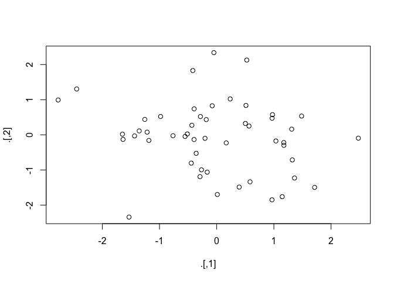
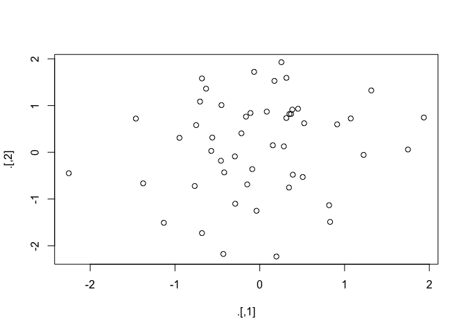

Pipes with magrittr
================
Emma Grossman
5/26/2021

The pipe character `%>%` comes from Stefan Milton’s package, `magrittr`.
The package isn’t loaded automatically, but the character is.

``` r
library(tidyverse)
```

    ## ── Attaching packages ─────────────────────────────────────── tidyverse 1.3.0 ──

    ## ✓ ggplot2 3.3.3     ✓ purrr   0.3.4
    ## ✓ tibble  3.1.0     ✓ dplyr   1.0.5
    ## ✓ tidyr   1.1.3     ✓ stringr 1.4.0
    ## ✓ readr   1.4.0     ✓ forcats 0.5.1

    ## ── Conflicts ────────────────────────────────────────── tidyverse_conflicts() ──
    ## x dplyr::filter() masks stats::filter()
    ## x dplyr::lag()    masks stats::lag()

``` r
library(magrittr)
```

    ## 
    ## Attaching package: 'magrittr'

    ## The following object is masked from 'package:purrr':
    ## 
    ##     set_names

    ## The following object is masked from 'package:tidyr':
    ## 
    ##     extract

Big picture: the pipe character helps to make code easily writable and
readable.

``` r
diamonds <- ggplot2::diamonds
diamonds2 <- diamonds %>%
  dplyr::mutate(price_per_carat = price / carat)
```

Using `magrittr`:

``` r
foo_foo %>%
  hop(through = forest) %>%
  scoop(up = field_mice) %>%
  bop(on = head)
```

Behind the scenes, `magrittr` does something like this:

``` r
my_pipe <- function(.) {
  . <- hop(., through = forest)
  . <- scoop(., up = field_mice)
  bop(., on = head)
}
my_pipe(foo_foo)
```

The pipe doesn’t work with functions that utilize the current
environment, like `assign()`, `get()`, and `load()`, or functions that
use lazy evaluation, like `tryCatch()`.

There is also the “tee” pipe, `%T>%`, which returns the lefthand side
rather than the righthand.

``` r
rnorm(100) %>%
  matrix(ncol = 2) %>%
  plot() %>%
  str()
```

<!-- -->

    ##  NULL

``` r
rnorm(100) %>%
  matrix(ncol = 2) %T>%
  plot() %>%
  str()
```

<!-- -->

    ##  num [1:50, 1:2] 0.39 -0.29 0.173 -0.148 -0.452 ...
